# Table of Contents
- [Items by ID](#Items-by-ID)
- [Items](#Items)
- [Powerups](#Powerups)

# Items by ID
0. [Bark](#Bark)
1. [Chest](#Chest)
2. [Coal](#Coal)
3. [Coin](#Coin)
4. [Flint](#Flint)
5. [Steel Boots](#Steel-Boots)
6. [Steel Helmet](#Steel-Helmet)
7. [Steel Pants](#Steel-Pants)
8. [Steel Chestplate](#Steel-Chestplate)
9. [Wood Doorway](#Wood-Doorway)
10. [Wood Doorway](#Wood-Doorway)
11. [Wood Floor](#Wood-Floor)
12. [Wood Pole](#Wood-Pole)
13. [Wood Pole](#Wood-Pole)
14. [Wood Roof](#Wood-Roof)
15. [Wood stairs](#Wood-stairs)
16. [Wood stairs thinn](#Wood-stairs-thinn)
17. [Wood Wall](#Wood-Wall)
18. [Wood Wall Half](#Wood-Wall-Half)
19. [Wood Wall Tilted](#Wood-Wall-Tilted)
20. [Torch](#Torch)
21. [Red Apple](#Red-Apple)
22. [Bowl](#Bowl)
23. [Dough](#Dough)
24. [Blue Flower](#Blue-Flower)
25. [Raw Meat](#Raw-Meat)
26. [Gulpon Shroom](#Gulpon-Shroom)
27. [Ligon Shroom](#Ligon-Shroom)
28. [Slurbon Shroom](#Slurbon-Shroom)
29. [Sugon Shroom](#Sugon-Shroom)
30. [Wheat](#Wheat)
31. [Bread](#Bread)
32. [Cooked Meat](#Cooked-Meat)
33. [Meat Pie](#Meat-Pie)
34. [Meat Soup](#Meat-Soup)
35. [Adamantite bar](#Adamantite-bar)
36. [Gold bar](#Gold-bar)
37. [Iron bar](#Iron-bar)
38. [Mithril bar](#Mithril-bar)
39. [Adamantite Ore](#Adamantite-Ore)
40. [Gold Ore](#Gold-Ore)
41. [Iron Ore](#Iron-Ore)
42. [Mithril Ore](#Mithril-Ore)
43. [Rock](#Rock)
44. [Birch Wood](#Birch-Wood)
45. [Fir Wood](#Fir-Wood)
46. [Wood](#Wood)
47. [Oak Wood](#Oak-Wood)
48. [Anvil](#Anvil)
49. [Cauldron](#Cauldron)
50. [Fletching Table](#Fletching-Table)
51. [Furnace](#Furnace)
52. [Workbench](#Workbench)
53. [Adamantite Axe](#Adamantite-Axe)
54. [Gold Axe](#Gold-Axe)
55. [Mithril Axe](#Mithril-Axe)
56. [Steel Axe](#Steel-Axe)
57. [Wood Axe](#Wood-Axe)
58. [Wood Bow](#Wood-Bow)
59. [Adamantite Pickaxe](#Adamantite-Pickaxe)
60. [Gold Pickaxe](#Gold-Pickaxe)
61. [Mithril Pickaxe](#Mithril-Pickaxe)
62. [Steel Pickaxe](#Steel-Pickaxe)
63. [Wood Pickaxe](#Wood-Pickaxe)
64. [Shovel](#Shovel)
65. [Adamantite Sword](#Adamantite-Sword)
66. [Gold Sword](#Gold-Sword)
67. [Mithril Sword](#Mithril-Sword)
68. [Steel Sword](#Steel-Sword)
69. [Apple Pie](#Apple-Pie)
70. [Adamantite Arrow](#Adamantite-Arrow)
71. [Flint Arrow](#Flint-Arrow)
72. [Mithril Arrow](#Mithril-Arrow)
73. [Steel Arrow](#Steel-Arrow)
74. [Rope](#Rope)
75. [Birch bow](#Birch-bow)
76. [Fir bow](#Fir-bow)
77. [Oak Bow](#Oak-Bow)
78. [Adamantite Boots](#Adamantite-Boots)
79. [Gold Boots](#Gold-Boots)
80. [Mithril Boots](#Mithril-Boots)
81. [Adamantite Helmet](#Adamantite-Helmet)
82. [Gold Helmet](#Gold-Helmet)
83. [Mithril Helmet](#Mithril-Helmet)
84. [Adamantite Pants](#Adamantite-Pants)
85. [Gold Pants](#Gold-Pants)
86. [Mithril Pants](#Mithril-Pants)
87. [Adamantite Chestplate](#Adamantite-Chestplate)
88. [Gold Chestplate](#Gold-Chestplate)
89. [Mithril Chestplate](#Mithril-Chestplate)
90. [Fireball](#Fireball)
91. [Lightningball](#Lightningball)
92. [Waterball](#Waterball)
93. [Windball](#Windball)
94. [Bone](#Bone)
95. [Rock Projectile](#Rock-Projectile)
96. [Rock Projectile](#Rock-Projectile)
97. [Chunkium bar](#Chunkium-bar)
98. [Chunky Hammer](#Chunky-Hammer)
99. [Chunkium Ore](#Chunkium-Ore)
100. [Wyvern Claws](#Wyvern-Claws)
101. [Wyvern Claws](#Wyvern-Claws)
102. [Wyvern Dagger](#Wyvern-Dagger)
103. [Hammer Shaft](#Hammer-Shaft)
104. [Chunkium Boots](#Chunkium-Boots)
105. [Chunkium Helmet](#Chunkium-Helmet)
106. [Chunkium Pants](#Chunkium-Pants)
107. [Chunkium Chestplate](#Chunkium-Chestplate)

# Items
###### 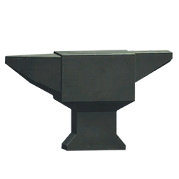
## Anvil
*chonky metal station*
- Type: Station
- Rarity: Common
- Stackable: Yes
- Crafting Amount: 1
- Buildable: Yes
- Processable: No
- Fuel: No
#### Crafting Recipe
- 5 [Iron bar](#Iron-bar)
- 15 [Rock](#Rock)
#### Weapon Stats
- Resource Damage:1
- Attack Damage:10
- Attack Speed:1
- Attack Range:2
- Sharpness: 0

###### 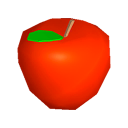
## Red Apple
*Red and shiny*
- Type: Food
- Tag: Food
- Rarity: Common
- Stackable: Yes
- Craftable: No
- Buildable: No
- Processable: No
- Fuel: No
#### Food Stats
- Health: 5
- Hunger: 15
- Stamina: 5

###### 
## Adamantite Arrow
*Green arrow*
- Type: Item
- Tag: Arrow
- Rarity: Common
- Stackable: 999
- Crafting Amount: 4
- Buildable: No
- Processable: No
- Fuel: No
#### Crafting Recipe
- 2 [Oak Wood](#Oak-Wood)
- 1 [Adamantite bar](#Adamantite-bar)
#### Weapon Stats
- Resource Damage:1
- Attack Damage:70
- Attack Speed:0.3
- Attack Range:1
- Sharpness: 0.8

###### 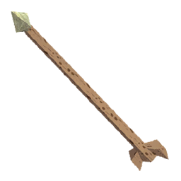
## Flint Arrow
*kinda wacky, but gets the job done ig*
- Type: Item
- Tag: Arrow
- Rarity: Common
- Stackable: 999
- Crafting Amount: 4
- Buildable: No
- Processable: No
- Fuel: No
#### Crafting Recipe
- 2 [Wood](#Wood)
- 1 [Flint](#Flint)
#### Weapon Stats
- Resource Damage:1
- Attack Damage:25
- Attack Speed:1
- Attack Range:1
- Sharpness: 0.8

###### 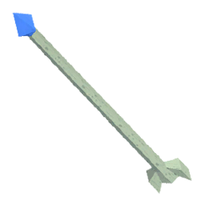
## Mithril Arrow
*Sharp arrow*
- Type: Item
- Tag: Arrow
- Rarity: Common
- Stackable: 999
- Crafting Amount: 4
- Buildable: No
- Processable: No
- Fuel: No
#### Crafting Recipe
- 2 [Fir Wood](#Fir-Wood)
- 1 [Mithril bar](#Mithril-bar)
#### Weapon Stats
- Resource Damage:1
- Attack Damage:45
- Attack Speed:1
- Attack Range:1
- Sharpness: 0.8

###### 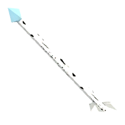
## Steel Arrow
*Shiny arrow*
- Type: Item
- Tag: Arrow
- Rarity: Common
- Stackable: 999
- Crafting Amount: 4
- Buildable: No
- Processable: No
- Fuel: No
#### Crafting Recipe
- 2 [Birch Wood](#Birch-Wood)
- 1 [Iron bar](#Iron-bar)
#### Weapon Stats
- Resource Damage:1
- Attack Damage:35
- Attack Speed:1
- Attack Range:1
- Sharpness: 0.8

###### 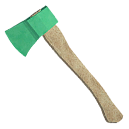
## Adamantite Axe
*its axe*
- Type: Axe
- Tier: Mithril
- Rarity: Common
- Stackable: No
- Crafting Amount: 1
- Buildable: No
- Processable: No
- Fuel: No
#### Crafting Recipe
- 5 [Adamantite bar](#Adamantite-bar)
- 5 [Bark](#Bark)
- 10 [Oak Wood](#Oak-Wood)
#### Weapon Stats
- Resource Damage:50
- Attack Damage:40
- Attack Speed:1
- Attack Range:1
- Sharpness: 0.8

###### 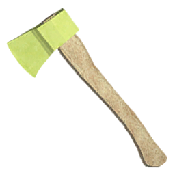
## Gold Axe
*its axe*
- Type: Axe
- Tier: Steel
- Rarity: Common
- Stackable: No
- Crafting Amount: 1
- Buildable: No
- Processable: No
- Fuel: No
#### Crafting Recipe
- 5 [Gold bar](#Gold-bar)
- 5 [Bark](#Bark)
- 10 [Wood](#Wood)
#### Weapon Stats
- Resource Damage:22
- Attack Damage:15
- Attack Speed:1.1
- Attack Range:1
- Sharpness: 0.8

###### 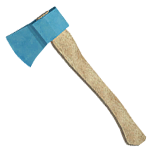
## Mithril Axe
*its axe*
- Type: Axe
- Tier: Mithril
- Rarity: Common
- Stackable: No
- Crafting Amount: 1
- Buildable: No
- Processable: No
- Fuel: No
#### Crafting Recipe
- 5 [Mithril bar](#Mithril-bar)
- 5 [Bark](#Bark)
- 10 [Fir Wood](#Fir-Wood)
#### Weapon Stats
- Resource Damage:35
- Attack Damage:25
- Attack Speed:0.95
- Attack Range:1
- Sharpness: 0.8

###### 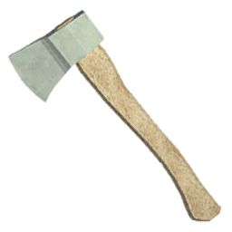
## Steel Axe
*its axe*
- Type: Axe
- Tier: Steel
- Rarity: Common
- Stackable: No
- Crafting Amount: 1
- Buildable: No
- Processable: No
- Fuel: No
#### Crafting Recipe
- 5 [Iron bar](#Iron-bar)
- 5 [Bark](#Bark)
- 10 [Birch Wood](#Birch-Wood)
#### Weapon Stats
- Resource Damage:25
- Attack Damage:20
- Attack Speed:0.9
- Attack Range:1
- Sharpness: 0.8

###### 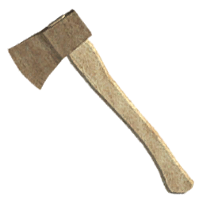
## Wood Axe
*its axe*
- Type: Axe
- Tier: Wood
- Rarity: Common
- Stackable: No
- Crafting Amount: 1
- Buildable: No
- Processable: No
- Fuel: 1 items
- Fuel Speed: 1x
#### Crafting Recipe
- 5 [Wood](#Wood)
- 5 [Bark](#Bark)
#### Weapon Stats
- Resource Damage:20
- Attack Damage:15
- Attack Speed:0.9
- Attack Range:1
- Sharpness: 0.75

###### 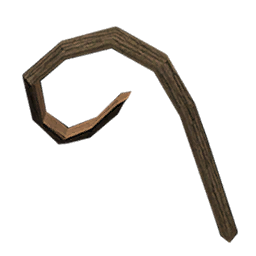
## Bark
*its wood but bark*
- Type: Item
- Rarity: Common
- Stackable: Yes
- Crafting Amount: 5
- Buildable: No
- Processable: No
- Fuel: No
#### Crafting Recipe
- 5 [Wood](#Wood)
#### Weapon Stats
- Resource Damage:1
- Attack Damage:1
- Attack Speed:2
- Attack Range:0.75
- Sharpness: 0

###### 
## Adamantite bar
*block of adamantite*
- Type: Item
- Rarity: Common
- Stackable: Yes
- Craftable: No
- Buildable: No
- Processable: No
- Fuel: No
#### Weapon Stats
- Resource Damage:1
- Attack Damage:1
- Attack Speed:0.7
- Attack Range:1
- Sharpness: 0

###### 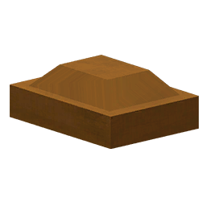
## Chunkium bar
*Looks very expensive (and chunky)*
- Type: Item
- Rarity: Rare
- Stackable: Yes
- Craftable: No
- Buildable: No
- Processable: No
- Fuel: No
#### Weapon Stats
- Resource Damage:1
- Attack Damage:1
- Attack Speed:0.7
- Attack Range:1
- Sharpness: 0

###### 
## Gold bar
*block of gold*
- Type: Item
- Rarity: Common
- Stackable: Yes
- Craftable: No
- Buildable: No
- Processable: No
- Fuel: No
#### Weapon Stats
- Resource Damage:1
- Attack Damage:1
- Attack Speed:0.7
- Attack Range:1
- Sharpness: 0

###### 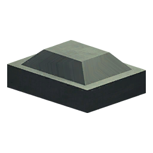
## Iron bar
*block of iron*
- Type: Item
- Rarity: Common
- Stackable: Yes
- Craftable: No
- Buildable: No
- Processable: No
- Fuel: No
#### Weapon Stats
- Resource Damage:1
- Attack Damage:1
- Attack Speed:0.7
- Attack Range:1
- Sharpness: 0

###### 
## Mithril bar
*block of mithril*
- Type: Item
- Rarity: Common
- Stackable: Yes
- Craftable: No
- Buildable: No
- Processable: No
- Fuel: No
#### Weapon Stats
- Resource Damage:1
- Attack Damage:1
- Attack Speed:0.7
- Attack Range:1
- Sharpness: 0

###### 
## Bone
*oof owie my bones*
- Type: Item
- Rarity: Common
- Stackable: Yes
- Craftable: No
- Buildable: No
- Processable: No
- Fuel: No
#### Weapon Stats
- Resource Damage:1
- Attack Damage:15
- Attack Speed:1
- Attack Range:1
- Sharpness: 0.8

###### 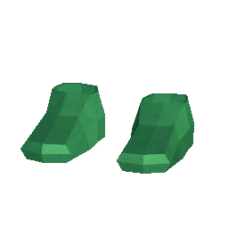
## Adamantite Boots
*it protecc foot*
- Type: Item
- Tag: Feet
- Rarity: Common
- Stackable: No
- Crafting Amount: 1
- Buildable: No
- Processable: No
- Fuel: No
#### Crafting Recipe
- 5 [Adamantite bar](#Adamantite-bar)
#### Weapon Stats
- Resource Damage:1
- Attack Damage:1
- Attack Speed:1
- Attack Range:2
- Sharpness: 1

###### 
## Chunkium Boots
*it protecc foot*
- Type: Item
- Tag: Feet
- Rarity: Rare
- Stackable: No
- Crafting Amount: 1
- Buildable: No
- Processable: No
- Fuel: No
#### Crafting Recipe
- 5 [Chunkium bar](#Chunkium-bar)
#### Weapon Stats
- Resource Damage:1
- Attack Damage:1
- Attack Speed:1
- Attack Range:2
- Sharpness: 1

###### 
## Gold Boots
*it protecc foot*
- Type: Item
- Tag: Feet
- Rarity: Common
- Stackable: No
- Crafting Amount: 1
- Buildable: No
- Processable: No
- Fuel: No
#### Crafting Recipe
- 5 [Gold bar](#Gold-bar)
#### Weapon Stats
- Resource Damage:1
- Attack Damage:1
- Attack Speed:1
- Attack Range:2
- Sharpness: 1

###### 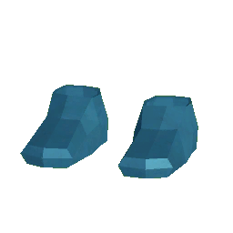
## Mithril Boots
*it protecc foot*
- Type: Item
- Tag: Feet
- Rarity: Common
- Stackable: No
- Crafting Amount: 1
- Buildable: No
- Processable: No
- Fuel: No
#### Crafting Recipe
- 5 [Mithril bar](#Mithril-bar)
#### Weapon Stats
- Resource Damage:1
- Attack Damage:1
- Attack Speed:1
- Attack Range:2
- Sharpness: 1

###### 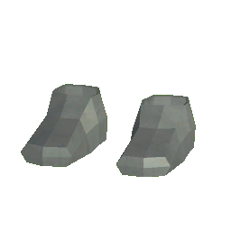
## Steel Boots
*it protecc foot*
- Type: Item
- Tag: Feet
- Rarity: Common
- Stackable: No
- Crafting Amount: 1
- Buildable: No
- Processable: No
- Fuel: No
#### Crafting Recipe
- 5 [Iron bar](#Iron-bar)
#### Weapon Stats
- Resource Damage:1
- Attack Damage:1
- Attack Speed:1
- Attack Range:2
- Sharpness: 1

###### 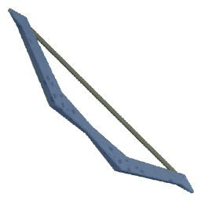
## Oak Bow
*This bow looks sick*
- Type: Bow
- Rarity: Common
- Stackable: No
- Crafting Amount: 1
- Buildable: No
- Processable: No
- Fuel: No
#### Crafting Recipe
- 5 [Oak Wood](#Oak-Wood)
- 1 [Rope](#Rope)
#### Weapon Stats
- Resource Damage:1
- Attack Damage:1
- Attack Speed:1.5
- Attack Range:2
- Sharpness: 1

###### 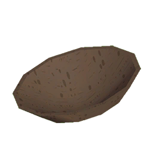
## Bowl
*its bowl*
- Type: Food
- Rarity: Common
- Stackable: Yes
- Craftable: No
- Buildable: No
- Processable: No
- Fuel: No
#### Weapon Stats
- Resource Damage:1
- Attack Damage:1
- Attack Speed:1
- Attack Range:1
- Sharpness: 0

###### 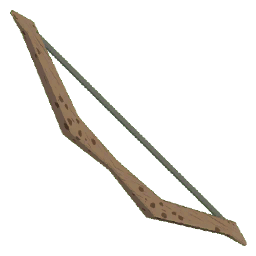
## Wood Bow
*Looks kinda scuffed*
- Type: Bow
- Rarity: Common
- Stackable: No
- Crafting Amount: 1
- Buildable: No
- Processable: No
- Fuel: No
#### Crafting Recipe
- 10 [Wood](#Wood)
- 1 [Rope](#Rope)
#### Weapon Stats
- Resource Damage:1
- Attack Damage:1
- Attack Speed:0.85
- Attack Range:2
- Sharpness: 1

###### 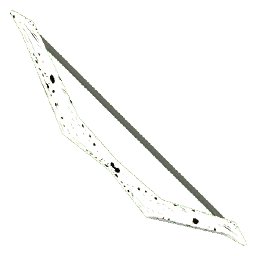
## Birch bow
*bitch boi*
- Type: Bow
- Rarity: Common
- Stackable: No
- Crafting Amount: 1
- Buildable: No
- Processable: No
- Fuel: No
#### Crafting Recipe
- 10 [Birch Wood](#Birch-Wood)
- 1 [Rope](#Rope)
#### Weapon Stats
- Resource Damage:1
- Attack Damage:1
- Attack Speed:1
- Attack Range:2
- Sharpness: 1

###### 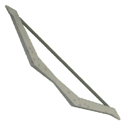
## Fir bow
*Bow*
- Type: Bow
- Rarity: Common
- Stackable: No
- Crafting Amount: 1
- Buildable: No
- Processable: No
- Fuel: No
#### Crafting Recipe
- 10 [Fir Wood](#Fir-Wood)
- 1 [Rope](#Rope)
#### Weapon Stats
- Resource Damage:1
- Attack Damage:1
- Attack Speed:1.25
- Attack Range:2
- Sharpness: 1

###### 
## Bread
*lets get this bread*
- Type: Item
- Tag: Food
- Rarity: Common
- Stackable: Yes
- Crafting Amount: 1
- Buildable: No
- Processable: No
- Fuel: No
#### Crafting Recipe
- 1 [Dough](#Dough)
#### Food Stats
- Health: 25
- Hunger: 25
- Stamina: 25

###### 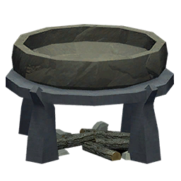
## Cauldron
*food go brr*
- Type: Storage
- Rarity: Common
- Stackable: Yes
- Crafting Amount: 1
- Buildable: Yes
- Processable: No
- Fuel: No
#### Crafting Recipe
- 10 [Wood](#Wood)
- 10 [Rock](#Rock)
#### Weapon Stats
- Resource Damage:1
- Attack Damage:1
- Attack Speed:2
- Attack Range:2
- Sharpness: 0

###### 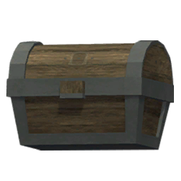
## Chest
*store thing in it*
- Type: Storage
- Rarity: Common
- Stackable: Yes
- Crafting Amount: 1
- Buildable: Yes
- Processable: No
- Fuel: No
#### Crafting Recipe
- 20 [Wood](#Wood)
- 10 [Rock](#Rock)
#### Weapon Stats
- Resource Damage:1
- Attack Damage:1
- Attack Speed:2
- Attack Range:1
- Sharpness: 0

###### 
## Chunky Hammer
*its blunt and chunky*
- Type: Sword
- Rarity: Rare
- Stackable: No
- Crafting Amount: 1
- Buildable: No
- Processable: No
- Fuel: No
#### Crafting Recipe
- 1 [Hammer Shaft](#Hammer-Shaft)
- 15 [Chunkium bar](#Chunkium-bar)
#### Weapon Stats
- Resource Damage:1
- Attack Damage:100
- Attack Speed:0.95
- Attack Range:2
- Sharpness: 1

###### 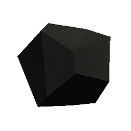
## Coal
*its flamable rock*
- Type: Item
- Tag: Fuel
- Rarity: Common
- Stackable: Yes
- Craftable: No
- Buildable: No
- Processable: No
- Fuel: 2 items
- Fuel Speed: 1.25x
#### Weapon Stats
- Resource Damage:1
- Attack Damage:1
- Attack Speed:1.2
- Attack Range:0.8
- Sharpness: 0

###### 
## Coin
*shiny*
- Type: Item
- Rarity: Common
- Stackable: 99999
- Craftable: No
- Buildable: No
- Processable: No
- Fuel: No
#### Weapon Stats
- Resource Damage:0
- Attack Damage:0
- Attack Speed:1
- Attack Range:1
- Sharpness: 0

###### 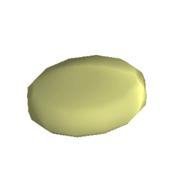
## Dough
*looks yummy*
- Type: Item
- Rarity: Common
- Stackable: Yes
- Crafting Amount: 1
- Buildable: No
- Processable: No
- Fuel: No
#### Crafting Recipe
- 5 [Wheat](#Wheat)
#### Weapon Stats
- Resource Damage:1
- Attack Damage:1
- Attack Speed:1
- Attack Range:1
- Sharpness: 0

###### 
## Fireball
*Ball of fire*
- Type: Item
- Tag: Arrow
- Rarity: Common
- Stackable: Yes
- Craftable: No
- Buildable: No
- Processable: No
- Fuel: No
#### Weapon Stats
- Resource Damage:1
- Attack Damage:23
- Attack Speed:1
- Attack Range:1
- Sharpness: 0.8

###### 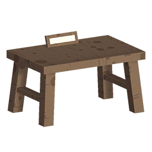
## Fletching Table
*fletch*
- Type: Station
- Rarity: Common
- Stackable: Yes
- Crafting Amount: 1
- Buildable: Yes
- Processable: No
- Fuel: No
#### Crafting Recipe
- 25 [Birch Wood](#Birch-Wood)
- 10 [Flint](#Flint)
#### Weapon Stats
- Resource Damage:1
- Attack Damage:1
- Attack Speed:1
- Attack Range:2
- Sharpness: 0

###### 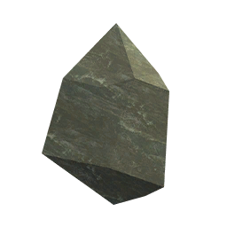
## Flint
*its rock but make fire*
- Type: Item
- Rarity: Common
- Stackable: Yes
- Craftable: No
- Buildable: No
- Processable: No
- Fuel: No
#### Weapon Stats
- Resource Damage:1
- Attack Damage:1
- Attack Speed:1.5
- Attack Range:0.8
- Sharpness: 0.7

###### 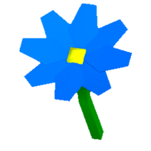
## Blue Flower
*A pretty blue flower*
- Type: Item
- Rarity: Common
- Stackable: Yes
- Craftable: No
- Buildable: No
- Processable: No
- Fuel: No
#### Weapon Stats
- Resource Damage:1
- Attack Damage:1
- Attack Speed:1
- Attack Range:1
- Sharpness: 0

###### 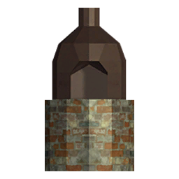
## Furnace
*it go melt*
- Type: Storage
- Rarity: Common
- Stackable: Yes
- Crafting Amount: 1
- Buildable: Yes
- Processable: No
- Fuel: No
#### Crafting Recipe
- 15 [Rock](#Rock)
#### Weapon Stats
- Resource Damage:1
- Attack Damage:1
- Attack Speed:1
- Attack Range:1
- Sharpness: 0

###### 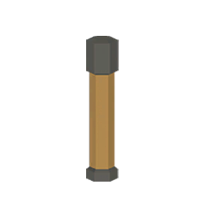
## Hammer Shaft
*Wild guess, but it might be used for making a hammer?*
- Type: Item
- Rarity: Rare
- Stackable: Yes
- Craftable: No
- Buildable: No
- Processable: No
- Fuel: No
#### Weapon Stats
- Resource Damage:1
- Attack Damage:1
- Attack Speed:0.9
- Attack Range:2
- Sharpness: 1

###### 
## Adamantite Helmet
*it protecc head*
- Type: Item
- Tag: Helmet
- Rarity: Common
- Stackable: No
- Crafting Amount: 1
- Buildable: No
- Processable: No
- Fuel: No
#### Crafting Recipe
- 5 [Adamantite bar](#Adamantite-bar)
#### Weapon Stats
- Resource Damage:1
- Attack Damage:1
- Attack Speed:1
- Attack Range:2
- Sharpness: 1

###### 
## Chunkium Helmet
*it protecc head*
- Type: Item
- Tag: Helmet
- Rarity: Rare
- Stackable: No
- Crafting Amount: 1
- Buildable: No
- Processable: No
- Fuel: No
#### Crafting Recipe
- 5 [Chunkium bar](#Chunkium-bar)
#### Weapon Stats
- Resource Damage:1
- Attack Damage:1
- Attack Speed:1
- Attack Range:2
- Sharpness: 1

###### 
## Gold Helmet
*it protecc head*
- Type: Item
- Tag: Helmet
- Rarity: Common
- Stackable: No
- Crafting Amount: 1
- Buildable: No
- Processable: No
- Fuel: No
#### Crafting Recipe
- 5 [Gold bar](#Gold-bar)
#### Weapon Stats
- Resource Damage:1
- Attack Damage:1
- Attack Speed:1
- Attack Range:2
- Sharpness: 1

###### 
## Mithril Helmet
*it protecc head*
- Type: Item
- Tag: Helmet
- Rarity: Common
- Stackable: No
- Crafting Amount: 1
- Buildable: No
- Processable: No
- Fuel: No
#### Crafting Recipe
- 5 [Mithril bar](#Mithril-bar)
#### Weapon Stats
- Resource Damage:1
- Attack Damage:1
- Attack Speed:1
- Attack Range:2
- Sharpness: 1

###### 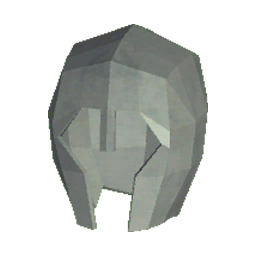
## Steel Helmet
*it protecc head*
- Type: Item
- Tag: Helmet
- Rarity: Common
- Stackable: No
- Crafting Amount: 1
- Buildable: No
- Processable: No
- Fuel: No
#### Crafting Recipe
- 5 [Iron bar](#Iron-bar)
#### Weapon Stats
- Resource Damage:1
- Attack Damage:1
- Attack Speed:1
- Attack Range:2
- Sharpness: 1

###### 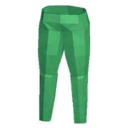
## Adamantite Pants
*it protecc leg*
- Type: Item
- Tag: Legs
- Rarity: Common
- Stackable: No
- Crafting Amount: 1
- Buildable: No
- Processable: No
- Fuel: No
#### Crafting Recipe
- 15 [Adamantite bar](#Adamantite-bar)
#### Weapon Stats
- Resource Damage:1
- Attack Damage:1
- Attack Speed:1
- Attack Range:2
- Sharpness: 1

###### 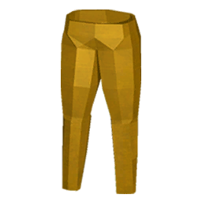
## Chunkium Pants
*it protecc leg*
- Type: Item
- Tag: Legs
- Rarity: Rare
- Stackable: No
- Crafting Amount: 1
- Buildable: No
- Processable: No
- Fuel: No
#### Crafting Recipe
- 15 [Chunkium bar](#Chunkium-bar)
#### Weapon Stats
- Resource Damage:1
- Attack Damage:1
- Attack Speed:1
- Attack Range:2
- Sharpness: 1

###### 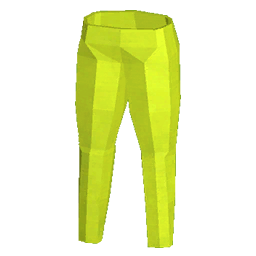
## Gold Pants
*it protecc leg*
- Type: Item
- Tag: Legs
- Rarity: Common
- Stackable: No
- Crafting Amount: 1
- Buildable: No
- Processable: No
- Fuel: No
#### Crafting Recipe
- 15 [Gold bar](#Gold-bar)
#### Weapon Stats
- Resource Damage:1
- Attack Damage:1
- Attack Speed:1
- Attack Range:2
- Sharpness: 1

###### 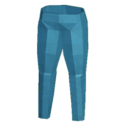
## Mithril Pants
*it protecc leg*
- Type: Item
- Tag: Legs
- Rarity: Common
- Stackable: No
- Crafting Amount: 1
- Buildable: No
- Processable: No
- Fuel: No
#### Crafting Recipe
- 15 [Mithril bar](#Mithril-bar)
#### Weapon Stats
- Resource Damage:1
- Attack Damage:1
- Attack Speed:1
- Attack Range:2
- Sharpness: 1

###### 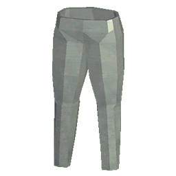
## Steel Pants
*it protecc leg*
- Type: Item
- Tag: Legs
- Rarity: Common
- Stackable: No
- Crafting Amount: 1
- Buildable: No
- Processable: No
- Fuel: No
#### Crafting Recipe
- 15 [Iron bar](#Iron-bar)
#### Weapon Stats
- Resource Damage:1
- Attack Damage:1
- Attack Speed:1
- Attack Range:2
- Sharpness: 1

###### 
## Lightningball
*Ball of lightning*
- Type: Item
- Tag: Arrow
- Rarity: Common
- Stackable: Yes
- Craftable: No
- Buildable: No
- Processable: No
- Fuel: No
#### Weapon Stats
- Resource Damage:1
- Attack Damage:23
- Attack Speed:1
- Attack Range:1
- Sharpness: 0.8

###### 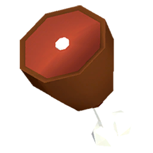
## Cooked Meat
*yummy*
- Type: Food
- Tag: Food
- Rarity: Common
- Stackable: Yes
- Craftable: No
- Buildable: No
- Processable: No
- Fuel: No
#### Food Stats
- Health: 30
- Hunger: 50
- Stamina: 5

###### 
## Raw Meat
*yummy*
- Type: Food
- Tag: Food
- Rarity: Common
- Stackable: Yes
- Craftable: No
- Buildable: No
- Processing Time: 1
- Processing Result: [Cooked Meat](#Cooked-Meat)
- Fuel: No
#### Food Stats
- Health: 5
- Hunger: 10
- Stamina: 0

###### 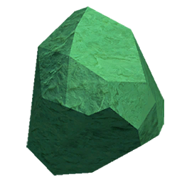
## Adamantite Ore
*its hard rock*
- Type: Axe
- Tier: None
- Rarity: Common
- Stackable: Yes
- Craftable: No
- Buildable: No
- Processing Time: 15
- Processing Result: [Adamantite bar](#Adamantite-bar)
- Fuel: No
#### Weapon Stats
- Resource Damage:1
- Attack Damage:1
- Attack Speed:0.7
- Attack Range:1
- Sharpness: 0

###### 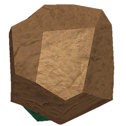
## Chunkium Ore
*looks like your mom*
- Type: Item
- Rarity: Rare
- Stackable: Yes
- Craftable: No
- Buildable: No
- Processing Time: 23
- Processing Result: [Chunkium bar](#Chunkium-bar)
- Fuel: No
#### Weapon Stats
- Resource Damage:1
- Attack Damage:1
- Attack Speed:0.7
- Attack Range:1
- Sharpness: 0

###### 
## Gold Ore
*its hard rock*
- Type: Axe
- Tier: None
- Rarity: Common
- Stackable: Yes
- Craftable: No
- Buildable: No
- Processing Time: 4
- Processing Result: [Gold bar](#Gold-bar)
- Fuel: No
#### Weapon Stats
- Resource Damage:1
- Attack Damage:1
- Attack Speed:0.7
- Attack Range:1
- Sharpness: 0

###### 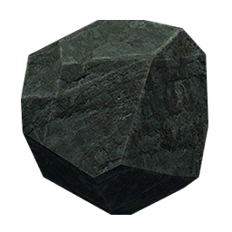
## Iron Ore
*its hard rock*
- Type: Axe
- Tier: None
- Rarity: Common
- Stackable: Yes
- Craftable: No
- Buildable: No
- Processing Time: 6
- Processing Result: [Iron bar](#Iron-bar)
- Fuel: No
#### Weapon Stats
- Resource Damage:1
- Attack Damage:1
- Attack Speed:0.7
- Attack Range:1
- Sharpness: 0

###### 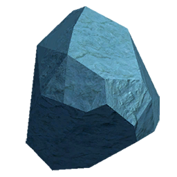
## Mithril Ore
*its hard rock*
- Type: Axe
- Tier: None
- Rarity: Common
- Stackable: Yes
- Craftable: No
- Buildable: No
- Processing Time: 10
- Processing Result: [Mithril bar](#Mithril-bar)
- Fuel: No
#### Weapon Stats
- Resource Damage:1
- Attack Damage:1
- Attack Speed:0.7
- Attack Range:1
- Sharpness: 0

###### 
## Adamantite Pickaxe
*its pickaxe*
- Type: Pickaxe
- Tier: Mithril
- Rarity: Common
- Stackable: No
- Crafting Amount: 1
- Buildable: No
- Processable: No
- Fuel: No
#### Crafting Recipe
- 5 [Adamantite bar](#Adamantite-bar)
- 5 [Bark](#Bark)
- 10 [Oak Wood](#Oak-Wood)
#### Weapon Stats
- Resource Damage:40
- Attack Damage:40
- Attack Speed:0.8
- Attack Range:1.2
- Sharpness: 0.2

###### 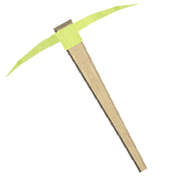
## Gold Pickaxe
*its pickaxe*
- Type: Pickaxe
- Tier: Wood
- Rarity: Common
- Stackable: No
- Crafting Amount: 1
- Buildable: No
- Processable: No
- Fuel: No
#### Crafting Recipe
- 5 [Gold bar](#Gold-bar)
- 5 [Bark](#Bark)
- 5 [Wood](#Wood)
#### Weapon Stats
- Resource Damage:22
- Attack Damage:24
- Attack Speed:0.9
- Attack Range:1.2
- Sharpness: 0.2

###### 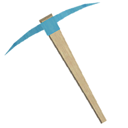
## Mithril Pickaxe
*its pickaxe*
- Type: Pickaxe
- Tier: Steel
- Rarity: Common
- Stackable: No
- Crafting Amount: 1
- Buildable: No
- Processable: No
- Fuel: No
#### Crafting Recipe
- 5 [Mithril bar](#Mithril-bar)
- 5 [Bark](#Bark)
- 10 [Fir Wood](#Fir-Wood)
#### Weapon Stats
- Resource Damage:32
- Attack Damage:30
- Attack Speed:0.8
- Attack Range:1.2
- Sharpness: 0.2

###### 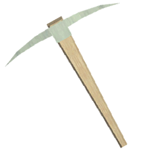
## Steel Pickaxe
*its pickaxe*
- Type: Pickaxe
- Tier: Wood
- Rarity: Common
- Stackable: No
- Crafting Amount: 1
- Buildable: No
- Processable: No
- Fuel: No
#### Crafting Recipe
- 5 [Iron bar](#Iron-bar)
- 5 [Bark](#Bark)
- 10 [Birch Wood](#Birch-Wood)
#### Weapon Stats
- Resource Damage:25
- Attack Damage:27
- Attack Speed:0.8
- Attack Range:1.2
- Sharpness: 0.2

###### 
## Wood Pickaxe
*its pickaxe*
- Type: Pickaxe
- Tier: None
- Rarity: Common
- Stackable: No
- Crafting Amount: 1
- Buildable: No
- Processable: No
- Fuel: 1 items
- Fuel Speed: 1x
#### Crafting Recipe
- 5 [Wood](#Wood)
- 5 [Bark](#Bark)
#### Weapon Stats
- Resource Damage:18
- Attack Damage:20
- Attack Speed:0.8
- Attack Range:1.2
- Sharpness: 0.2

###### 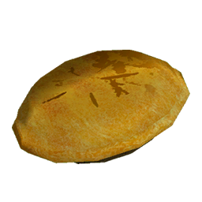
## Apple Pie
*pie with apple*
- Type: Food
- Tag: Food
- Rarity: Common
- Stackable: Yes
- Craftable: No
- Buildable: No
- Processable: No
- Fuel: No
#### Food Stats
- Health: 40
- Hunger: 60
- Stamina: 20

###### 
## Meat Pie
*yummy*
- Type: Food
- Tag: Food
- Rarity: Common
- Stackable: Yes
- Craftable: No
- Buildable: No
- Processable: No
- Fuel: No
#### Food Stats
- Health: 40
- Hunger: 60
- Stamina: 20

###### 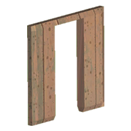
## Wood Doorway
*its wood*
- Type: Item
- Rarity: Common
- Stackable: Yes
- Crafting Amount: 1
- Buildable: Yes
- Processable: No
- Fuel: No
#### Crafting Recipe
- 2 [Wood](#Wood)
#### Weapon Stats
- Resource Damage:1
- Attack Damage:1
- Attack Speed:2
- Attack Range:2
- Sharpness: 0

###### 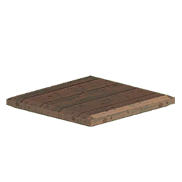
## Wood Floor
*its wood*
- Type: Item
- Rarity: Common
- Stackable: Yes
- Crafting Amount: 1
- Buildable: Yes
- Processable: No
- Fuel: No
#### Crafting Recipe
- 2 [Wood](#Wood)
#### Weapon Stats
- Resource Damage:1
- Attack Damage:1
- Attack Speed:2
- Attack Range:2
- Sharpness: 0

###### 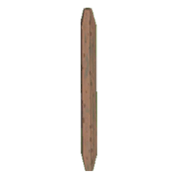
## Wood Pole
*its wood*
- Type: Item
- Rarity: Common
- Stackable: Yes
- Crafting Amount: 1
- Buildable: Yes
- Processable: No
- Fuel: No
#### Crafting Recipe
- 2 [Wood](#Wood)
#### Weapon Stats
- Resource Damage:1
- Attack Damage:1
- Attack Speed:2
- Attack Range:2
- Sharpness: 0

###### 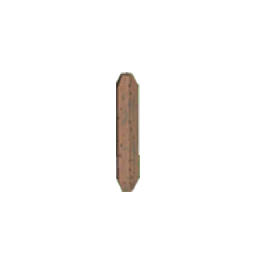
## Wood Pole
*its wood*
- Type: Item
- Rarity: Common
- Stackable: Yes
- Crafting Amount: 1
- Buildable: Yes
- Processable: No
- Fuel: No
#### Crafting Recipe
- 2 [Wood](#Wood)
#### Weapon Stats
- Resource Damage:1
- Attack Damage:1
- Attack Speed:2
- Attack Range:2
- Sharpness: 0

###### 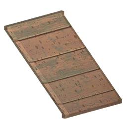
## Wood Roof
*its wood*
- Type: Item
- Rarity: Common
- Stackable: Yes
- Crafting Amount: 1
- Buildable: Yes
- Processable: No
- Fuel: No
#### Crafting Recipe
- 2 [Wood](#Wood)
#### Weapon Stats
- Resource Damage:1
- Attack Damage:1
- Attack Speed:2
- Attack Range:2
- Sharpness: 0

###### 
## Wood stairs
*its wood*
- Type: Item
- Rarity: Common
- Stackable: Yes
- Crafting Amount: 1
- Buildable: Yes
- Processable: No
- Fuel: No
#### Crafting Recipe
- 2 [Wood](#Wood)
#### Weapon Stats
- Resource Damage:1
- Attack Damage:1
- Attack Speed:2
- Attack Range:2
- Sharpness: 0

###### 
## Wood stairs thinn
*its wood*
- Type: Item
- Rarity: Common
- Stackable: Yes
- Crafting Amount: 1
- Buildable: Yes
- Processable: No
- Fuel: No
#### Crafting Recipe
- 2 [Wood](#Wood)
#### Weapon Stats
- Resource Damage:1
- Attack Damage:1
- Attack Speed:2
- Attack Range:2
- Sharpness: 0

###### 
## Wood Wall
*its wood*
- Type: Item
- Rarity: Common
- Stackable: Yes
- Crafting Amount: 1
- Buildable: Yes
- Processable: No
- Fuel: No
#### Crafting Recipe
- 2 [Wood](#Wood)
#### Weapon Stats
- Resource Damage:1
- Attack Damage:1
- Attack Speed:2
- Attack Range:2
- Sharpness: 0

###### 
## Wood Wall Half
*its wood*
- Type: Item
- Rarity: Common
- Stackable: Yes
- Crafting Amount: 1
- Buildable: Yes
- Processable: No
- Fuel: No
#### Crafting Recipe
- 2 [Wood](#Wood)
#### Weapon Stats
- Resource Damage:1
- Attack Damage:1
- Attack Speed:2
- Attack Range:2
- Sharpness: 0

###### 
## Wood Wall Tilted
*its wood*
- Type: Item
- Rarity: Common
- Stackable: Yes
- Crafting Amount: 1
- Buildable: Yes
- Processable: No
- Fuel: No
#### Crafting Recipe
- 2 [Wood](#Wood)
#### Weapon Stats
- Resource Damage:1
- Attack Damage:1
- Attack Speed:2
- Attack Range:2
- Sharpness: 0

###### 
## Wood Doorway
*its wood*
- Type: Item
- Rarity: Common
- Stackable: Yes
- Crafting Amount: 1
- Buildable: Yes
- Processable: No
- Fuel: No
#### Crafting Recipe
- 2 [Wood](#Wood)
#### Weapon Stats
- Resource Damage:1
- Attack Damage:1
- Attack Speed:2
- Attack Range:2
- Sharpness: 0

###### 
## Rock
*its rock*
- Type: Axe
- Tier: None
- Rarity: Common
- Stackable: Yes
- Craftable: No
- Buildable: No
- Processable: No
- Fuel: No
#### Weapon Stats
- Resource Damage:15
- Attack Damage:15
- Attack Speed:0.72
- Attack Range:1
- Sharpness: 0

###### 
## Rock Projectile
*It's a rock, but for some reason you can use this on a bow lol*
- Type: Item
- Tag: Arrow
- Rarity: Common
- Stackable: Yes
- Craftable: No
- Buildable: No
- Processable: No
- Fuel: No
#### Weapon Stats
- Resource Damage:1
- Attack Damage:30
- Attack Speed:1
- Attack Range:1
- Sharpness: 0.8

###### 
## Rock Projectile
*It's a rock, but for some reason you can use this on a bow lol*
- Type: Item
- Tag: Arrow
- Rarity: Common
- Stackable: Yes
- Craftable: No
- Buildable: No
- Processable: No
- Fuel: No
#### Weapon Stats
- Resource Damage:1
- Attack Damage:50
- Attack Speed:1
- Attack Range:1
- Sharpness: 0.8

###### 
## Rope
*how do i make a noose again?*
- Type: Item
- Rarity: Common
- Stackable: Yes
- Crafting Amount: 2
- Buildable: No
- Processable: No
- Fuel: No
#### Crafting Recipe
- 10 [Wheat](#Wheat)
- 10 [Bark](#Bark)
#### Weapon Stats
- Resource Damage:1
- Attack Damage:1
- Attack Speed:1.5
- Attack Range:2
- Sharpness: 1

###### 
## Shovel
*its shovel dig dig*
- Type: Shovel
- Tier: None
- Rarity: Common
- Stackable: No
- Crafting Amount: 1
- Buildable: No
- Processable: No
- Fuel: No
#### Crafting Recipe
- 5 [Wood](#Wood)
- 5 [Rock](#Rock)
- 5 [Bark](#Bark)
#### Weapon Stats
- Resource Damage:1
- Attack Damage:25
- Attack Speed:1.5
- Attack Range:2
- Sharpness: 0.5

###### 
## Gulpon Shroom
*yummy*
- Type: Food
- Tag: Food
- Rarity: Common
- Stackable: Yes
- Craftable: No
- Buildable: No
- Processable: No
- Fuel: No
#### Food Stats
- Health: 20
- Hunger: 0
- Stamina: 0

###### 
## Ligon Shroom
*yummy*
- Type: Food
- Tag: Food
- Rarity: Common
- Stackable: Yes
- Craftable: No
- Buildable: No
- Processable: No
- Fuel: No
#### Food Stats
- Health: 0
- Hunger: 20
- Stamina: 0

###### 
## Slurbon Shroom
*sus shroom*
- Type: Food
- Tag: Food
- Rarity: Common
- Stackable: Yes
- Craftable: No
- Buildable: No
- Processable: No
- Fuel: No
#### Food Stats
- Health: 15
- Hunger: 15
- Stamina: 15

###### 
## Sugon Shroom
*yummy*
- Type: Food
- Tag: Food
- Rarity: Common
- Stackable: Yes
- Craftable: No
- Buildable: No
- Processable: No
- Fuel: No
#### Food Stats
- Health: 0
- Hunger: 0
- Stamina: 20

###### 
## Meat Soup
*yummy*
- Type: Food
- Tag: Food
- Rarity: Common
- Stackable: Yes
- Craftable: No
- Buildable: No
- Processable: No
- Fuel: No
#### Food Stats
- Health: 30
- Hunger: 50
- Stamina: 10

###### 
## Adamantite Sword
*its sharp*
- Type: Sword
- Rarity: Common
- Stackable: No
- Crafting Amount: 1
- Buildable: No
- Processable: No
- Fuel: No
#### Crafting Recipe
- 5 [Adamantite bar](#Adamantite-bar)
- 5 [Oak Wood](#Oak-Wood)
#### Weapon Stats
- Resource Damage:1
- Attack Damage:50
- Attack Speed:1.4
- Attack Range:2
- Sharpness: 1

###### 
## Gold Sword
*its sharp*
- Type: Sword
- Rarity: Common
- Stackable: No
- Crafting Amount: 1
- Buildable: No
- Processable: No
- Fuel: No
#### Crafting Recipe
- 5 [Gold bar](#Gold-bar)
- 5 [Wood](#Wood)
#### Weapon Stats
- Resource Damage:1
- Attack Damage:15
- Attack Speed:1.6
- Attack Range:2
- Sharpness: 0.9

###### 
## Mithril Sword
*its sharp*
- Type: Sword
- Rarity: Common
- Stackable: No
- Crafting Amount: 1
- Buildable: No
- Processable: No
- Fuel: No
#### Crafting Recipe
- 5 [Mithril bar](#Mithril-bar)
- 5 [Fir Wood](#Fir-Wood)
#### Weapon Stats
- Resource Damage:1
- Attack Damage:35
- Attack Speed:1.4
- Attack Range:2
- Sharpness: 1

###### 
## Steel Sword
*its sharp*
- Type: Sword
- Rarity: Common
- Stackable: No
- Crafting Amount: 1
- Buildable: No
- Processable: No
- Fuel: No
#### Crafting Recipe
- 7 [Iron bar](#Iron-bar)
- 5 [Birch Wood](#Birch-Wood)
#### Weapon Stats
- Resource Damage:1
- Attack Damage:25
- Attack Speed:1.3
- Attack Range:2
- Sharpness: 1

###### 
## Torch
*fire wosh*
- Type: Item
- Rarity: Common
- Stackable: Yes
- Crafting Amount: 5
- Buildable: Yes
- Processable: No
- Fuel: No
#### Crafting Recipe
- 2 [Wood](#Wood)
- 1 [Coal](#Coal)
#### Weapon Stats
- Resource Damage:1
- Attack Damage:1
- Attack Speed:2
- Attack Range:2
- Sharpness: 0

###### 
## Adamantite Chestplate
*it protecc chest*
- Type: Item
- Tag: Torso
- Rarity: Common
- Stackable: No
- Crafting Amount: 1
- Buildable: No
- Processable: No
- Fuel: No
#### Crafting Recipe
- 15 [Adamantite bar](#Adamantite-bar)
#### Weapon Stats
- Resource Damage:1
- Attack Damage:1
- Attack Speed:1
- Attack Range:2
- Sharpness: 1

###### 
## Chunkium Chestplate
*it protecc chest*
- Type: Item
- Tag: Torso
- Rarity: Rare
- Stackable: No
- Crafting Amount: 1
- Buildable: No
- Processable: No
- Fuel: No
#### Crafting Recipe
- 15 [Chunkium bar](#Chunkium-bar)
#### Weapon Stats
- Resource Damage:1
- Attack Damage:1
- Attack Speed:1
- Attack Range:2
- Sharpness: 1

###### 
## Gold Chestplate
*it protecc chest*
- Type: Item
- Tag: Torso
- Rarity: Common
- Stackable: No
- Crafting Amount: 1
- Buildable: No
- Processable: No
- Fuel: No
#### Crafting Recipe
- 15 [Gold bar](#Gold-bar)
#### Weapon Stats
- Resource Damage:1
- Attack Damage:1
- Attack Speed:1
- Attack Range:2
- Sharpness: 1

###### 
## Mithril Chestplate
*it protecc chest*
- Type: Item
- Tag: Torso
- Rarity: Common
- Stackable: No
- Crafting Amount: 1
- Buildable: No
- Processable: No
- Fuel: No
#### Crafting Recipe
- 20 [Mithril bar](#Mithril-bar)
#### Weapon Stats
- Resource Damage:1
- Attack Damage:1
- Attack Speed:1
- Attack Range:2
- Sharpness: 1

###### 
## Steel Chestplate
*it protecc chest*
- Type: Item
- Tag: Torso
- Rarity: Common
- Stackable: No
- Crafting Amount: 1
- Buildable: No
- Processable: No
- Fuel: No
#### Crafting Recipe
- 20 [Iron bar](#Iron-bar)
#### Weapon Stats
- Resource Damage:1
- Attack Damage:1
- Attack Speed:1
- Attack Range:2
- Sharpness: 1

###### 
## Waterball
*Ball of water*
- Type: Item
- Tag: Arrow
- Rarity: Common
- Stackable: Yes
- Craftable: No
- Buildable: No
- Processable: No
- Fuel: No
#### Weapon Stats
- Resource Damage:1
- Attack Damage:23
- Attack Speed:1
- Attack Range:1
- Sharpness: 0.8

###### 
## Wheat
*i could totally make dough with this*
- Type: Item
- Rarity: Common
- Stackable: Yes
- Craftable: No
- Buildable: No
- Processable: No
- Fuel: No
#### Weapon Stats
- Resource Damage:1
- Attack Damage:1
- Attack Speed:1
- Attack Range:1
- Sharpness: 0

###### 
## Windball
*Ball of wind*
- Type: Item
- Tag: Arrow
- Rarity: Common
- Stackable: Yes
- Craftable: No
- Buildable: No
- Processable: No
- Fuel: No
#### Weapon Stats
- Resource Damage:1
- Attack Damage:30
- Attack Speed:1.1
- Attack Range:1
- Sharpness: 0.8

###### 
## Birch Wood
*its bitch wood*
- Type: Item
- Tag: Fuel
- Rarity: Common
- Stackable: Yes
- Craftable: No
- Buildable: No
- Processable: No
- Fuel: 1 items
- Fuel Speed: 1x
#### Weapon Stats
- Resource Damage:1
- Attack Damage:1
- Attack Speed:2
- Attack Range:2
- Sharpness: 0

###### 
## Fir Wood
*its fir wood*
- Type: Item
- Tag: Fuel
- Rarity: Common
- Stackable: Yes
- Craftable: No
- Buildable: No
- Processable: No
- Fuel: 1 items
- Fuel Speed: 1x
#### Weapon Stats
- Resource Damage:1
- Attack Damage:1
- Attack Speed:2
- Attack Range:2
- Sharpness: 0

###### 
## Wood
*its wood*
- Type: Item
- Tag: Fuel
- Rarity: Common
- Stackable: Yes
- Craftable: No
- Buildable: No
- Processable: No
- Fuel: 1 items
- Fuel Speed: 1x
#### Weapon Stats
- Resource Damage:1
- Attack Damage:1
- Attack Speed:2
- Attack Range:2
- Sharpness: 0

###### 
## Oak Wood
*its oak wood*
- Type: Item
- Tag: Fuel
- Rarity: Common
- Stackable: Yes
- Craftable: No
- Buildable: No
- Processable: No
- Fuel: 1 items
- Fuel Speed: 1x
#### Weapon Stats
- Resource Damage:1
- Attack Damage:1
- Attack Speed:2
- Attack Range:2
- Sharpness: 0

###### 
## Workbench
*A crafting table*
- Type: Station
- Rarity: Common
- Stackable: Yes
- Crafting Amount: 1
- Buildable: Yes
- Processable: No
- Fuel: No
#### Crafting Recipe
- 10 [Wood](#Wood)
#### Weapon Stats
- Resource Damage:1
- Attack Damage:1
- Attack Speed:2
- Attack Range:2
- Sharpness: 0

###### 
## Wyvern Claws
*Extremely sharp claws*
- Type: Item
- Rarity: Rare
- Stackable: Yes
- Craftable: No
- Buildable: No
- Processable: No
- Fuel: No
#### Weapon Stats
- Resource Damage:1
- Attack Damage:1
- Attack Speed:0.9
- Attack Range:2
- Sharpness: 1

###### 
## Wyvern Dagger
*An extremely sharp dagger*
- Type: Sword
- Rarity: Rare
- Stackable: No
- Crafting Amount: 1
- Buildable: No
- Processable: No
- Fuel: No
#### Crafting Recipe
- 1 [Wyvern Claws](#Wyvern-Claws)
- 10 [Oak Wood](#Oak-Wood)
#### Weapon Stats
- Resource Damage:1
- Attack Damage:45
- Attack Speed:1.75
- Attack Range:2
- Sharpness: 1

# Powerups
###### 
## Adrenaline
*Falling below 30% boosts your stats*

###### 
## Spooo Bean
*Hunger drains slower*

###### 
## Berserk
*The lower hp, the more damage*

###### 
## Broccoli
*+Health regeneration*

###### 
## Bulldozer
*Chance to knock back enemies*

###### 
## Checkered Shirt
*Increase damage dealt to resources*

###### 
## Dracula
*Permanently increase max hp on kill*

###### 
## Dumbbell
*+Base strength*

###### 
## Enforcer
*Deal more damage when moving faster*

###### 
## Knuts Hammer
*And his hammer was electric*

###### 
## Horseshoe
*Increased chance to hit a critical strike*

###### 
## Janniks Frog
*+1 Jump*

###### 
## Jetpack
*To the moon*

###### 
## X Juice
*Get juiced up when landing a crit*

###### 
## Danis Milk
*Strong bones*

###### 
## Orange Juice
*+Attack speed*

###### 
## Peanut Butter
*+Stamina*

###### 
## Piggybank
*I'm feeling lucky, time to <i>hog</i> all the loot*

###### 
## Blue Pill
*Increase shield capacity*

###### 
## Red Pill
*Increase max hp*

###### 
## Crimson Dagger
*Lifesteal - Dealing damage heals you*

###### 
## Robin Hood Hat
*Increased draw speed, arrows speed & damage*

###### 
## Sneaker
*+Movement speed*

###### 
## Sniper Scope
*Small chance on hit to deal chunky damage*

###### 
## Wings of Glory
*Deal bonus damage while falling*