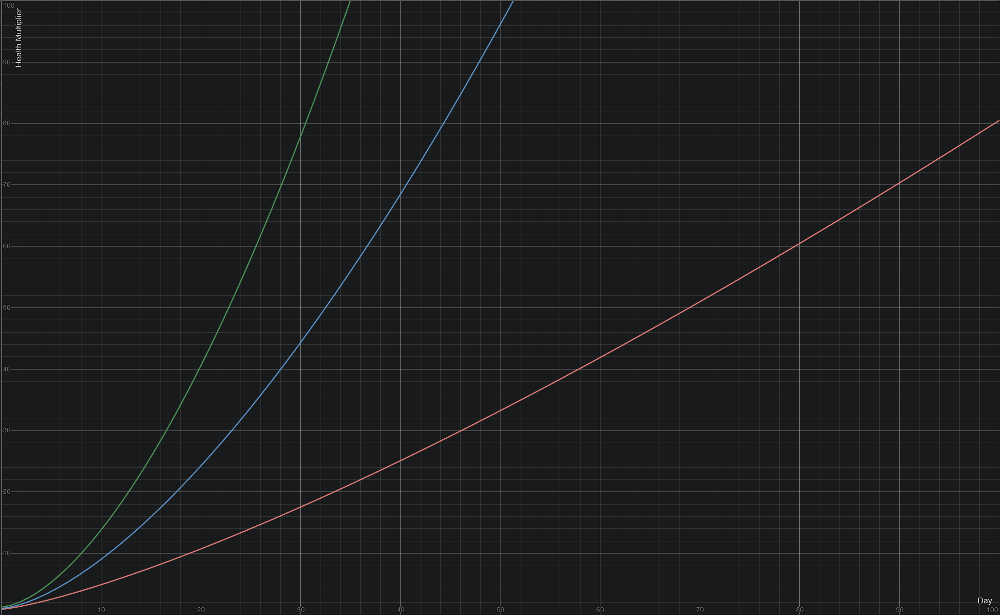

links not working? [go to hosted site][hosted-site]

# Table of Contents
- [Items by ID](#items-by-id)
- [Items by name](#items-by-name)
- [Items](#items)
- [Recipes](#recipes)
- [Armor Sets](#armor-sets)
- [Powerups by ID](#powerups-by-id)
- [Powerups by name](#powerups-by-name)
- [Powerups](#powerups)
- [Mobs](#mobs)
- [Woodman Trades](#woodman-trades)

# Items by ID
0. [Bark](#bark)
1. [Chest](#chest)
2. [Coal](#coal)
3. [Coin](#coin)
4. [Flint](#flint)
5. [Adamantite Boots](#adamantite-boots)
6. [Chunkium Boots](#chunkium-boots)
7. [Gold Boots](#gold-boots)
8. [Mithril Boots](#mithril-boots)
9. [Obamium Boots](#obamium-boots)
10. [Steel Boots](#steel-boots)
11. [Wolfskin Boots](#wolfskin-boots)
12. [Adamantite Helmet](#adamantite-helmet)
13. [Chunkium Helmet](#chunkium-helmet)
14. [Gold Helmet](#gold-helmet)
15. [Mithril Helmet](#mithril-helmet)
16. [Obamium Helmet](#obamium-helmet)
17. [Steel Helmet](#steel-helmet)
18. [Wolfskin Helmet](#wolfskin-helmet)
19. [Adamantite Pants](#adamantite-pants)
20. [Chunkium Pants](#chunkium-pants)
21. [Gold Pants](#gold-pants)
22. [Mithril Pants](#mithril-pants)
23. [Obamium Pants](#obamium-pants)
24. [Steel Pants](#steel-pants)
25. [Wolfskin Pants](#wolfskin-pants)
26. [Adamantite Chestplate](#adamantite-chestplate)
27. [Chunkium Chestplate](#chunkium-chestplate)
28. [Gold Chestplate](#gold-chestplate)
29. [Mithril Chestplate](#mithril-chestplate)
30. [Obamium Chestplate](#obamium-chestplate)
31. [Steel Chestplate](#steel-chestplate)
32. [Wolfskin Chestplate](#wolfskin-chestplate)
33. [Wood Doorway](#wood-doorway)
34. [Wood Doorway](#wood-doorway)
35. [Wood Floor](#wood-floor)
36. [Wood Pole](#wood-pole)
37. [Wood Pole](#wood-pole)
38. [Wood Roof](#wood-roof)
39. [Wood stairs](#wood-stairs)
40. [Wood stairs thinn](#wood-stairs-thinn)
41. [Wood Wall](#wood-wall)
42. [Wood Wall Half](#wood-wall-half)
43. [Wood Wall Tilted](#wood-wall-tilted)
44. [Torch](#torch)
45. [Red Apple](#red-apple)
46. [Bowl](#bowl)
47. [Dough](#dough)
48. [Flax Fibers](#flax-fibers)
49. [Flax](#flax)
50. [Raw Meat](#raw-meat)
51. [Gulpon Shroom](#gulpon-shroom)
52. [Ligon Shroom](#ligon-shroom)
53. [Slurbon Shroom](#slurbon-shroom)
54. [Sugon Shroom](#sugon-shroom)
55. [Wheat](#wheat)
56. [Bread](#bread)
57. [Cooked Meat](#cooked-meat)
58. [Apple Pie](#apple-pie)
59. [Meat Pie](#meat-pie)
60. [Meat Soup](#meat-soup)
61. [Purple Soup](#purple-soup)
62. [Red Soup](#red-soup)
63. [Weird Soup](#weird-soup)
64. [Yellow Soup](#yellow-soup)
65. [AncientCore](#ancientcore)
66. [Adamantite bar](#adamantite-bar)
67. [Chunkium bar](#chunkium-bar)
68. [Gold bar](#gold-bar)
69. [Iron bar](#iron-bar)
70. [Mithril bar](#mithril-bar)
71. [Obamium bar](#obamium-bar)
72. [Ancient Bone](#ancient-bone)
73. [Dragonball](#dragonball)
74. [Fireball](#fireball)
75. [Lightningball](#lightningball)
76. [Rock Projectile](#rock-projectile)
77. [Rock Projectile](#rock-projectile)
78. [Gronk Projectile](#gronk-projectile)
79. [Spike Attack](#spike-attack)
80. [Gronk Projectile](#gronk-projectile)
81. [Waterball](#waterball)
82. [Windball](#windball)
83. [Adamantite Ore](#adamantite-ore)
84. [Chunkium Ore](#chunkium-ore)
85. [Gold Ore](#gold-ore)
86. [Iron Ore](#iron-ore)
87. [Mithril Ore](#mithril-ore)
88. [Obamium Ore](#obamium-ore)
89. [Ruby](#ruby)
90. [Rock](#rock)
91. [Birch Wood](#birch-wood)
92. [Dark Oak Wood](#dark-oak-wood)
93. [Fir Wood](#fir-wood)
94. [Wood](#wood)
95. [Oak Wood](#oak-wood)
96. [Anvil](#anvil)
97. [Cauldron](#cauldron)
98. [Fletching Table](#fletching-table)
99. [Furnace](#furnace)
100. [Workbench](#workbench)
101. [Boat Map](#boat-map)
102. [Gem Map](#gem-map)
103. [Blue Gem](#blue-gem)
104. [Green Gem](#green-gem)
105. [Pink Gem](#pink-gem)
106. [Red Gem](#red-gem)
107. [Yellow Gem](#yellow-gem)
108. [Adamantite Axe](#adamantite-axe)
109. [Gold Axe](#gold-axe)
110. [Mithril Axe](#mithril-axe)
111. [Steel Axe](#steel-axe)
112. [Wood Axe](#wood-axe)
113. [Oak Bow](#oak-bow)
114. [Wood Bow](#wood-bow)
115. [Birch bow](#birch-bow)
116. [Fir bow](#fir-bow)
117. [Ancient Bow](#ancient-bow)
118. [Adamantite Pickaxe](#adamantite-pickaxe)
119. [Gold Pickaxe](#gold-pickaxe)
120. [Mithril Pickaxe](#mithril-pickaxe)
121. [Steel Pickaxe](#steel-pickaxe)
122. [Wood Pickaxe](#wood-pickaxe)
123. [Rope](#rope)
124. [Shovel](#shovel)
125. [Adamantite Sword](#adamantite-sword)
126. [Gold Sword](#gold-sword)
127. [Mithril Sword](#mithril-sword)
128. [Obamium Sword](#obamium-sword)
129. [Steel Sword](#steel-sword)
130. [milk](#milk)
131. [Adamantite Arrow](#adamantite-arrow)
132. [Fire arrow](#fire-arrow)
133. [Flint Arrow](#flint-arrow)
134. [Lightning Arrow](#lightning-arrow)
135. [Mithril Arrow](#mithril-arrow)
136. [Steel Arrow](#steel-arrow)
137. [Water Arrow](#water-arrow)
138. [Chiefs Spear](#chiefs-spear)
139. [Chunky Hammer](#chunky-hammer)
140. [Gronks Sword](#gronks-sword)
141. [Gronks Sword Projectile](#gronks-sword-projectile)
142. [Night Blade](#night-blade)
143. [Wyvern Dagger](#wyvern-dagger)
144. [Black Shard](#black-shard)
145. [Blade](#blade)
146. [Hammer Shaft](#hammer-shaft)
147. [Spear Tip](#spear-tip)
148. [Sword Hilt](#sword-hilt)
149. [Wolf Claws](#wolf-claws)
150. [Wolfskin](#wolfskin)
151. [Wyvern Claws](#wyvern-claws)

# Items by name
- [Adamantite Arrow](#adamantite-arrow)
- [Adamantite Axe](#adamantite-axe)
- [Adamantite bar](#adamantite-bar)
- [Adamantite Boots](#adamantite-boots)
- [Adamantite Chestplate](#adamantite-chestplate)
- [Adamantite Helmet](#adamantite-helmet)
- [Adamantite Ore](#adamantite-ore)
- [Adamantite Pants](#adamantite-pants)
- [Adamantite Pickaxe](#adamantite-pickaxe)
- [Adamantite Sword](#adamantite-sword)
- [Ancient Bone](#ancient-bone)
- [Ancient Bow](#ancient-bow)
- [AncientCore](#ancientcore)
- [Anvil](#anvil)
- [Apple Pie](#apple-pie)
- [Bark](#bark)
- [Birch bow](#birch-bow)
- [Birch Wood](#birch-wood)
- [Black Shard](#black-shard)
- [Blade](#blade)
- [Blue Gem](#blue-gem)
- [Boat Map](#boat-map)
- [Bowl](#bowl)
- [Bread](#bread)
- [Cauldron](#cauldron)
- [Chest](#chest)
- [Chiefs Spear](#chiefs-spear)
- [Chunkium bar](#chunkium-bar)
- [Chunkium Boots](#chunkium-boots)
- [Chunkium Chestplate](#chunkium-chestplate)
- [Chunkium Helmet](#chunkium-helmet)
- [Chunkium Ore](#chunkium-ore)
- [Chunkium Pants](#chunkium-pants)
- [Chunky Hammer](#chunky-hammer)
- [Coal](#coal)
- [Coin](#coin)
- [Cooked Meat](#cooked-meat)
- [Dark Oak Wood](#dark-oak-wood)
- [Dough](#dough)
- [Dragonball](#dragonball)
- [Fir bow](#fir-bow)
- [Fir Wood](#fir-wood)
- [Fire arrow](#fire-arrow)
- [Fireball](#fireball)
- [Flax](#flax)
- [Flax Fibers](#flax-fibers)
- [Fletching Table](#fletching-table)
- [Flint](#flint)
- [Flint Arrow](#flint-arrow)
- [Furnace](#furnace)
- [Gem Map](#gem-map)
- [Gold Axe](#gold-axe)
- [Gold bar](#gold-bar)
- [Gold Boots](#gold-boots)
- [Gold Chestplate](#gold-chestplate)
- [Gold Helmet](#gold-helmet)
- [Gold Ore](#gold-ore)
- [Gold Pants](#gold-pants)
- [Gold Pickaxe](#gold-pickaxe)
- [Gold Sword](#gold-sword)
- [Green Gem](#green-gem)
- [Gronk Projectile](#gronk-projectile)
- [Gronk Projectile](#gronk-projectile)
- [Gronks Sword](#gronks-sword)
- [Gronks Sword Projectile](#gronks-sword-projectile)
- [Gulpon Shroom](#gulpon-shroom)
- [Hammer Shaft](#hammer-shaft)
- [Iron bar](#iron-bar)
- [Iron Ore](#iron-ore)
- [Lightning Arrow](#lightning-arrow)
- [Lightningball](#lightningball)
- [Ligon Shroom](#ligon-shroom)
- [Meat Pie](#meat-pie)
- [Meat Soup](#meat-soup)
- [milk](#milk)
- [Mithril Arrow](#mithril-arrow)
- [Mithril Axe](#mithril-axe)
- [Mithril bar](#mithril-bar)
- [Mithril Boots](#mithril-boots)
- [Mithril Chestplate](#mithril-chestplate)
- [Mithril Helmet](#mithril-helmet)
- [Mithril Ore](#mithril-ore)
- [Mithril Pants](#mithril-pants)
- [Mithril Pickaxe](#mithril-pickaxe)
- [Mithril Sword](#mithril-sword)
- [Night Blade](#night-blade)
- [Oak Bow](#oak-bow)
- [Oak Wood](#oak-wood)
- [Obamium bar](#obamium-bar)
- [Obamium Boots](#obamium-boots)
- [Obamium Chestplate](#obamium-chestplate)
- [Obamium Helmet](#obamium-helmet)
- [Obamium Ore](#obamium-ore)
- [Obamium Pants](#obamium-pants)
- [Obamium Sword](#obamium-sword)
- [Pink Gem](#pink-gem)
- [Purple Soup](#purple-soup)
- [Raw Meat](#raw-meat)
- [Red Apple](#red-apple)
- [Red Gem](#red-gem)
- [Red Soup](#red-soup)
- [Rock](#rock)
- [Rock Projectile](#rock-projectile)
- [Rock Projectile](#rock-projectile)
- [Rope](#rope)
- [Ruby](#ruby)
- [Shovel](#shovel)
- [Slurbon Shroom](#slurbon-shroom)
- [Spear Tip](#spear-tip)
- [Spike Attack](#spike-attack)
- [Steel Arrow](#steel-arrow)
- [Steel Axe](#steel-axe)
- [Steel Boots](#steel-boots)
- [Steel Chestplate](#steel-chestplate)
- [Steel Helmet](#steel-helmet)
- [Steel Pants](#steel-pants)
- [Steel Pickaxe](#steel-pickaxe)
- [Steel Sword](#steel-sword)
- [Sugon Shroom](#sugon-shroom)
- [Sword Hilt](#sword-hilt)
- [Torch](#torch)
- [Water Arrow](#water-arrow)
- [Waterball](#waterball)
- [Weird Soup](#weird-soup)
- [Wheat](#wheat)
- [Windball](#windball)
- [Wolf Claws](#wolf-claws)
- [Wolfskin](#wolfskin)
- [Wolfskin Boots](#wolfskin-boots)
- [Wolfskin Chestplate](#wolfskin-chestplate)
- [Wolfskin Helmet](#wolfskin-helmet)
- [Wolfskin Pants](#wolfskin-pants)
- [Wood](#wood)
- [Wood Axe](#wood-axe)
- [Wood Bow](#wood-bow)
- [Wood Doorway](#wood-doorway)
- [Wood Doorway](#wood-doorway)
- [Wood Floor](#wood-floor)
- [Wood Pickaxe](#wood-pickaxe)
- [Wood Pole](#wood-pole)
- [Wood Pole](#wood-pole)
- [Wood Roof](#wood-roof)
- [Wood stairs](#wood-stairs)
- [Wood stairs thinn](#wood-stairs-thinn)
- [Wood Wall](#wood-wall)
- [Wood Wall Half](#wood-wall-half)
- [Wood Wall Tilted](#wood-wall-tilted)
- [Workbench](#workbench)
- [Wyvern Claws](#wyvern-claws)
- [Wyvern Dagger](#wyvern-dagger)
- [Yellow Gem](#yellow-gem)
- [Yellow Soup](#yellow-soup)

# Items
### Adamantite Arrow
*Green arrow*

![item-131]
- Type: Item
- Tag: Arrow
- Rarity: Common
- Stackable: 999
#### Weapon
- Resource Damage: 1
- Attack Damage: 70
- Attack Speed: 0.3
- DPS: 21
- Attack Range: 0
- Sharpness: 0.8
#### Crafting: Gives 4 Adamantite Arrow
- 2 [Oak Wood](#oak-wood)
- 1 [Adamantite bar](#adamantite-bar)

---

### Adamantite Axe
*its axe*

![item-108]
- Type: Axe
- Tier: Adamantite
- Rarity: Common
- Stackable: No
#### Weapon
- Resource Damage: 50
- Attack Damage: 40
- Attack Speed: 1
- DPS: 40
- Attack Range: 0
- Sharpness: 0.8
#### Crafting: Gives 1 Adamantite Axe
- 5 [Adamantite bar](#adamantite-bar)
- 5 [Bark](#bark)
- 10 [Oak Wood](#oak-wood)

---

### Adamantite bar
*block of adamantite*

![item-66]
- Type: Item
- Rarity: Common
- Stackable: Yes
#### Weapon
- Resource Damage: 1
- Attack Damage: 1
- Attack Speed: 0.7
- DPS: 0.7
- Attack Range: 0
- Sharpness: 0
#### Smelting: Gives 1 Adamantite bar
- Takes 15 seconds
- Made in Furnace
- Needs 1 [Adamantite Ore](#adamantite-ore)
#### Ingredient For:
- [Adamantite Boots](#adamantite-boots)
- [Adamantite Helmet](#adamantite-helmet)
- [Adamantite Pants](#adamantite-pants)
- [Adamantite Chestplate](#adamantite-chestplate)
- [Adamantite Axe](#adamantite-axe)
- [Adamantite Pickaxe](#adamantite-pickaxe)
- [Adamantite Sword](#adamantite-sword)
- [Adamantite Arrow](#adamantite-arrow)

---

### Adamantite Boots
*it protecc foot*

![item-5]
- Type: Item
- Tag: Feet
- Rarity: Common
- Stackable: No
- +6 armor
- Armor Set: None
#### Weapon
- Resource Damage: 1
- Attack Damage: 1
- Attack Speed: 1
- DPS: 1
- Attack Range: 0
- Sharpness: 1
#### Crafting: Gives 1 Adamantite Boots
- 5 [Adamantite bar](#adamantite-bar)

---

### Adamantite Chestplate
*it protecc chest*

![item-26]
- Type: Item
- Tag: Torso
- Rarity: Common
- Stackable: No
- +18 armor
- Armor Set: None
#### Weapon
- Resource Damage: 1
- Attack Damage: 1
- Attack Speed: 1
- DPS: 1
- Attack Range: 0
- Sharpness: 1
#### Crafting: Gives 1 Adamantite Chestplate
- 15 [Adamantite bar](#adamantite-bar)

---

### Adamantite Helmet
*it protecc head*

![item-12]
- Type: Item
- Tag: Helmet
- Rarity: Common
- Stackable: No
- +8 armor
- Armor Set: None
#### Weapon
- Resource Damage: 1
- Attack Damage: 1
- Attack Speed: 1
- DPS: 1
- Attack Range: 0
- Sharpness: 1
#### Crafting: Gives 1 Adamantite Helmet
- 5 [Adamantite bar](#adamantite-bar)

---

### Adamantite Ore
*its hard rock*

![item-83]
- Type: Axe
- Tier: None
- Rarity: Common
- Stackable: Yes
#### Weapon
- Resource Damage: 1
- Attack Damage: 1
- Attack Speed: 0.7
- DPS: 0.7
- Attack Range: 0
- Sharpness: 0
#### Ingredient For:
- [Adamantite bar](#adamantite-bar)

---

### Adamantite Pants
*it protecc leg*

![item-19]
- Type: Item
- Tag: Legs
- Rarity: Common
- Stackable: No
- +14 armor
- Armor Set: None
#### Weapon
- Resource Damage: 1
- Attack Damage: 1
- Attack Speed: 1
- DPS: 1
- Attack Range: 0
- Sharpness: 1
#### Crafting: Gives 1 Adamantite Pants
- 15 [Adamantite bar](#adamantite-bar)

---

### Adamantite Pickaxe
*its pickaxe*

![item-118]
- Type: Pickaxe
- Tier: Adamantite
- Rarity: Common
- Stackable: No
#### Weapon
- Resource Damage: 40
- Attack Damage: 40
- Attack Speed: 0.8
- DPS: 32
- Attack Range: 0
- Sharpness: 0.2
#### Crafting: Gives 1 Adamantite Pickaxe
- 5 [Adamantite bar](#adamantite-bar)
- 5 [Bark](#bark)
- 10 [Oak Wood](#oak-wood)

---

### Adamantite Sword
*its sharp*

![item-125]
- Type: Sword
- Rarity: Common
- Stackable: No
#### Weapon
- Resource Damage: 1
- Attack Damage: 50
- Attack Speed: 1.4
- DPS: 70
- Attack Range: 0
- Sharpness: 1
#### Crafting: Gives 1 Adamantite Sword
- 5 [Adamantite bar](#adamantite-bar)
- 5 [Oak Wood](#oak-wood)

---

### Anvil
*chonky metal station*

![item-96]
- Type: Station
- Rarity: Common
- Stackable: Yes
- Buildable
#### Weapon
- Resource Damage: 1
- Attack Damage: 10
- Attack Speed: 1
- DPS: 10
- Attack Range: 0
- Sharpness: 0
#### Crafting: Gives 1 Anvil
- 5 [Iron bar](#iron-bar)
- 15 [Rock](#rock)

---

### Apple Pie
*pie with apple*

![item-58]
- Type: Food
- Tag: Food
- Rarity: Common
- Stackable: Yes
#### Food
- Health: 30
- Hunger: 60
- Stamina: 20
#### Weapon
- Resource Damage: 1
- Attack Damage: 1
- Attack Speed: 1
- DPS: 1
- Attack Range: 0
- Sharpness: 0
#### Cooking: Gives 1 Apple Pie
- Takes 5 seconds
- Made in Cauldron
- Needs 1 [Bowl](#bowl)
- Needs 1 [Red Apple](#red-apple)
- Needs 1 [Dough](#dough)

---

### Bark
*its wood but bark*

![item-0]
- Type: Item
- Rarity: Common
- Stackable: Yes
#### Weapon
- Resource Damage: 1
- Attack Damage: 1
- Attack Speed: 2
- DPS: 2
- Attack Range: 0
- Sharpness: 0
#### Crafting: Gives 5 Bark
- 5 [Wood](#wood)
#### Ingredient For:
- [Adamantite Axe](#adamantite-axe)
- [Gold Axe](#gold-axe)
- [Mithril Axe](#mithril-axe)
- [Steel Axe](#steel-axe)
- [Wood Axe](#wood-axe)
- [Adamantite Pickaxe](#adamantite-pickaxe)
- [Gold Pickaxe](#gold-pickaxe)
- [Mithril Pickaxe](#mithril-pickaxe)
- [Steel Pickaxe](#steel-pickaxe)
- [Wood Pickaxe](#wood-pickaxe)
- [Rope](#rope)

---

### Birch bow
*bitch boi*

![item-115]
- Type: Bow
- Rarity: Common
- Stackable: No
#### Bow
- Projectile Speed: 20
- Arrows per shot: 1
#### Crafting: Gives 1 Birch bow
- 10 [Birch Wood](#birch-wood)
- 1 [Rope](#rope)

---

### Birch Wood
*its bitch wood*

![item-91]
- Type: Item
- Tag: Fuel
- Rarity: Common
- Stackable: Yes
- Fuel: 1 items
- Fuel Speed: 1x
#### Weapon
- Resource Damage: 1
- Attack Damage: 1
- Attack Speed: 2
- DPS: 2
- Attack Range: 0
- Sharpness: 0
#### Ingredient For:
- [Fletching Table](#fletching-table)
- [Steel Axe](#steel-axe)
- [Birch bow](#birch-bow)
- [Steel Pickaxe](#steel-pickaxe)
- [Steel Sword](#steel-sword)
- [Steel Arrow](#steel-arrow)

---

### Boat Map
*Something important is marked on this map..*

![item-101]
- Type: Item
- Rarity: Common
- Stackable: Yes
#### Weapon
- Resource Damage: 0
- Attack Damage: 0
- Attack Speed: 1
- DPS: 0
- Attack Range: 0
- Sharpness: 0

---

### Bowl
*its bowl*

![item-46]
- Type: Food
- Rarity: Common
- Stackable: Yes
#### Weapon
- Resource Damage: 1
- Attack Damage: 1
- Attack Speed: 1
- DPS: 1
- Attack Range: 0
- Sharpness: 0
#### Crafting: Gives 1 Bowl
- 1 [Wood](#wood)
#### Ingredient For:
- [Apple Pie](#apple-pie)
- [Meat Pie](#meat-pie)
- [Meat Soup](#meat-soup)
- [Purple Soup](#purple-soup)
- [Red Soup](#red-soup)
- [Weird Soup](#weird-soup)
- [Yellow Soup](#yellow-soup)

---

### Bread
*lets get this bread*

![item-56]
- Type: Item
- Tag: Food
- Rarity: Common
- Stackable: Yes
#### Food
- Health: 25
- Hunger: 25
- Stamina: 25
#### Weapon
- Resource Damage: 1
- Attack Damage: 1
- Attack Speed: 1
- DPS: 1
- Attack Range: 0
- Sharpness: 0
#### Cooking: Gives 1 Bread
- Takes 5 seconds
- Made in Cauldron
- Needs 1 [Dough](#dough)

---

### Cauldron
*food go brr*

![item-97]
- Type: Storage
- Rarity: Common
- Stackable: Yes
- Buildable
#### Weapon
- Resource Damage: 1
- Attack Damage: 1
- Attack Speed: 2
- DPS: 2
- Attack Range: 0
- Sharpness: 0
#### Crafting: Gives 1 Cauldron
- 10 [Wood](#wood)
- 10 [Rock](#rock)

---

### Chest
*store thing in it*

![item-1]
- Type: Storage
- Rarity: Common
- Stackable: Yes
- Buildable
#### Weapon
- Resource Damage: 1
- Attack Damage: 1
- Attack Speed: 2
- DPS: 2
- Attack Range: 0
- Sharpness: 0
#### Crafting: Gives 1 Chest
- 20 [Wood](#wood)
- 10 [Rock](#rock)

---

### Coal
*its flamable rock*

![item-2]
- Type: Item
- Tag: Fuel
- Rarity: Common
- Stackable: Yes
- Fuel: 2 items
- Fuel Speed: 1.25x
#### Weapon
- Resource Damage: 1
- Attack Damage: 1
- Attack Speed: 1.2
- DPS: 1.2
- Attack Range: 0
- Sharpness: 0
#### Ingredient For:
- [Torch](#torch)

---

### Coin
*shiny*

![item-3]
- Type: Item
- Rarity: Common
- Stackable: 99999
#### Weapon
- Resource Damage: 0
- Attack Damage: 0
- Attack Speed: 1
- DPS: 0
- Attack Range: 0
- Sharpness: 0
#### Crafting: Gives 5 Coin
- 1 [Gold bar](#gold-bar)

---

### Cooked Meat
*yummy*

![item-57]
- Type: Food
- Tag: Food
- Rarity: Common
- Stackable: Yes
#### Food
- Health: 20
- Hunger: 50
- Stamina: 5
#### Weapon
- Resource Damage: 1
- Attack Damage: 1
- Attack Speed: 1
- DPS: 1
- Attack Range: 0
- Sharpness: 0
#### Cooking: Gives 1 Cooked Meat
- Takes 5 seconds
- Made in Cauldron
- Needs 1 [Raw Meat](#raw-meat)

---

### Dough
*looks yummy*

![item-47]
- Type: Item
- Rarity: Common
- Stackable: Yes
#### Weapon
- Resource Damage: 1
- Attack Damage: 1
- Attack Speed: 1
- DPS: 1
- Attack Range: 0
- Sharpness: 0
#### Crafting: Gives 1 Dough
- 5 [Wheat](#wheat)
#### Ingredient For:
- [Bread](#bread)
- [Apple Pie](#apple-pie)
- [Meat Pie](#meat-pie)

---

### Fir bow
*Bow*

![item-116]
- Type: Bow
- Rarity: Common
- Stackable: No
#### Bow
- Projectile Speed: 30
- Arrows per shot: 1
#### Crafting: Gives 1 Fir bow
- 10 [Fir Wood](#fir-wood)
- 1 [Rope](#rope)

---

### Fir Wood
*its fir wood*

![item-93]
- Type: Item
- Tag: Fuel
- Rarity: Common
- Stackable: Yes
- Fuel: 1 items
- Fuel Speed: 1x
#### Weapon
- Resource Damage: 1
- Attack Damage: 1
- Attack Speed: 2
- DPS: 2
- Attack Range: 0
- Sharpness: 0
#### Ingredient For:
- [Mithril Axe](#mithril-axe)
- [Fir bow](#fir-bow)
- [Mithril Pickaxe](#mithril-pickaxe)
- [Mithril Sword](#mithril-sword)
- [Mithril Arrow](#mithril-arrow)

---

### Flax
*This could make for some strong fiber*

![item-49]
- Type: Item
- Rarity: Common
- Stackable: Yes
#### Weapon
- Resource Damage: 1
- Attack Damage: 1
- Attack Speed: 1
- DPS: 1
- Attack Range: 0
- Sharpness: 0
#### Ingredient For:
- [Flax Fibers](#flax-fibers)

---

### Flax Fibers
*This looks pretty strong*

![item-48]
- Type: Item
- Rarity: Common
- Stackable: Yes
#### Weapon
- Resource Damage: 1
- Attack Damage: 1
- Attack Speed: 1
- DPS: 1
- Attack Range: 0
- Sharpness: 0
#### Crafting: Gives 1 Flax Fibers
- 1 [Flax](#flax)
#### Ingredient For:
- [Wolfskin Boots](#wolfskin-boots)
- [Wolfskin Helmet](#wolfskin-helmet)
- [Wolfskin Pants](#wolfskin-pants)
- [Wolfskin Chestplate](#wolfskin-chestplate)

---

### Fletching Table
*fletch*

![item-98]
- Type: Station
- Rarity: Common
- Stackable: Yes
- Buildable
#### Weapon
- Resource Damage: 1
- Attack Damage: 1
- Attack Speed: 1
- DPS: 1
- Attack Range: 0
- Sharpness: 0
#### Crafting: Gives 1 Fletching Table
- 25 [Birch Wood](#birch-wood)
- 10 [Flint](#flint)

---

### Flint
*its rock but make fire*

![item-4]
- Type: Item
- Rarity: Common
- Stackable: Yes
#### Weapon
- Resource Damage: 1
- Attack Damage: 1
- Attack Speed: 1.5
- DPS: 1.5
- Attack Range: 0
- Sharpness: 0.7
#### Ingredient For:
- [Fletching Table](#fletching-table)
- [Flint Arrow](#flint-arrow)

---

### Flint Arrow
*kinda wacky, but gets the job done ig*

![item-133]
- Type: Item
- Tag: Arrow
- Rarity: Common
- Stackable: 999
#### Weapon
- Resource Damage: 1
- Attack Damage: 25
- Attack Speed: 1
- DPS: 25
- Attack Range: 0
- Sharpness: 0.8
#### Crafting: Gives 4 Flint Arrow
- 2 [Wood](#wood)
- 1 [Flint](#flint)

---

### Furnace
*it go melt*

![item-99]
- Type: Storage
- Rarity: Common
- Stackable: Yes
- Buildable
#### Weapon
- Resource Damage: 1
- Attack Damage: 1
- Attack Speed: 1
- DPS: 1
- Attack Range: 0
- Sharpness: 0
#### Crafting: Gives 1 Furnace
- 15 [Rock](#rock)

---

### Gem Map
*Something important is marked on this map..*

![item-102]
- Type: Item
- Rarity: Common
- Stackable: Yes
#### Weapon
- Resource Damage: 0
- Attack Damage: 0
- Attack Speed: 1
- DPS: 0
- Attack Range: 0
- Sharpness: 0

---

### Gold Axe
*its axe*

![item-109]
- Type: Axe
- Tier: Steel
- Rarity: Common
- Stackable: No
#### Weapon
- Resource Damage: 22
- Attack Damage: 15
- Attack Speed: 1.1
- DPS: 16.5
- Attack Range: 0
- Sharpness: 0.8
#### Crafting: Gives 1 Gold Axe
- 5 [Gold bar](#gold-bar)
- 5 [Bark](#bark)
- 10 [Wood](#wood)

---

### Gold bar
*block of gold*

![item-68]
- Type: Item
- Rarity: Common
- Stackable: Yes
#### Weapon
- Resource Damage: 1
- Attack Damage: 1
- Attack Speed: 0.7
- DPS: 0.7
- Attack Range: 0
- Sharpness: 0
#### Smelting: Gives 1 Gold bar
- Takes 4 seconds
- Made in Furnace
- Needs 1 [Gold Ore](#gold-ore)
#### Ingredient For:
- [Coin](#coin)
- [Gold Boots](#gold-boots)
- [Gold Helmet](#gold-helmet)
- [Gold Pants](#gold-pants)
- [Gold Chestplate](#gold-chestplate)
- [Gold Axe](#gold-axe)
- [Gold Pickaxe](#gold-pickaxe)
- [Gold Sword](#gold-sword)

---

### Gold Boots
*it protecc foot*

![item-7]
- Type: Item
- Tag: Feet
- Rarity: Common
- Stackable: No
- +2 armor
- Armor Set: None
#### Weapon
- Resource Damage: 1
- Attack Damage: 1
- Attack Speed: 1
- DPS: 1
- Attack Range: 0
- Sharpness: 1
#### Crafting: Gives 1 Gold Boots
- 5 [Gold bar](#gold-bar)

---

### Gold Chestplate
*it protecc chest*

![item-28]
- Type: Item
- Tag: Torso
- Rarity: Common
- Stackable: No
- +8 armor
- Armor Set: None
#### Weapon
- Resource Damage: 1
- Attack Damage: 1
- Attack Speed: 1
- DPS: 1
- Attack Range: 0
- Sharpness: 1
#### Crafting: Gives 1 Gold Chestplate
- 15 [Gold bar](#gold-bar)

---

### Gold Helmet
*it protecc head*

![item-14]
- Type: Item
- Tag: Helmet
- Rarity: Common
- Stackable: No
- +3 armor
- Armor Set: None
#### Weapon
- Resource Damage: 1
- Attack Damage: 1
- Attack Speed: 1
- DPS: 1
- Attack Range: 0
- Sharpness: 1
#### Crafting: Gives 1 Gold Helmet
- 5 [Gold bar](#gold-bar)

---

### Gold Ore
*its hard rock*

![item-85]
- Type: Axe
- Tier: None
- Rarity: Common
- Stackable: Yes
#### Weapon
- Resource Damage: 1
- Attack Damage: 1
- Attack Speed: 0.7
- DPS: 0.7
- Attack Range: 0
- Sharpness: 0
#### Ingredient For:
- [Gold bar](#gold-bar)

---

### Gold Pants
*it protecc leg*

![item-21]
- Type: Item
- Tag: Legs
- Rarity: Common
- Stackable: No
- +6 armor
- Armor Set: None
#### Weapon
- Resource Damage: 1
- Attack Damage: 1
- Attack Speed: 1
- DPS: 1
- Attack Range: 0
- Sharpness: 1
#### Crafting: Gives 1 Gold Pants
- 15 [Gold bar](#gold-bar)

---

### Gold Pickaxe
*its pickaxe*

![item-119]
- Type: Pickaxe
- Tier: Wood
- Rarity: Common
- Stackable: No
#### Weapon
- Resource Damage: 22
- Attack Damage: 24
- Attack Speed: 0.9
- DPS: 21.6
- Attack Range: 0
- Sharpness: 0.2
#### Crafting: Gives 1 Gold Pickaxe
- 5 [Gold bar](#gold-bar)
- 5 [Bark](#bark)
- 5 [Wood](#wood)

---

### Gold Sword
*its sharp*

![item-126]
- Type: Sword
- Rarity: Common
- Stackable: No
#### Weapon
- Resource Damage: 1
- Attack Damage: 15
- Attack Speed: 1.6
- DPS: 24
- Attack Range: 0
- Sharpness: 0.9
#### Crafting: Gives 1 Gold Sword
- 5 [Gold bar](#gold-bar)
- 5 [Wood](#wood)

---

### Gronk Projectile
*I shouldn't have this*

![item-78]
- Type: Item
- Rarity: Common
- Stackable: Yes
#### Bow
- Projectile Speed: 3.6
- Arrows per shot: 1

---

### Gronk Projectile
*I shouldn't have this*

![item-80]
- Type: Item
- Rarity: Common
- Stackable: Yes
#### Bow
- Projectile Speed: 3
- Arrows per shot: 1

---

### Gulpon Shroom
*yummy*

![item-51]
- Type: Food
- Tag: Food
- Rarity: Common
- Stackable: Yes
#### Food
- Health: 12
- Hunger: 0
- Stamina: 0
#### Weapon
- Resource Damage: 1
- Attack Damage: 1
- Attack Speed: 1
- DPS: 1
- Attack Range: 0
- Sharpness: 0
#### Ingredient For:
- [Red Soup](#red-soup)

---

### Iron bar
*block of iron*

![item-69]
- Type: Item
- Rarity: Common
- Stackable: Yes
#### Weapon
- Resource Damage: 1
- Attack Damage: 1
- Attack Speed: 0.7
- DPS: 0.7
- Attack Range: 0
- Sharpness: 0
#### Smelting: Gives 1 Iron bar
- Takes 6 seconds
- Made in Furnace
- Needs 1 [Iron Ore](#iron-ore)
#### Ingredient For:
- [Steel Boots](#steel-boots)
- [Steel Helmet](#steel-helmet)
- [Steel Pants](#steel-pants)
- [Steel Chestplate](#steel-chestplate)
- [Anvil](#anvil)
- [Steel Axe](#steel-axe)
- [Steel Pickaxe](#steel-pickaxe)
- [Steel Sword](#steel-sword)
- [Steel Arrow](#steel-arrow)

---

### Iron Ore
*its hard rock*

![item-86]
- Type: Axe
- Tier: None
- Rarity: Common
- Stackable: Yes
#### Weapon
- Resource Damage: 1
- Attack Damage: 1
- Attack Speed: 0.7
- DPS: 0.7
- Attack Range: 0
- Sharpness: 0
#### Ingredient For:
- [Iron bar](#iron-bar)

---

### Ligon Shroom
*yummy*

![item-52]
- Type: Food
- Tag: Food
- Rarity: Common
- Stackable: Yes
#### Food
- Health: 0
- Hunger: 12
- Stamina: 0
#### Weapon
- Resource Damage: 1
- Attack Damage: 1
- Attack Speed: 1
- DPS: 1
- Attack Range: 0
- Sharpness: 0
#### Ingredient For:
- [Yellow Soup](#yellow-soup)

---

### Meat Pie
*yummy*

![item-59]
- Type: Food
- Tag: Food
- Rarity: Common
- Stackable: Yes
#### Food
- Health: 30
- Hunger: 60
- Stamina: 20
#### Weapon
- Resource Damage: 1
- Attack Damage: 1
- Attack Speed: 1
- DPS: 1
- Attack Range: 0
- Sharpness: 0
#### Cooking: Gives 1 Meat Pie
- Takes 5 seconds
- Made in Cauldron
- Needs 1 [Bowl](#bowl)
- Needs 1 [Raw Meat](#raw-meat)
- Needs 1 [Dough](#dough)

---

### Meat Soup
*yummy*

![item-60]
- Type: Food
- Tag: Food
- Rarity: Common
- Stackable: Yes
#### Food
- Health: 30
- Hunger: 50
- Stamina: 20
#### Weapon
- Resource Damage: 1
- Attack Damage: 1
- Attack Speed: 1
- DPS: 1
- Attack Range: 0
- Sharpness: 0
#### Cooking: Gives 1 Meat Soup
- Takes 5 seconds
- Made in Cauldron
- Needs 1 [Bowl](#bowl)
- Needs 1 [Raw Meat](#raw-meat)

---

### milk
*testing item lol*

![item-130]
- Type: Axe
- Tier: Milk
- Rarity: Common
- Stackable: No
#### Weapon
- Resource Damage: 500
- Attack Damage: 15
- Attack Speed: 1.5
- DPS: 22.5
- Attack Range: 0
- Sharpness: 1

---

### Mithril Arrow
*Sharp arrow*

![item-135]
- Type: Item
- Tag: Arrow
- Rarity: Common
- Stackable: 999
#### Weapon
- Resource Damage: 1
- Attack Damage: 45
- Attack Speed: 1
- DPS: 45
- Attack Range: 0
- Sharpness: 0.8
#### Crafting: Gives 4 Mithril Arrow
- 2 [Fir Wood](#fir-wood)
- 1 [Mithril bar](#mithril-bar)

---

### Mithril Axe
*its axe*

![item-110]
- Type: Axe
- Tier: Mithril
- Rarity: Common
- Stackable: No
#### Weapon
- Resource Damage: 35
- Attack Damage: 25
- Attack Speed: 0.95
- DPS: 23.75
- Attack Range: 0
- Sharpness: 0.8
#### Crafting: Gives 1 Mithril Axe
- 5 [Mithril bar](#mithril-bar)
- 5 [Bark](#bark)
- 10 [Fir Wood](#fir-wood)

---

### Mithril bar
*block of mithril*

![item-70]
- Type: Item
- Rarity: Common
- Stackable: Yes
#### Weapon
- Resource Damage: 1
- Attack Damage: 1
- Attack Speed: 0.7
- DPS: 0.7
- Attack Range: 0
- Sharpness: 0
#### Smelting: Gives 1 Mithril bar
- Takes 10 seconds
- Made in Furnace
- Needs 1 [Mithril Ore](#mithril-ore)
#### Ingredient For:
- [Mithril Boots](#mithril-boots)
- [Mithril Helmet](#mithril-helmet)
- [Mithril Pants](#mithril-pants)
- [Mithril Chestplate](#mithril-chestplate)
- [Mithril Axe](#mithril-axe)
- [Mithril Pickaxe](#mithril-pickaxe)
- [Mithril Sword](#mithril-sword)
- [Mithril Arrow](#mithril-arrow)

---

### Mithril Boots
*it protecc foot*

![item-8]
- Type: Item
- Tag: Feet
- Rarity: Common
- Stackable: No
- +4 armor
- Armor Set: None
#### Weapon
- Resource Damage: 1
- Attack Damage: 1
- Attack Speed: 1
- DPS: 1
- Attack Range: 0
- Sharpness: 1
#### Crafting: Gives 1 Mithril Boots
- 5 [Mithril bar](#mithril-bar)

---

### Mithril Chestplate
*it protecc chest*

![item-29]
- Type: Item
- Tag: Torso
- Rarity: Common
- Stackable: No
- +14 armor
- Armor Set: None
#### Weapon
- Resource Damage: 1
- Attack Damage: 1
- Attack Speed: 1
- DPS: 1
- Attack Range: 0
- Sharpness: 1
#### Crafting: Gives 1 Mithril Chestplate
- 20 [Mithril bar](#mithril-bar)

---

### Mithril Helmet
*it protecc head*

![item-15]
- Type: Item
- Tag: Helmet
- Rarity: Common
- Stackable: No
- +6 armor
- Armor Set: None
#### Weapon
- Resource Damage: 1
- Attack Damage: 1
- Attack Speed: 1
- DPS: 1
- Attack Range: 0
- Sharpness: 1
#### Crafting: Gives 1 Mithril Helmet
- 5 [Mithril bar](#mithril-bar)

---

### Mithril Ore
*its hard rock*

![item-87]
- Type: Axe
- Tier: None
- Rarity: Common
- Stackable: Yes
#### Weapon
- Resource Damage: 1
- Attack Damage: 1
- Attack Speed: 0.7
- DPS: 0.7
- Attack Range: 0
- Sharpness: 0
#### Ingredient For:
- [Mithril bar](#mithril-bar)

---

### Mithril Pants
*it protecc leg*

![item-22]
- Type: Item
- Tag: Legs
- Rarity: Common
- Stackable: No
- +11 armor
- Armor Set: None
#### Weapon
- Resource Damage: 1
- Attack Damage: 1
- Attack Speed: 1
- DPS: 1
- Attack Range: 0
- Sharpness: 1
#### Crafting: Gives 1 Mithril Pants
- 15 [Mithril bar](#mithril-bar)

---

### Mithril Pickaxe
*its pickaxe*

![item-120]
- Type: Pickaxe
- Tier: Steel
- Rarity: Common
- Stackable: No
#### Weapon
- Resource Damage: 32
- Attack Damage: 30
- Attack Speed: 0.8
- DPS: 24
- Attack Range: 0
- Sharpness: 0.2
#### Crafting: Gives 1 Mithril Pickaxe
- 5 [Mithril bar](#mithril-bar)
- 5 [Bark](#bark)
- 10 [Fir Wood](#fir-wood)

---

### Mithril Sword
*its sharp*

![item-127]
- Type: Sword
- Rarity: Common
- Stackable: No
#### Weapon
- Resource Damage: 1
- Attack Damage: 35
- Attack Speed: 1.4
- DPS: 49
- Attack Range: 0
- Sharpness: 1
#### Crafting: Gives 1 Mithril Sword
- 5 [Mithril bar](#mithril-bar)
- 5 [Fir Wood](#fir-wood)

---

### Oak Bow
*This bow looks sick*

![item-113]
- Type: Bow
- Rarity: Common
- Stackable: No
#### Bow
- Projectile Speed: 50
- Arrows per shot: 1
#### Crafting: Gives 1 Oak Bow
- 5 [Oak Wood](#oak-wood)
- 1 [Rope](#rope)

---

### Oak Wood
*its oak wood*

![item-95]
- Type: Item
- Tag: Fuel
- Rarity: Common
- Stackable: Yes
- Fuel: 1 items
- Fuel Speed: 1x
#### Weapon
- Resource Damage: 1
- Attack Damage: 1
- Attack Speed: 2
- DPS: 2
- Attack Range: 0
- Sharpness: 0
#### Ingredient For:
- [Adamantite Axe](#adamantite-axe)
- [Oak Bow](#oak-bow)
- [Adamantite Pickaxe](#adamantite-pickaxe)
- [Adamantite Sword](#adamantite-sword)
- [Adamantite Arrow](#adamantite-arrow)
- [Wyvern Dagger](#wyvern-dagger)

---

### Obamium Boots
*it protecc foot*

![item-9]
- Type: Item
- Tag: Feet
- Rarity: Common
- Stackable: No
- +7 armor
- Armor Set: None
#### Weapon
- Resource Damage: 1
- Attack Damage: 1
- Attack Speed: 1
- DPS: 1
- Attack Range: 0
- Sharpness: 1
#### Crafting: Gives 1 Obamium Boots
- 5 [Obamium bar](#obamium-bar)

---

### Obamium Chestplate
*it protecc chest*

![item-30]
- Type: Item
- Tag: Torso
- Rarity: Common
- Stackable: No
- +20 armor
- Armor Set: None
#### Weapon
- Resource Damage: 1
- Attack Damage: 1
- Attack Speed: 1
- DPS: 1
- Attack Range: 0
- Sharpness: 1
#### Crafting: Gives 1 Obamium Chestplate
- 15 [Obamium bar](#obamium-bar)

---

### Obamium Helmet
*it protecc head*

![item-16]
- Type: Item
- Tag: Helmet
- Rarity: Common
- Stackable: No
- +9 armor
- Armor Set: None
#### Weapon
- Resource Damage: 1
- Attack Damage: 1
- Attack Speed: 1
- DPS: 1
- Attack Range: 0
- Sharpness: 1
#### Crafting: Gives 1 Obamium Helmet
- 5 [Obamium bar](#obamium-bar)

---

### Obamium Pants
*it protecc leg*

![item-23]
- Type: Item
- Tag: Legs
- Rarity: Common
- Stackable: No
- +16 armor
- Armor Set: None
#### Weapon
- Resource Damage: 1
- Attack Damage: 1
- Attack Speed: 1
- DPS: 1
- Attack Range: 0
- Sharpness: 1
#### Crafting: Gives 1 Obamium Pants
- 15 [Obamium bar](#obamium-bar)

---

### Purple Soup
*Looks like a fast soup*

![item-61]
- Type: Food
- Tag: Food
- Rarity: Common
- Stackable: Yes
#### Food
- Health: 10
- Hunger: 10
- Stamina: 40
#### Weapon
- Resource Damage: 1
- Attack Damage: 1
- Attack Speed: 1
- DPS: 1
- Attack Range: 0
- Sharpness: 0
#### Cooking: Gives 1 Purple Soup
- Takes 5 seconds
- Made in Cauldron
- Needs 1 [Bowl](#bowl)
- Needs 1 [Sugon Shroom](#sugon-shroom)

---

### Raw Meat
*yummy*

![item-50]
- Type: Food
- Tag: Food
- Rarity: Common
- Stackable: Yes
#### Food
- Health: 5
- Hunger: 10
- Stamina: 0
#### Weapon
- Resource Damage: 1
- Attack Damage: 1
- Attack Speed: 1
- DPS: 1
- Attack Range: 0
- Sharpness: 0
#### Ingredient For:
- [Cooked Meat](#cooked-meat)
- [Meat Pie](#meat-pie)
- [Meat Soup](#meat-soup)

---

### Red Apple
*Red and shiny*

![item-45]
- Type: Food
- Tag: Food
- Rarity: Common
- Stackable: Yes
#### Food
- Health: 5
- Hunger: 15
- Stamina: 5
#### Weapon
- Resource Damage: 1
- Attack Damage: 1
- Attack Speed: 1
- DPS: 1
- Attack Range: 0
- Sharpness: 0
#### Ingredient For:
- [Apple Pie](#apple-pie)

---

### Red Soup
*Looks spicy*

![item-62]
- Type: Food
- Tag: Food
- Rarity: Common
- Stackable: Yes
#### Food
- Health: 30
- Hunger: 10
- Stamina: 10
#### Weapon
- Resource Damage: 1
- Attack Damage: 1
- Attack Speed: 1
- DPS: 1
- Attack Range: 0
- Sharpness: 0
#### Cooking: Gives 1 Red Soup
- Takes 5 seconds
- Made in Cauldron
- Needs 1 [Bowl](#bowl)
- Needs 1 [Gulpon Shroom](#gulpon-shroom)

---

### Rock
*its rock*

![item-90]
- Type: Axe
- Tier: None
- Rarity: Common
- Stackable: Yes
#### Weapon
- Resource Damage: 15
- Attack Damage: 15
- Attack Speed: 0.72
- DPS: 10.799999999999999
- Attack Range: 0
- Sharpness: 0
#### Ingredient For:
- [Chest](#chest)
- [Anvil](#anvil)
- [Cauldron](#cauldron)
- [Furnace](#furnace)

---

### Rock Projectile
*It's a rock, but for some reason you can use this on a bow lol*

![item-76]
- Type: Item
- Tag: Arrow
- Rarity: Common
- Stackable: Yes
- Enemy Projectile
#### Bow
- Projectile Speed: 1
- Arrows per shot: 1

---

### Rock Projectile
*It's a rock, but for some reason you can use this on a bow lol*

![item-77]
- Type: Item
- Tag: Arrow
- Rarity: Common
- Stackable: Yes
- Enemy Projectile
#### Bow
- Projectile Speed: 50
- Arrows per shot: 1

---

### Rope
*how do i make a noose again?*

![item-123]
- Type: Item
- Rarity: Common
- Stackable: Yes
#### Weapon
- Resource Damage: 1
- Attack Damage: 1
- Attack Speed: 1.5
- DPS: 1.5
- Attack Range: 0
- Sharpness: 1
#### Crafting: Gives 2 Rope
- 10 [Wheat](#wheat)
- 10 [Bark](#bark)
#### Ingredient For:
- [Oak Bow](#oak-bow)
- [Wood Bow](#wood-bow)
- [Birch bow](#birch-bow)
- [Fir bow](#fir-bow)
- [Ancient Bow](#ancient-bow)

---

### Shovel
*its shovel dig dig*

![item-124]
- Type: Shovel
- Tier: None
- Rarity: Common
- Stackable: No
#### Weapon
- Resource Damage: 1
- Attack Damage: 25
- Attack Speed: 1.5
- DPS: 37.5
- Attack Range: 0
- Sharpness: 0.5

---

### Slurbon Shroom
*sus shroom*

![item-53]
- Type: Food
- Tag: Food
- Rarity: Common
- Stackable: Yes
#### Food
- Health: 15
- Hunger: 15
- Stamina: 15
#### Weapon
- Resource Damage: 1
- Attack Damage: 1
- Attack Speed: 1
- DPS: 1
- Attack Range: 0
- Sharpness: 0
#### Ingredient For:
- [Weird Soup](#weird-soup)

---

### Spike Attack
*I shouldn't have this*

![item-79]
- Type: Item
- Rarity: Common
- Stackable: Yes
#### Bow
- Projectile Speed: 3
- Arrows per shot: 1

---

### Steel Arrow
*Shiny arrow*

![item-136]
- Type: Item
- Tag: Arrow
- Rarity: Common
- Stackable: 999
#### Weapon
- Resource Damage: 1
- Attack Damage: 35
- Attack Speed: 1
- DPS: 35
- Attack Range: 0
- Sharpness: 0.8
#### Crafting: Gives 4 Steel Arrow
- 2 [Birch Wood](#birch-wood)
- 1 [Iron bar](#iron-bar)

---

### Steel Axe
*its axe*

![item-111]
- Type: Axe
- Tier: Steel
- Rarity: Common
- Stackable: No
#### Weapon
- Resource Damage: 25
- Attack Damage: 20
- Attack Speed: 0.9
- DPS: 18
- Attack Range: 0
- Sharpness: 0.8
#### Crafting: Gives 1 Steel Axe
- 5 [Iron bar](#iron-bar)
- 5 [Bark](#bark)
- 10 [Birch Wood](#birch-wood)

---

### Steel Boots
*it protecc foot*

![item-10]
- Type: Item
- Tag: Feet
- Rarity: Common
- Stackable: No
- +3 armor
- Armor Set: None
#### Weapon
- Resource Damage: 1
- Attack Damage: 1
- Attack Speed: 1
- DPS: 1
- Attack Range: 0
- Sharpness: 1
#### Crafting: Gives 1 Steel Boots
- 5 [Iron bar](#iron-bar)

---

### Steel Chestplate
*it protecc chest*

![item-31]
- Type: Item
- Tag: Torso
- Rarity: Common
- Stackable: No
- +10 armor
- Armor Set: None
#### Weapon
- Resource Damage: 1
- Attack Damage: 1
- Attack Speed: 1
- DPS: 1
- Attack Range: 0
- Sharpness: 1
#### Crafting: Gives 1 Steel Chestplate
- 20 [Iron bar](#iron-bar)

---

### Steel Helmet
*it protecc head*

![item-17]
- Type: Item
- Tag: Helmet
- Rarity: Common
- Stackable: No
- +4 armor
- Armor Set: None
#### Weapon
- Resource Damage: 1
- Attack Damage: 1
- Attack Speed: 1
- DPS: 1
- Attack Range: 0
- Sharpness: 1
#### Crafting: Gives 1 Steel Helmet
- 5 [Iron bar](#iron-bar)

---

### Steel Pants
*it protecc leg*

![item-24]
- Type: Item
- Tag: Legs
- Rarity: Common
- Stackable: No
- +8 armor
- Armor Set: None
#### Weapon
- Resource Damage: 1
- Attack Damage: 1
- Attack Speed: 1
- DPS: 1
- Attack Range: 0
- Sharpness: 1
#### Crafting: Gives 1 Steel Pants
- 15 [Iron bar](#iron-bar)

---

### Steel Pickaxe
*its pickaxe*

![item-121]
- Type: Pickaxe
- Tier: Wood
- Rarity: Common
- Stackable: No
#### Weapon
- Resource Damage: 25
- Attack Damage: 27
- Attack Speed: 0.8
- DPS: 21.6
- Attack Range: 0
- Sharpness: 0.2
#### Crafting: Gives 1 Steel Pickaxe
- 5 [Iron bar](#iron-bar)
- 5 [Bark](#bark)
- 10 [Birch Wood](#birch-wood)

---

### Steel Sword
*its sharp*

![item-129]
- Type: Sword
- Rarity: Common
- Stackable: No
#### Weapon
- Resource Damage: 1
- Attack Damage: 25
- Attack Speed: 1.3
- DPS: 32.5
- Attack Range: 0
- Sharpness: 1
#### Crafting: Gives 1 Steel Sword
- 7 [Iron bar](#iron-bar)
- 5 [Birch Wood](#birch-wood)

---

### Sugon Shroom
*yummy*

![item-54]
- Type: Food
- Tag: Food
- Rarity: Common
- Stackable: Yes
#### Food
- Health: 0
- Hunger: 0
- Stamina: 12
#### Weapon
- Resource Damage: 1
- Attack Damage: 1
- Attack Speed: 1
- DPS: 1
- Attack Range: 0
- Sharpness: 0
#### Ingredient For:
- [Purple Soup](#purple-soup)

---

### Torch
*fire wosh*

![item-44]
- Type: Item
- Rarity: Common
- Stackable: Yes
- Buildable
#### Weapon
- Resource Damage: 1
- Attack Damage: 1
- Attack Speed: 2
- DPS: 2
- Attack Range: 0
- Sharpness: 0
#### Crafting: Gives 5 Torch
- 2 [Wood](#wood)
- 1 [Coal](#coal)

---

### Weird Soup
*I'm not sure I should eat this*

![item-63]
- Type: Food
- Tag: Food
- Rarity: Common
- Stackable: Yes
#### Food
- Health: 40
- Hunger: 40
- Stamina: 40
#### Weapon
- Resource Damage: 1
- Attack Damage: 1
- Attack Speed: 1
- DPS: 1
- Attack Range: 0
- Sharpness: 0
#### Cooking: Gives 1 Weird Soup
- Takes 5 seconds
- Made in Cauldron
- Needs 1 [Bowl](#bowl)
- Needs 1 [Slurbon Shroom](#slurbon-shroom)

---

### Wheat
*i could totally make dough with this*

![item-55]
- Type: Item
- Rarity: Common
- Stackable: Yes
#### Weapon
- Resource Damage: 1
- Attack Damage: 1
- Attack Speed: 1
- DPS: 1
- Attack Range: 0
- Sharpness: 0
#### Ingredient For:
- [Dough](#dough)
- [Rope](#rope)

---

### Wolfskin
*Feels warm and cozy*

![item-150]
- Type: Item
- Rarity: Common
- Stackable: Yes
#### Weapon
- Resource Damage: 1
- Attack Damage: 1
- Attack Speed: 0.9
- DPS: 0.9
- Attack Range: 0
- Sharpness: 1
#### Ingredient For:
- [Wolfskin Boots](#wolfskin-boots)
- [Wolfskin Helmet](#wolfskin-helmet)
- [Wolfskin Pants](#wolfskin-pants)
- [Wolfskin Chestplate](#wolfskin-chestplate)

---

### Wolfskin Boots
*it protecc foot*

![item-11]
- Type: Item
- Tag: Feet
- Rarity: Common
- Stackable: No
- +2 armor
- Armor Set: [Wolfskin Armor](#wolfskin-armor) (<i>Full set gives 50% speed increase</i>)
#### Weapon
- Resource Damage: 1
- Attack Damage: 1
- Attack Speed: 1
- DPS: 1
- Attack Range: 0
- Sharpness: 1
#### Crafting: Gives 1 Wolfskin Boots
- 5 [Wolfskin](#wolfskin)
- 5 [Flax Fibers](#flax-fibers)

---

### Wolfskin Chestplate
*it protecc chest*

![item-32]
- Type: Item
- Tag: Torso
- Rarity: Common
- Stackable: No
- +8 armor
- Armor Set: [Wolfskin Armor](#wolfskin-armor) (<i>Full set gives 50% speed increase</i>)
#### Weapon
- Resource Damage: 1
- Attack Damage: 1
- Attack Speed: 1
- DPS: 1
- Attack Range: 0
- Sharpness: 1
#### Crafting: Gives 1 Wolfskin Chestplate
- 20 [Wolfskin](#wolfskin)
- 20 [Flax Fibers](#flax-fibers)

---

### Wolfskin Helmet
*it protecc head*

![item-18]
- Type: Item
- Tag: Helmet
- Rarity: Common
- Stackable: No
- +3 armor
- Armor Set: [Wolfskin Armor](#wolfskin-armor) (<i>Full set gives 50% speed increase</i>)
#### Weapon
- Resource Damage: 1
- Attack Damage: 1
- Attack Speed: 1
- DPS: 1
- Attack Range: 0
- Sharpness: 1
#### Crafting: Gives 1 Wolfskin Helmet
- 5 [Wolfskin](#wolfskin)
- 5 [Flax Fibers](#flax-fibers)

---

### Wolfskin Pants
*it protecc leg*

![item-25]
- Type: Item
- Tag: Legs
- Rarity: Common
- Stackable: No
- +6 armor
- Armor Set: [Wolfskin Armor](#wolfskin-armor) (<i>Full set gives 50% speed increase</i>)
#### Weapon
- Resource Damage: 1
- Attack Damage: 1
- Attack Speed: 1
- DPS: 1
- Attack Range: 0
- Sharpness: 1
#### Crafting: Gives 1 Wolfskin Pants
- 15 [Wolfskin](#wolfskin)
- 15 [Flax Fibers](#flax-fibers)

---

### Wood
*its wood*

![item-94]
- Type: Item
- Tag: Fuel
- Rarity: Common
- Stackable: Yes
- Fuel: 1 items
- Fuel Speed: 1x
#### Weapon
- Resource Damage: 1
- Attack Damage: 1
- Attack Speed: 2
- DPS: 2
- Attack Range: 0
- Sharpness: 0
#### Ingredient For:
- [Bark](#bark)
- [Chest](#chest)
- [Wood Doorway](#wood-doorway)
- [Wood Doorway](#wood-doorway)
- [Wood Floor](#wood-floor)
- [Wood Pole](#wood-pole)
- [Wood Pole](#wood-pole)
- [Wood Roof](#wood-roof)
- [Wood stairs](#wood-stairs)
- [Wood stairs thinn](#wood-stairs-thinn)
- [Wood Wall](#wood-wall)
- [Wood Wall Half](#wood-wall-half)
- [Wood Wall Tilted](#wood-wall-tilted)
- [Torch](#torch)
- [Bowl](#bowl)
- [Cauldron](#cauldron)
- [Workbench](#workbench)
- [Gold Axe](#gold-axe)
- [Wood Axe](#wood-axe)
- [Wood Bow](#wood-bow)
- [Gold Pickaxe](#gold-pickaxe)
- [Wood Pickaxe](#wood-pickaxe)
- [Gold Sword](#gold-sword)
- [Flint Arrow](#flint-arrow)

---

### Wood Axe
*its axe*

![item-112]
- Type: Axe
- Tier: Wood
- Rarity: Common
- Stackable: No
- Fuel: 1 items
- Fuel Speed: 1x
#### Weapon
- Resource Damage: 20
- Attack Damage: 15
- Attack Speed: 0.9
- DPS: 13.5
- Attack Range: 0
- Sharpness: 0.75
#### Crafting: Gives 1 Wood Axe
- 5 [Wood](#wood)
- 5 [Bark](#bark)

---

### Wood Bow
*Looks kinda scuffed*

![item-114]
- Type: Bow
- Rarity: Common
- Stackable: No
#### Bow
- Projectile Speed: 15
- Arrows per shot: 1
#### Crafting: Gives 1 Wood Bow
- 10 [Wood](#wood)
- 1 [Rope](#rope)

---

### Wood Doorway
*its wood*

![item-33]
- Type: Item
- Rarity: Common
- Stackable: Yes
- Buildable
#### Weapon
- Resource Damage: 1
- Attack Damage: 1
- Attack Speed: 2
- DPS: 2
- Attack Range: 0
- Sharpness: 0
#### Crafting: Gives 1 Wood Doorway
- 2 [Wood](#wood)

---

### Wood Doorway
*its wood*

![item-34]
- Type: Item
- Rarity: Common
- Stackable: Yes
- Buildable
#### Weapon
- Resource Damage: 1
- Attack Damage: 1
- Attack Speed: 2
- DPS: 2
- Attack Range: 0
- Sharpness: 0
#### Crafting: Gives 1 Wood Doorway
- 2 [Wood](#wood)

---

### Wood Floor
*its wood*

![item-35]
- Type: Item
- Rarity: Common
- Stackable: Yes
- Buildable
#### Weapon
- Resource Damage: 1
- Attack Damage: 1
- Attack Speed: 2
- DPS: 2
- Attack Range: 0
- Sharpness: 0
#### Crafting: Gives 1 Wood Floor
- 2 [Wood](#wood)

---

### Wood Pickaxe
*its pickaxe*

![item-122]
- Type: Pickaxe
- Tier: None
- Rarity: Common
- Stackable: No
- Fuel: 1 items
- Fuel Speed: 1x
#### Weapon
- Resource Damage: 18
- Attack Damage: 20
- Attack Speed: 0.8
- DPS: 16
- Attack Range: 0
- Sharpness: 0.2
#### Crafting: Gives 1 Wood Pickaxe
- 5 [Wood](#wood)
- 5 [Bark](#bark)

---

### Wood Pole
*its wood*

![item-36]
- Type: Item
- Rarity: Common
- Stackable: Yes
- Buildable
#### Weapon
- Resource Damage: 1
- Attack Damage: 1
- Attack Speed: 2
- DPS: 2
- Attack Range: 0
- Sharpness: 0
#### Crafting: Gives 1 Wood Pole
- 2 [Wood](#wood)

---

### Wood Pole
*its wood*

![item-37]
- Type: Item
- Rarity: Common
- Stackable: Yes
- Buildable
#### Weapon
- Resource Damage: 1
- Attack Damage: 1
- Attack Speed: 2
- DPS: 2
- Attack Range: 0
- Sharpness: 0
#### Crafting: Gives 1 Wood Pole
- 2 [Wood](#wood)

---

### Wood Roof
*its wood*

![item-38]
- Type: Item
- Rarity: Common
- Stackable: Yes
- Buildable
#### Weapon
- Resource Damage: 1
- Attack Damage: 1
- Attack Speed: 2
- DPS: 2
- Attack Range: 0
- Sharpness: 0
#### Crafting: Gives 1 Wood Roof
- 2 [Wood](#wood)

---

### Wood stairs
*its wood*

![item-39]
- Type: Item
- Rarity: Common
- Stackable: Yes
- Buildable
#### Weapon
- Resource Damage: 1
- Attack Damage: 1
- Attack Speed: 2
- DPS: 2
- Attack Range: 0
- Sharpness: 0
#### Crafting: Gives 1 Wood stairs
- 2 [Wood](#wood)

---

### Wood stairs thinn
*its wood*

![item-40]
- Type: Item
- Rarity: Common
- Stackable: Yes
- Buildable
#### Weapon
- Resource Damage: 1
- Attack Damage: 1
- Attack Speed: 2
- DPS: 2
- Attack Range: 0
- Sharpness: 0
#### Crafting: Gives 1 Wood stairs thinn
- 2 [Wood](#wood)

---

### Wood Wall
*its wood*

![item-41]
- Type: Item
- Rarity: Common
- Stackable: Yes
- Buildable
#### Weapon
- Resource Damage: 1
- Attack Damage: 1
- Attack Speed: 2
- DPS: 2
- Attack Range: 0
- Sharpness: 0
#### Crafting: Gives 1 Wood Wall
- 2 [Wood](#wood)

---

### Wood Wall Half
*its wood*

![item-42]
- Type: Item
- Rarity: Common
- Stackable: Yes
- Buildable
#### Weapon
- Resource Damage: 1
- Attack Damage: 1
- Attack Speed: 2
- DPS: 2
- Attack Range: 0
- Sharpness: 0
#### Crafting: Gives 1 Wood Wall Half
- 2 [Wood](#wood)

---

### Wood Wall Tilted
*its wood*

![item-43]
- Type: Item
- Rarity: Common
- Stackable: Yes
- Buildable
#### Weapon
- Resource Damage: 1
- Attack Damage: 1
- Attack Speed: 2
- DPS: 2
- Attack Range: 0
- Sharpness: 0
#### Crafting: Gives 1 Wood Wall Tilted
- 2 [Wood](#wood)

---

### Workbench
*A crafting table*

![item-100]
- Type: Station
- Rarity: Common
- Stackable: Yes
- Buildable
#### Weapon
- Resource Damage: 1
- Attack Damage: 1
- Attack Speed: 2
- DPS: 2
- Attack Range: 0
- Sharpness: 0
#### Crafting: Gives 1 Workbench
- 10 [Wood](#wood)

---

### Yellow Soup
*Looks like it'll make me full*

![item-64]
- Type: Food
- Tag: Food
- Rarity: Common
- Stackable: Yes
#### Food
- Health: 10
- Hunger: 50
- Stamina: 10
#### Weapon
- Resource Damage: 1
- Attack Damage: 1
- Attack Speed: 1
- DPS: 1
- Attack Range: 0
- Sharpness: 0
#### Cooking: Gives 1 Yellow Soup
- Takes 5 seconds
- Made in Cauldron
- Needs 1 [Bowl](#bowl)
- Needs 1 [Ligon Shroom](#ligon-shroom)

---

### Dark Oak Wood
*its literally oak but darker*

![item-92]
- Type: Item
- Tag: Fuel
- Rarity: Uncommon
- Stackable: Yes
- Fuel: 1 items
- Fuel Speed: 1x
#### Weapon
- Resource Damage: 1
- Attack Damage: 1
- Attack Speed: 2
- DPS: 2
- Attack Range: 0
- Sharpness: 0
#### Ingredient For:
- [Obamium Sword](#obamium-sword)
- [Fire arrow](#fire-arrow)
- [Lightning Arrow](#lightning-arrow)
- [Water Arrow](#water-arrow)
- [Chiefs Spear](#chiefs-spear)
- [Gronks Sword](#gronks-sword)
- [Night Blade](#night-blade)

---

### Obamium bar
*block of Obamium*

![item-71]
- Type: Item
- Rarity: Uncommon
- Stackable: Yes
#### Weapon
- Resource Damage: 1
- Attack Damage: 1
- Attack Speed: 0.7
- DPS: 0.7
- Attack Range: 0
- Sharpness: 0
#### Smelting: Gives 1 Obamium bar
- Takes 15 seconds
- Made in Furnace
- Needs 1 [Obamium Ore](#obamium-ore)
#### Ingredient For:
- [Obamium Boots](#obamium-boots)
- [Obamium Helmet](#obamium-helmet)
- [Obamium Pants](#obamium-pants)
- [Obamium Chestplate](#obamium-chestplate)
- [Obamium Sword](#obamium-sword)
- [Night Blade](#night-blade)

---

### Obamium Ore
*its purple rock*

![item-88]
- Type: Item
- Rarity: Uncommon
- Stackable: Yes
#### Weapon
- Resource Damage: 1
- Attack Damage: 1
- Attack Speed: 0.7
- DPS: 0.7
- Attack Range: 0
- Sharpness: 0
#### Ingredient For:
- [Obamium bar](#obamium-bar)

---

### Ruby
*This looks pretty expensive*

![item-89]
- Type: Item
- Rarity: Uncommon
- Stackable: Yes
#### Weapon
- Resource Damage: 1
- Attack Damage: 1
- Attack Speed: 0.7
- DPS: 0.7
- Attack Range: 0
- Sharpness: 0

---

### Ancient Bone
*oof owie my bones*

![item-72]
- Type: Item
- Rarity: Rare
- Stackable: Yes
#### Bow
- Projectile Speed: 2.75
- Arrows per shot: 1
#### Ingredient For:
- [Ancient Bow](#ancient-bow)

---

### Ancient Bow
*It has ancient in the name, so it must be good*

![item-117]
- Type: Bow
- Rarity: Rare
- Stackable: No
#### Bow
- Projectile Speed: 50
- Arrows per shot: 3 (2 degrees apart)
#### Crafting: Gives 1 Ancient Bow
- 1 [Ancient Bone](#ancient-bone)
- 1 [Rope](#rope)

---

### AncientCore
*A powerful source of energy*

![item-65]
- Type: Item
- Rarity: Rare
- Stackable: Yes
#### Weapon
- Resource Damage: 0
- Attack Damage: 0
- Attack Speed: 1
- DPS: 0
- Attack Range: 0
- Sharpness: 0

---

### Black Shard
*It's black*

![item-144]
- Type: Item
- Rarity: Rare
- Stackable: Yes
#### Weapon
- Resource Damage: 1
- Attack Damage: 1
- Attack Speed: 0.9
- DPS: 0.9
- Attack Range: 0
- Sharpness: 1
#### Ingredient For:
- [Night Blade](#night-blade)

---

### Blade
*I need a sword hilt for this*

![item-145]
- Type: Item
- Rarity: Rare
- Stackable: Yes
#### Weapon
- Resource Damage: 1
- Attack Damage: 20
- Attack Speed: 0.9
- DPS: 18
- Attack Range: 0
- Sharpness: 1
#### Ingredient For:
- [Gronks Sword](#gronks-sword)

---

### Blue Gem
*A shiny blue gem*

![item-103]
- Type: Item
- Tag: Gem
- Rarity: Rare
- Stackable: 1
#### Weapon
- Resource Damage: 0
- Attack Damage: 1
- Attack Speed: 1
- DPS: 1
- Attack Range: 0
- Sharpness: 0

---

### Chiefs Spear
*It's a spear*

![item-138]
- Type: Sword
- Rarity: Rare
- Stackable: No
#### Weapon
- Resource Damage: 1
- Attack Damage: 150
- Attack Speed: 0.95
- DPS: 142.5
- Attack Range: 2.75
- Sharpness: 1
#### Crafting: Gives 1 Chiefs Spear
- 1 [Spear Tip](#spear-tip)
- 15 [Dark Oak Wood](#dark-oak-wood)

---

### Chunkium bar
*Looks very expensive (and chunky)*

![item-67]
- Type: Item
- Rarity: Rare
- Stackable: Yes
#### Weapon
- Resource Damage: 1
- Attack Damage: 1
- Attack Speed: 0.7
- DPS: 0.7
- Attack Range: 0
- Sharpness: 0
#### Smelting: Gives 1 Chunkium bar
- Takes 23 seconds
- Made in Furnace
- Needs 1 [Chunkium Ore](#chunkium-ore)
#### Ingredient For:
- [Chunkium Boots](#chunkium-boots)
- [Chunkium Helmet](#chunkium-helmet)
- [Chunkium Pants](#chunkium-pants)
- [Chunkium Chestplate](#chunkium-chestplate)
- [Chunky Hammer](#chunky-hammer)

---

### Chunkium Boots
*it protecc foot*

![item-6]
- Type: Item
- Tag: Feet
- Rarity: Rare
- Stackable: No
- +4 armor
- Armor Set: [Chunkium Armor](#chunkium-armor) (<i>Full set gives 60% increased attack length</i>)
#### Weapon
- Resource Damage: 1
- Attack Damage: 1
- Attack Speed: 1
- DPS: 1
- Attack Range: 0
- Sharpness: 1
#### Crafting: Gives 1 Chunkium Boots
- 5 [Chunkium bar](#chunkium-bar)

---

### Chunkium Chestplate
*it protecc chest*

![item-27]
- Type: Item
- Tag: Torso
- Rarity: Rare
- Stackable: No
- +15 armor
- Armor Set: [Chunkium Armor](#chunkium-armor) (<i>Full set gives 60% increased attack length</i>)
#### Weapon
- Resource Damage: 1
- Attack Damage: 1
- Attack Speed: 1
- DPS: 1
- Attack Range: 0
- Sharpness: 1
#### Crafting: Gives 1 Chunkium Chestplate
- 15 [Chunkium bar](#chunkium-bar)

---

### Chunkium Helmet
*it protecc head*

![item-13]
- Type: Item
- Tag: Helmet
- Rarity: Rare
- Stackable: No
- +6 armor
- Armor Set: [Chunkium Armor](#chunkium-armor) (<i>Full set gives 60% increased attack length</i>)
#### Weapon
- Resource Damage: 1
- Attack Damage: 1
- Attack Speed: 1
- DPS: 1
- Attack Range: 0
- Sharpness: 1
#### Crafting: Gives 1 Chunkium Helmet
- 5 [Chunkium bar](#chunkium-bar)

---

### Chunkium Ore
*looks like your mom*

![item-84]
- Type: Item
- Rarity: Rare
- Stackable: Yes
#### Weapon
- Resource Damage: 1
- Attack Damage: 1
- Attack Speed: 0.7
- DPS: 0.7
- Attack Range: 0
- Sharpness: 0
#### Ingredient For:
- [Chunkium bar](#chunkium-bar)

---

### Chunkium Pants
*it protecc leg*

![item-20]
- Type: Item
- Tag: Legs
- Rarity: Rare
- Stackable: No
- +11 armor
- Armor Set: [Chunkium Armor](#chunkium-armor) (<i>Full set gives 60% increased attack length</i>)
#### Weapon
- Resource Damage: 1
- Attack Damage: 1
- Attack Speed: 1
- DPS: 1
- Attack Range: 0
- Sharpness: 1
#### Crafting: Gives 1 Chunkium Pants
- 15 [Chunkium bar](#chunkium-bar)

---

### Chunky Hammer
*its blunt and chunky*

![item-139]
- Type: Sword
- Rarity: Rare
- Stackable: No
#### Weapon
- Resource Damage: 1
- Attack Damage: 120
- Attack Speed: 0.95
- DPS: 114
- Attack Range: 0
- Sharpness: 1
#### Crafting: Gives 1 Chunky Hammer
- 1 [Hammer Shaft](#hammer-shaft)
- 15 [Chunkium bar](#chunkium-bar)

---

### Dragonball
*Ball of fire*

![item-73]
- Type: Item
- Rarity: Rare
- Stackable: Yes
#### Bow
- Projectile Speed: 80
- Arrows per shot: 1

---

### Fire arrow
*An arrow charged with fire*

![item-132]
- Type: Item
- Tag: Arrow
- Rarity: Rare
- Stackable: 999
#### Weapon
- Resource Damage: 1
- Attack Damage: 100
- Attack Speed: 0.3
- DPS: 30
- Attack Range: 0
- Sharpness: 0.8
#### Crafting: Gives 4 Fire arrow
- 1 [Fireball](#fireball)
- 1 [Dark Oak Wood](#dark-oak-wood)

---

### Fireball
*Ball of fire*

![item-74]
- Type: Item
- Rarity: Rare
- Stackable: Yes
#### Bow
- Projectile Speed: 1
- Arrows per shot: 1
#### Ingredient For:
- [Fire arrow](#fire-arrow)

---

### Green Gem
*A shiny green gem*

![item-104]
- Type: Item
- Tag: Gem
- Rarity: Rare
- Stackable: 1
#### Weapon
- Resource Damage: 0
- Attack Damage: 1
- Attack Speed: 1
- DPS: 1
- Attack Range: 0
- Sharpness: 0

---

### Gronks Sword
*A very heavy sword*

![item-140]
- Type: Sword
- Rarity: Rare
- Stackable: No
#### Weapon
- Resource Damage: 1
- Attack Damage: 110
- Attack Speed: 1.1
- DPS: 121.00000000000001
- Attack Range: 0
- Sharpness: 1
#### Crafting: Gives 1 Gronks Sword
- 1 [Blade](#blade)
- 10 [Dark Oak Wood](#dark-oak-wood)
- 1 [Sword Hilt](#sword-hilt)

---

### Gronks Sword Projectile
*A very heavy sword*

![item-141]
- Type: Sword
- Rarity: Rare
- Stackable: No
#### Bow
- Projectile Speed: 75
- Arrows per shot: 1

---

### Hammer Shaft
*Wild guess, but it might be used for making a hammer?*

![item-146]
- Type: Item
- Rarity: Rare
- Stackable: Yes
#### Weapon
- Resource Damage: 1
- Attack Damage: 1
- Attack Speed: 0.9
- DPS: 0.9
- Attack Range: 0
- Sharpness: 1
#### Ingredient For:
- [Chunky Hammer](#chunky-hammer)

---

### Lightning Arrow
*An arrow charged with lightning*

![item-134]
- Type: Item
- Tag: Arrow
- Rarity: Rare
- Stackable: 999
#### Weapon
- Resource Damage: 1
- Attack Damage: 100
- Attack Speed: 0.3
- DPS: 30
- Attack Range: 0
- Sharpness: 0.8
#### Crafting: Gives 4 Lightning Arrow
- 1 [Lightningball](#lightningball)
- 1 [Dark Oak Wood](#dark-oak-wood)

---

### Lightningball
*Ball of lightning*

![item-75]
- Type: Item
- Rarity: Rare
- Stackable: Yes
#### Bow
- Projectile Speed: 1
- Arrows per shot: 1
#### Ingredient For:
- [Lightning Arrow](#lightning-arrow)

---

### Night Blade
*Dark as the night sky*

![item-142]
- Type: Sword
- Rarity: Rare
- Stackable: No
#### Weapon
- Resource Damage: 1
- Attack Damage: 130
- Attack Speed: 1.15
- DPS: 149.5
- Attack Range: 0
- Sharpness: 1
#### Crafting: Gives 1 Night Blade
- 1 [Black Shard](#black-shard)
- 15 [Dark Oak Wood](#dark-oak-wood)
- 10 [Obamium bar](#obamium-bar)

---

### Obamium Sword
*its sharp*

![item-128]
- Type: Sword
- Rarity: Rare
- Stackable: No
#### Weapon
- Resource Damage: 1
- Attack Damage: 70
- Attack Speed: 1.4
- DPS: 98
- Attack Range: 0
- Sharpness: 1
#### Crafting: Gives 1 Obamium Sword
- 5 [Obamium bar](#obamium-bar)
- 5 [Dark Oak Wood](#dark-oak-wood)

---

### Pink Gem
*A shiny pink gem*

![item-105]
- Type: Item
- Tag: Gem
- Rarity: Rare
- Stackable: 1
#### Weapon
- Resource Damage: 0
- Attack Damage: 1
- Attack Speed: 1
- DPS: 1
- Attack Range: 0
- Sharpness: 0

---

### Red Gem
*A shiny red gem*

![item-106]
- Type: Item
- Tag: Gem
- Rarity: Rare
- Stackable: 1
#### Weapon
- Resource Damage: 0
- Attack Damage: 1
- Attack Speed: 1
- DPS: 1
- Attack Range: 0
- Sharpness: 0

---

### Spear Tip
*Looks like the tip of a spear*

![item-147]
- Type: Item
- Rarity: Rare
- Stackable: Yes
#### Weapon
- Resource Damage: 1
- Attack Damage: 1
- Attack Speed: 0.9
- DPS: 0.9
- Attack Range: 0
- Sharpness: 1
#### Ingredient For:
- [Chiefs Spear](#chiefs-spear)

---

### Sword Hilt
*I'm gonna need a blade for this*

![item-148]
- Type: Item
- Rarity: Rare
- Stackable: Yes
#### Weapon
- Resource Damage: 1
- Attack Damage: 1
- Attack Speed: 0.9
- DPS: 0.9
- Attack Range: 0
- Sharpness: 1
#### Ingredient For:
- [Gronks Sword](#gronks-sword)

---

### Water Arrow
*An arrow charged with water*

![item-137]
- Type: Item
- Tag: Arrow
- Rarity: Rare
- Stackable: 999
#### Weapon
- Resource Damage: 1
- Attack Damage: 100
- Attack Speed: 0.3
- DPS: 30
- Attack Range: 0
- Sharpness: 0.8
#### Crafting: Gives 4 Water Arrow
- 1 [Waterball](#waterball)
- 1 [Dark Oak Wood](#dark-oak-wood)

---

### Waterball
*Ball of water*

![item-81]
- Type: Item
- Rarity: Rare
- Stackable: Yes
#### Bow
- Projectile Speed: 1
- Arrows per shot: 1
#### Ingredient For:
- [Water Arrow](#water-arrow)

---

### Windball
*Ball of wind*

![item-82]
- Type: Item
- Rarity: Rare
- Stackable: Yes
#### Bow
- Projectile Speed: 1
- Arrows per shot: 1

---

### Wolf Claws
*A wolfs claws*

![item-149]
- Type: Item
- Rarity: Rare
- Stackable: Yes
#### Weapon
- Resource Damage: 1
- Attack Damage: 20
- Attack Speed: 1.2
- DPS: 24
- Attack Range: 0
- Sharpness: 1

---

### Wyvern Claws
*Extremely sharp claws*

![item-151]
- Type: Item
- Rarity: Rare
- Stackable: Yes
#### Weapon
- Resource Damage: 1
- Attack Damage: 1
- Attack Speed: 0.9
- DPS: 0.9
- Attack Range: 0
- Sharpness: 1
#### Ingredient For:
- [Wyvern Dagger](#wyvern-dagger)

---

### Wyvern Dagger
*An extremely sharp dagger*

![item-143]
- Type: Sword
- Rarity: Rare
- Stackable: No
#### Weapon
- Resource Damage: 1
- Attack Damage: 60
- Attack Speed: 1.75
- DPS: 105
- Attack Range: 0
- Sharpness: 1
#### Crafting: Gives 1 Wyvern Dagger
- 1 [Wyvern Claws](#wyvern-claws)
- 10 [Oak Wood](#oak-wood)

---

### Yellow Gem
*A shiny yellow gem*

![item-107]
- Type: Item
- Tag: Gem
- Rarity: Rare
- Stackable: 1
#### Weapon
- Resource Damage: 0
- Attack Damage: 1
- Attack Speed: 1
- DPS: 1
- Attack Range: 0
- Sharpness: 0

# Recipes
### Handcrafting Recipes
- 10 [Wood](#wood) => 1 [Workbench](#workbench)
---
### [Workbench](#workbench) Recipes
- 5 [Wood](#wood) => 5 [Bark](#bark)
- 20 [Wood](#wood) + 10 [Rock](#rock) => 1 [Chest](#chest)
- 2 [Wood](#wood) => 1 [Wood Doorway](#wood-doorway)
- 2 [Wood](#wood) => 1 [Wood Doorway](#wood-doorway)
- 2 [Wood](#wood) => 1 [Wood Floor](#wood-floor)
- 2 [Wood](#wood) => 1 [Wood Pole](#wood-pole)
- 2 [Wood](#wood) => 1 [Wood Pole](#wood-pole)
- 2 [Wood](#wood) => 1 [Wood Roof](#wood-roof)
- 2 [Wood](#wood) => 1 [Wood stairs](#wood-stairs)
- 2 [Wood](#wood) => 1 [Wood stairs thinn](#wood-stairs-thinn)
- 2 [Wood](#wood) => 1 [Wood Wall](#wood-wall)
- 2 [Wood](#wood) => 1 [Wood Wall Half](#wood-wall-half)
- 2 [Wood](#wood) => 1 [Wood Wall Tilted](#wood-wall-tilted)
- 2 [Wood](#wood) + 1 [Coal](#coal) => 5 [Torch](#torch)
- 1 [Wood](#wood) => 1 [Bowl](#bowl)
- 5 [Wheat](#wheat) => 1 [Dough](#dough)
- 5 [Iron bar](#iron-bar) + 15 [Rock](#rock) => 1 [Anvil](#anvil)
- 10 [Wood](#wood) + 10 [Rock](#rock) => 1 [Cauldron](#cauldron)
- 25 [Birch Wood](#birch-wood) + 10 [Flint](#flint) => 1 [Fletching Table](#fletching-table)
- 15 [Rock](#rock) => 1 [Furnace](#furnace)
- 5 [Wood](#wood) + 5 [Bark](#bark) => 1 [Wood Axe](#wood-axe)
- 10 [Wood](#wood) + 1 [Rope](#rope) => 1 [Wood Bow](#wood-bow)
- 5 [Wood](#wood) + 5 [Bark](#bark) => 1 [Wood Pickaxe](#wood-pickaxe)
- 10 [Wheat](#wheat) + 10 [Bark](#bark) => 2 [Rope](#rope)
- 2 [Wood](#wood) + 1 [Flint](#flint) => 4 [Flint Arrow](#flint-arrow)
---
### [Anvil](#anvil) Recipes
- 1 [Gold bar](#gold-bar) => 5 [Coin](#coin)
- 5 [Adamantite bar](#adamantite-bar) => 1 [Adamantite Boots](#adamantite-boots)
- 5 [Chunkium bar](#chunkium-bar) => 1 [Chunkium Boots](#chunkium-boots)
- 5 [Gold bar](#gold-bar) => 1 [Gold Boots](#gold-boots)
- 5 [Mithril bar](#mithril-bar) => 1 [Mithril Boots](#mithril-boots)
- 5 [Obamium bar](#obamium-bar) => 1 [Obamium Boots](#obamium-boots)
- 5 [Iron bar](#iron-bar) => 1 [Steel Boots](#steel-boots)
- 5 [Adamantite bar](#adamantite-bar) => 1 [Adamantite Helmet](#adamantite-helmet)
- 5 [Chunkium bar](#chunkium-bar) => 1 [Chunkium Helmet](#chunkium-helmet)
- 5 [Gold bar](#gold-bar) => 1 [Gold Helmet](#gold-helmet)
- 5 [Mithril bar](#mithril-bar) => 1 [Mithril Helmet](#mithril-helmet)
- 5 [Obamium bar](#obamium-bar) => 1 [Obamium Helmet](#obamium-helmet)
- 5 [Iron bar](#iron-bar) => 1 [Steel Helmet](#steel-helmet)
- 15 [Adamantite bar](#adamantite-bar) => 1 [Adamantite Pants](#adamantite-pants)
- 15 [Chunkium bar](#chunkium-bar) => 1 [Chunkium Pants](#chunkium-pants)
- 15 [Gold bar](#gold-bar) => 1 [Gold Pants](#gold-pants)
- 15 [Mithril bar](#mithril-bar) => 1 [Mithril Pants](#mithril-pants)
- 15 [Obamium bar](#obamium-bar) => 1 [Obamium Pants](#obamium-pants)
- 15 [Iron bar](#iron-bar) => 1 [Steel Pants](#steel-pants)
- 15 [Adamantite bar](#adamantite-bar) => 1 [Adamantite Chestplate](#adamantite-chestplate)
- 15 [Chunkium bar](#chunkium-bar) => 1 [Chunkium Chestplate](#chunkium-chestplate)
- 15 [Gold bar](#gold-bar) => 1 [Gold Chestplate](#gold-chestplate)
- 20 [Mithril bar](#mithril-bar) => 1 [Mithril Chestplate](#mithril-chestplate)
- 15 [Obamium bar](#obamium-bar) => 1 [Obamium Chestplate](#obamium-chestplate)
- 20 [Iron bar](#iron-bar) => 1 [Steel Chestplate](#steel-chestplate)
- 5 [Adamantite bar](#adamantite-bar) + 5 [Bark](#bark) + 10 [Oak Wood](#oak-wood) => 1 [Adamantite Axe](#adamantite-axe)
- 5 [Gold bar](#gold-bar) + 5 [Bark](#bark) + 10 [Wood](#wood) => 1 [Gold Axe](#gold-axe)
- 5 [Mithril bar](#mithril-bar) + 5 [Bark](#bark) + 10 [Fir Wood](#fir-wood) => 1 [Mithril Axe](#mithril-axe)
- 5 [Iron bar](#iron-bar) + 5 [Bark](#bark) + 10 [Birch Wood](#birch-wood) => 1 [Steel Axe](#steel-axe)
- 5 [Adamantite bar](#adamantite-bar) + 5 [Bark](#bark) + 10 [Oak Wood](#oak-wood) => 1 [Adamantite Pickaxe](#adamantite-pickaxe)
- 5 [Gold bar](#gold-bar) + 5 [Bark](#bark) + 5 [Wood](#wood) => 1 [Gold Pickaxe](#gold-pickaxe)
- 5 [Mithril bar](#mithril-bar) + 5 [Bark](#bark) + 10 [Fir Wood](#fir-wood) => 1 [Mithril Pickaxe](#mithril-pickaxe)
- 5 [Iron bar](#iron-bar) + 5 [Bark](#bark) + 10 [Birch Wood](#birch-wood) => 1 [Steel Pickaxe](#steel-pickaxe)
- 5 [Adamantite bar](#adamantite-bar) + 5 [Oak Wood](#oak-wood) => 1 [Adamantite Sword](#adamantite-sword)
- 5 [Gold bar](#gold-bar) + 5 [Wood](#wood) => 1 [Gold Sword](#gold-sword)
- 5 [Mithril bar](#mithril-bar) + 5 [Fir Wood](#fir-wood) => 1 [Mithril Sword](#mithril-sword)
- 5 [Obamium bar](#obamium-bar) + 5 [Dark Oak Wood](#dark-oak-wood) => 1 [Obamium Sword](#obamium-sword)
- 7 [Iron bar](#iron-bar) + 5 [Birch Wood](#birch-wood) => 1 [Steel Sword](#steel-sword)
- 1 [Spear Tip](#spear-tip) + 15 [Dark Oak Wood](#dark-oak-wood) => 1 [Chiefs Spear](#chiefs-spear)
- 1 [Hammer Shaft](#hammer-shaft) + 15 [Chunkium bar](#chunkium-bar) => 1 [Chunky Hammer](#chunky-hammer)
- 1 [Blade](#blade) + 10 [Dark Oak Wood](#dark-oak-wood) + 1 [Sword Hilt](#sword-hilt) => 1 [Gronks Sword](#gronks-sword)
- 1 [Black Shard](#black-shard) + 15 [Dark Oak Wood](#dark-oak-wood) + 10 [Obamium bar](#obamium-bar) => 1 [Night Blade](#night-blade)
- 1 [Wyvern Claws](#wyvern-claws) + 10 [Oak Wood](#oak-wood) => 1 [Wyvern Dagger](#wyvern-dagger)
---
### [Fletching Table](#fletching-table) Recipes
- 5 [Wolfskin](#wolfskin) + 5 [Flax Fibers](#flax-fibers) => 1 [Wolfskin Boots](#wolfskin-boots)
- 5 [Wolfskin](#wolfskin) + 5 [Flax Fibers](#flax-fibers) => 1 [Wolfskin Helmet](#wolfskin-helmet)
- 15 [Wolfskin](#wolfskin) + 15 [Flax Fibers](#flax-fibers) => 1 [Wolfskin Pants](#wolfskin-pants)
- 20 [Wolfskin](#wolfskin) + 20 [Flax Fibers](#flax-fibers) => 1 [Wolfskin Chestplate](#wolfskin-chestplate)
- 1 [Flax](#flax) => 1 [Flax Fibers](#flax-fibers)
- 5 [Oak Wood](#oak-wood) + 1 [Rope](#rope) => 1 [Oak Bow](#oak-bow)
- 10 [Birch Wood](#birch-wood) + 1 [Rope](#rope) => 1 [Birch bow](#birch-bow)
- 10 [Fir Wood](#fir-wood) + 1 [Rope](#rope) => 1 [Fir bow](#fir-bow)
- 1 [Ancient Bone](#ancient-bone) + 1 [Rope](#rope) => 1 [Ancient Bow](#ancient-bow)
- 2 [Oak Wood](#oak-wood) + 1 [Adamantite bar](#adamantite-bar) => 4 [Adamantite Arrow](#adamantite-arrow)
- 1 [Fireball](#fireball) + 1 [Dark Oak Wood](#dark-oak-wood) => 4 [Fire arrow](#fire-arrow)
- 1 [Lightningball](#lightningball) + 1 [Dark Oak Wood](#dark-oak-wood) => 4 [Lightning Arrow](#lightning-arrow)
- 2 [Fir Wood](#fir-wood) + 1 [Mithril bar](#mithril-bar) => 4 [Mithril Arrow](#mithril-arrow)
- 2 [Birch Wood](#birch-wood) + 1 [Iron bar](#iron-bar) => 4 [Steel Arrow](#steel-arrow)
- 1 [Waterball](#waterball) + 1 [Dark Oak Wood](#dark-oak-wood) => 4 [Water Arrow](#water-arrow)
---
### [Cauldron](#cauldron) Recipes
- 1 [Dough](#dough) => [Bread](#bread) (5s)
- 1 [Raw Meat](#raw-meat) => [Cooked Meat](#cooked-meat) (5s)
- 1 [Bowl](#bowl) + 1 [Red Apple](#red-apple) + 1 [Dough](#dough) => [Apple Pie](#apple-pie) (5s)
- 1 [Bowl](#bowl) + 1 [Raw Meat](#raw-meat) + 1 [Dough](#dough) => [Meat Pie](#meat-pie) (5s)
- 1 [Bowl](#bowl) + 1 [Raw Meat](#raw-meat) => [Meat Soup](#meat-soup) (5s)
- 1 [Bowl](#bowl) + 1 [Sugon Shroom](#sugon-shroom) => [Purple Soup](#purple-soup) (5s)
- 1 [Bowl](#bowl) + 1 [Gulpon Shroom](#gulpon-shroom) => [Red Soup](#red-soup) (5s)
- 1 [Bowl](#bowl) + 1 [Slurbon Shroom](#slurbon-shroom) => [Weird Soup](#weird-soup) (5s)
- 1 [Bowl](#bowl) + 1 [Ligon Shroom](#ligon-shroom) => [Yellow Soup](#yellow-soup) (5s)
---
### [Furnace](#furnace) Recipes
- [Adamantite Ore](#adamantite-ore) => [Adamantite bar](#adamantite-bar) (15s)
- [Chunkium Ore](#chunkium-ore) => [Chunkium bar](#chunkium-bar) (23s)
- [Gold Ore](#gold-ore) => [Gold bar](#gold-bar) (4s)
- [Iron Ore](#iron-ore) => [Iron bar](#iron-bar) (6s)
- [Mithril Ore](#mithril-ore) => [Mithril bar](#mithril-bar) (10s)
- [Obamium Ore](#obamium-ore) => [Obamium bar](#obamium-bar) (15s)

# Armor Sets
### Chunkium Armor
*<i>Full set gives 60% increased attack length</i>*
- [Chunkium Helmet](#chunkium-helmet)
- [Chunkium Chestplate](#chunkium-chestplate)
- [Chunkium Pants](#chunkium-pants)
- [Chunkium Boots](#chunkium-boots)
### Wolfskin Armor
*<i>Full set gives 50% speed increase</i>*
- [Wolfskin Helmet](#wolfskin-helmet)
- [Wolfskin Chestplate](#wolfskin-chestplate)
- [Wolfskin Pants](#wolfskin-pants)
- [Wolfskin Boots](#wolfskin-boots)

# Powerups by ID
0. [Blue Pill](#blue-pill)
0. [Red Pill](#red-pill)
1. [Bulldozer](#bulldozer)
1. [Dracula](#dracula)
1. [Horseshoe](#horseshoe)
1. [Janniks Frog](#janniks-frog)
1. [Piggybank](#piggybank)
1. [Crimson Dagger](#crimson-dagger)
2. [Orange Juice](#orange-juice)
3. [Dumbbell](#dumbbell)
3. [Peanut Butter](#peanut-butter)
5. [Adrenaline](#adrenaline)
6. [Jetpack](#jetpack)
6. [Sneaker](#sneaker)
7. [Spooo Bean](#spooo-bean)
7. [Broccoli](#broccoli)
7. [Robin Hood Hat](#robin-hood-hat)
8. [Berserk](#berserk)
8. [Checkered Shirt](#checkered-shirt)
8. [Enforcer](#enforcer)
8. [Knuts Hammer](#knuts-hammer)
8. [Danis Milk](#danis-milk)
8. [Sniper Scope](#sniper-scope)
8. [Wings of Glory](#wings-of-glory)
17. [Juice](#juice)

# Powerups by name
- [Adrenaline](#adrenaline)
- [Berserk](#berserk)
- [Blue Pill](#blue-pill)
- [Broccoli](#broccoli)
- [Bulldozer](#bulldozer)
- [Checkered Shirt](#checkered-shirt)
- [Crimson Dagger](#crimson-dagger)
- [Danis Milk](#danis-milk)
- [Dracula](#dracula)
- [Dumbbell](#dumbbell)
- [Enforcer](#enforcer)
- [Horseshoe](#horseshoe)
- [Janniks Frog](#janniks-frog)
- [Jetpack](#jetpack)
- [Juice](#juice)
- [Knuts Hammer](#knuts-hammer)
- [Orange Juice](#orange-juice)
- [Peanut Butter](#peanut-butter)
- [Piggybank](#piggybank)
- [Red Pill](#red-pill)
- [Robin Hood Hat](#robin-hood-hat)
- [Sneaker](#sneaker)
- [Sniper Scope](#sniper-scope)
- [Spooo Bean](#spooo-bean)
- [Wings of Glory](#wings-of-glory)

# Powerups
## Cumulative Distribution Information

This isn't a powerup, but an explanation of the math behind how they scale. If you don't care about how exactly it works or wanna just see the pictures of the results, scroll down.

A lot of powerups get stronger over time, but eventually cap out, no matter how many powerups you have. There's a function in math that tells you how likely a random value `n` is to be less than or equal to a specific value `x`. These can be plotted on a graph, giving you a lookup table so that if you look at the `x` axis for a specific value, the `y` axis tells you how likely the random value is to be below that number. `y` never quite reaches 100%, but it approaches that more and more as `x` gets infinitely big.

Some chance functions in the game use that function to actually get the probability you should have, and then getting a random value. If the random value is below the value it calculated, then an effect is applied (such as the snipe scope chance). However, Muck also uses the same function, scaled upwards, to determine how *strong* some powerups should be (such as the sniper scope actual damage multiplier). 

The function the game uses to calculate these values takes in two parameters: `a` (the 'scale speed') and `b` (the 'max value'), which are the same for the "same calculation" always (i.e. those parameters always are the same for every time it calculates the speed boost for the sneakers), and one parameter `x`, which is different for each calculation. It is always an integer (in the context of powerups, that's how many of the powerup you have, but some parts of the game do use the same function with a different value for this parameter). That function returns the calculation `b(1-e^(-ax))`, where `e` is Euler's constant. In powerup descriptions, i will not be writing the formula, just its parameters.

It's not gonna make much of a difference, but just for accuracy's sake, if you want the exact result the game produces, it's using single-precision (32-bit) floating point numbers and `e` has the exact value of `2.71828`. It uses Unity's built in `Mathf.Pow` function, which as far as i know uses instructions, so they are not completely consistent across platforms. If you want completely 100% for sure exactly identical results to the game, get fucked. You can't.

This function can be graphed using a tool like [desmos](https://www.desmos.com/calculator), by replacing `a` and `b` in the formula with the actual values, and setting that as the value for `y`, which is what i've used for all the graphs on this page. You can click on any graph i've made to view the interactive desmos page for it.

# YOU CAN CLICK ON ANY GRAPH AND YOU CAN ZOOM OUT AND SHIT AND SEE THE EQUATIONS ON THE LEFT SIDE

---

### Blue Pill
*Increase shield capacity*
###### ![blue-pill]

 Boring nerd details 

Every blue pill you have gives you +10 shield. There is no limit to this, other than the bounds of 32-bit integers.

---

### Broccoli
*+Health regeneration*
###### ![broccoli]

 Boring nerd details 

Broccoli gives you passive health regen over time. It does not consume any hunger, though it does not work when you have 0 hunger. It is linear, and every broccoli gives you +0.05 health regen per second. Implementation regenerates health every frame, multiplied by `Time.deltaTime`.

---

### Dumbbell
*+Base strength*
###### ![dumbbell]

 Boring nerd details 

The dumbbell effect adds to your strength multiplier. The strength has a base value of 1, and the [Berserk](#Berserk) and this effect will add to that value. Dumbbell is not exponential, it is simply the amount of dumbbells you have times 0.1 (so 10 dumbbells is +1 strength = 2x base without berserk, and 100 dumbbells is +10 strength = 11x base without berserk)

---

### Jetpack
*To the moon*
###### ![jetpack]

 Boring nerd details 

This powerup increases the force that is applied to your player when you jump. In other words, it increases your jump height. Specifically, it multiplies the jump force by the result of a cumulative distribution function plus one, with a scale speed of 0.075 and a max value of 2.5. Here's the graph for that:

[![jetpack-image]][jetpack-link]

And if you want the numbers, here's that too:

0. 1x jump force
1. 1.2x jump force
2. 1.3x jump force
3. 1.5x jump force
4. 1.6x jump force
5. 1.8x jump force
6. 1.9x jump force
7. 2x jump force
8. 2.1x jump force
9. 2.2x jump force
10. 2.3x jump force
11. 2.4x jump force
12. 2.5x jump force
13. 2.6x jump force
14. 2.6x jump force
15. 2.7x jump force
16. 2.7x jump force
17. 2.8x jump force
18. 2.9x jump force
19. 2.9x jump force
20. 2.9x jump force
21. 3x jump force
22. 3x jump force
23. 3.1x jump force
24. 3.1x jump force
25. 3.1x jump force
26. 3.1x jump force
27. 3.2x jump force
28. 3.2x jump force
29. 3.2x jump force
30. 3.2x jump force
31. 3.3x jump force
32. 3.3x jump force
33. 3.3x jump force
34. 3.3x jump force
35. 3.3x jump force
36. 3.3x jump force
37. 3.3x jump force
38. 3.4x jump force
39. 3.4x jump force
40. 3.4x jump force
41. 3.4x jump force
42. 3.4x jump force
43. 3.4x jump force
44. 3.4x jump force
45. 3.4x jump force
46. 3.4x jump force
47. 3.4x jump force
48. 3.4x jump force
49. 3.4x jump force
50. 3.4x jump force
51. 3.4x jump force
52. 3.4x jump force
53. 3.5x jump force
54. 3.5x jump force
55. 3.5x jump force

---

### Orange Juice
*+Attack speed*
###### ![orange-juice]

 Boring nerd details 

Orange Juice lets you attack faster. The attack speed is multiplied by Orange Juice cumulative distribution function, which has a scale speed of 0.12 and a max value of 1. Here's a graph of that:

[![orange-juice-image]][orange-juice-link]

And here's the first couple values:

0. 1x attack speed
1. 1.1x attack speed
2. 1.2x attack speed
3. 1.3x attack speed
4. 1.4x attack speed
5. 1.5x attack speed
6. 1.5x attack speed
7. 1.6x attack speed
8. 1.6x attack speed
9. 1.7x attack speed
10. 1.7x attack speed
11. 1.7x attack speed
12. 1.8x attack speed
13. 1.8x attack speed
14. 1.8x attack speed
15. 1.8x attack speed
16. 1.9x attack speed
17. 1.9x attack speed
18. 1.9x attack speed
19. 1.9x attack speed
20. 1.9x attack speed
21. 1.9x attack speed
22. 1.9x attack speed
23. 1.9x attack speed
24. 1.9x attack speed
25. 2x attack speed

---

### Peanut Butter
*+Stamina*
###### ![peanut-butter]

 Boring nerd details 

The peanut butter effect is a linear multiplier to the stamina drain. With 0 peanut butter your stamina drain has a base value of 1, and each peanut butter adds 0.15 to that value. This value is then multiplied by the adrenaline boost, if active. When stamina is drained, it is first divided by this value. So with 0 peanut butter, it divides by 1 and does nothing. With 20 peanut butter, this multiplier is increased by 3, so stamina drain is divided by 4, effectively letting you run/jump for 4x as long.  There is no limit to this powerup, other than the bounds of 32-bit integers.

---

### Red Pill
*Increase max hp*
###### ![red-pill]

 Boring nerd details 

Every red pill you have gives you +10 hp. There is no limit to this, other than the bounds of 32-bit integers.

---

### Robin Hood Hat
*Increased draw speed, arrows speed & damage*
###### ![robin-hood-hat]

 Boring nerd details 

Robin Hood Hat has a cumulative distribution function with a scale speed of 0.06 and a max value of 2. It is added to the base value of 1 and it is used in these calculations:

- The time it takes to charge your bow is always divided by the robin value (i.e. 2x robin = half as long to charge the bow).
- The force that is added to an arrow when you shoot it is always multiplied by the robin value
- The damage that an arrow will deal when you fire it is always multiplied by the robin value

[![robin-hood-hat-image]][robin-hood-hat-link]

0. 1x bow charge speed, arrow velocity, arrow damage
1. 1.1x bow charge speed, arrow velocity, arrow damage
2. 1.2x bow charge speed, arrow velocity, arrow damage
3. 1.3x bow charge speed, arrow velocity, arrow damage
4. 1.4x bow charge speed, arrow velocity, arrow damage
5. 1.5x bow charge speed, arrow velocity, arrow damage
6. 1.6x bow charge speed, arrow velocity, arrow damage
7. 1.7x bow charge speed, arrow velocity, arrow damage
8. 1.8x bow charge speed, arrow velocity, arrow damage
9. 1.8x bow charge speed, arrow velocity, arrow damage
10. 1.9x bow charge speed, arrow velocity, arrow damage
11. 2x bow charge speed, arrow velocity, arrow damage
12. 2x bow charge speed, arrow velocity, arrow damage
13. 2.1x bow charge speed, arrow velocity, arrow damage
14. 2.1x bow charge speed, arrow velocity, arrow damage
15. 2.2x bow charge speed, arrow velocity, arrow damage
16. 2.2x bow charge speed, arrow velocity, arrow damage
17. 2.3x bow charge speed, arrow velocity, arrow damage
18. 2.3x bow charge speed, arrow velocity, arrow damage
19. 2.4x bow charge speed, arrow velocity, arrow damage
20. 2.4x bow charge speed, arrow velocity, arrow damage
21. 2.4x bow charge speed, arrow velocity, arrow damage
22. 2.5x bow charge speed, arrow velocity, arrow damage
23. 2.5x bow charge speed, arrow velocity, arrow damage
24. 2.5x bow charge speed, arrow velocity, arrow damage
25. 2.6x bow charge speed, arrow velocity, arrow damage
26. 2.6x bow charge speed, arrow velocity, arrow damage
27. 2.6x bow charge speed, arrow velocity, arrow damage
28. 2.6x bow charge speed, arrow velocity, arrow damage
29. 2.6x bow charge speed, arrow velocity, arrow damage
30. 2.7x bow charge speed, arrow velocity, arrow damage
31. 2.7x bow charge speed, arrow velocity, arrow damage
32. 2.7x bow charge speed, arrow velocity, arrow damage
33. 2.7x bow charge speed, arrow velocity, arrow damage
34. 2.7x bow charge speed, arrow velocity, arrow damage
35. 2.8x bow charge speed, arrow velocity, arrow damage
36. 2.8x bow charge speed, arrow velocity, arrow damage
37. 2.8x bow charge speed, arrow velocity, arrow damage
38. 2.8x bow charge speed, arrow velocity, arrow damage
39. 2.8x bow charge speed, arrow velocity, arrow damage
40. 2.8x bow charge speed, arrow velocity, arrow damage
41. 2.8x bow charge speed, arrow velocity, arrow damage
42. 2.8x bow charge speed, arrow velocity, arrow damage
43. 2.8x bow charge speed, arrow velocity, arrow damage
44. 2.9x bow charge speed, arrow velocity, arrow damage
45. 2.9x bow charge speed, arrow velocity, arrow damage
46. 2.9x bow charge speed, arrow velocity, arrow damage
47. 2.9x bow charge speed, arrow velocity, arrow damage
48. 2.9x bow charge speed, arrow velocity, arrow damage
49. 2.9x bow charge speed, arrow velocity, arrow damage
50. 2.9x bow charge speed, arrow velocity, arrow damage
51. 2.9x bow charge speed, arrow velocity, arrow damage
52. 2.9x bow charge speed, arrow velocity, arrow damage
53. 2.9x bow charge speed, arrow velocity, arrow damage
54. 2.9x bow charge speed, arrow velocity, arrow damage
55. 2.9x bow charge speed, arrow velocity, arrow damage
56. 2.9x bow charge speed, arrow velocity, arrow damage
57. 2.9x bow charge speed, arrow velocity, arrow damage
58. 2.9x bow charge speed, arrow velocity, arrow damage
59. 2.9x bow charge speed, arrow velocity, arrow damage
60. 2.9x bow charge speed, arrow velocity, arrow damage
61. 2.9x bow charge speed, arrow velocity, arrow damage
62. 3x bow charge speed, arrow velocity, arrow damage
63. 3x bow charge speed, arrow velocity, arrow damage
64. 3x bow charge speed, arrow velocity, arrow damage
65. 3x bow charge speed, arrow velocity, arrow damage

---

### Sneaker
*+Movement speed*
###### ![sneaker]

 Boring nerd details 

The sneaker makes you move faster. It doesn't actually make your acceleration faster or anything, it just multiplies the max speed before you stop accelerating. It also multiplies the counter movement, which is only when you're grounded and will bring you down to your max speed if you're moving above it. The sneaker has a cumulative distribution with a scale speed of 0.08 and a max value of 1.75, which is added to 1 as a base value. Here's the graph for that:

[![sneaker-image]][sneaker-link]

And here are the first couple values:

0. 1x max speed
1. 1.13x max speed
2. 1.26x max speed
3. 1.37x max speed
4. 1.48x max speed
5. 1.58x max speed
6. 1.67x max speed
7. 1.75x max speed
8. 1.83x max speed
9. 1.9x max speed
10. 1.96x max speed
11. 2.02x max speed
12. 2.08x max speed
13. 2.13x max speed
14. 2.18x max speed
15. 2.22x max speed
16. 2.26x max speed
17. 2.3x max speed
18. 2.34x max speed
19. 2.37x max speed
20. 2.4x max speed
21. 2.42x max speed
22. 2.45x max speed
23. 2.47x max speed
24. 2.49x max speed
25. 2.51x max speed
26. 2.53x max speed
27. 2.55x max speed
28. 2.56x max speed
29. 2.58x max speed
30. 2.59x max speed
31. 2.6x max speed
32. 2.61x max speed
33. 2.63x max speed
34. 2.63x max speed
35. 2.64x max speed
36. 2.65x max speed
37. 2.66x max speed
38. 2.67x max speed
39. 2.67x max speed
40. 2.68x max speed
41. 2.68x max speed
42. 2.69x max speed
43. 2.69x max speed
44. 2.7x max speed
45. 2.7x max speed
46. 2.71x max speed
47. 2.71x max speed
48. 2.71x max speed
49. 2.72x max speed
50. 2.72x max speed
51. 2.72x max speed
52. 2.72x max speed
53. 2.72x max speed
54. 2.73x max speed
55. 2.73x max speed
56. 2.73x max speed
57. 2.73x max speed
58. 2.73x max speed
59. 2.73x max speed
60. 2.74x max speed
61. 2.74x max speed
62. 2.74x max speed
63. 2.74x max speed
64. 2.74x max speed
65. 2.74x max speed
66. 2.74x max speed
67. 2.74x max speed
68. 2.74x max speed
69. 2.74x max speed
70. 2.74x max speed
71. 2.74x max speed
72. 2.74x max speed
73. 2.74x max speed
74. 2.75x max speed
75. 2.75x max speed

---

### Spooo Bean
*Hunger drains slower*
###### ![spooo-bean]

 Boring nerd details 

Spooo Bean has a cumulative distribution function with a scale speed of 0.2 and max value of 0.5. The value is inverted to go from 1 instead of 0 (1 - x). This value is a multiplier for how much hunger is drained (so the cap, 0.5, is half hunger drain).

[![spooo-bean-image]][spooo-bean-link]

0. 1x hunger drain
1. 0.9x hunger drain
2. 0.8x hunger drain
3. 0.8x hunger drain
4. 0.7x hunger drain
5. 0.7x hunger drain
6. 0.7x hunger drain
7. 0.6x hunger drain
8. 0.6x hunger drain
9. 0.6x hunger drain
10. 0.6x hunger drain
11. 0.6x hunger drain
12. 0.5x hunger drain
13. 0.5x hunger drain
14. 0.5x hunger drain
15. 0.5x hunger drain

---

### Bulldozer
*Chance to knock back enemies*
###### ![bulldozer]

 Boring nerd details 

Each mob has a "knockback threshold" which is a fraction, the amount of damage you need to deal to also deal knockback. This is set per-mob, but for most of them it's 20% of their total health. One notable exception is big chunk, which is 100%, meaning you can never deal knockback because you'd need to kill him to deal knockback, and knockback is not dealt when the enemy dies.

The bulldozer powerup is has a cumulative distribution with a scale speed of 0.15 and a max value of 1. It is the chance you have to deal knockback, even if you did not deal the proper amount of damage. Here's a graph showing how that increases as you get more powerups:

[![bulldozer-image]][bulldozer-link]

You will deal knockback to a mob if you dealt sufficient damage OR bulldozer got you lucky. At 50 bulldozers, you're practically guaranteed to always deal knockback, including to Big Chunk.

Here's the chances in percentages for the first couple values:

0. 0% knockback chance
1. 13.9% knockback chance
2. 25.9% knockback chance
3. 36.2% knockback chance
4. 45.1% knockback chance
5. 52.8% knockback chance
6. 59.3% knockback chance
7. 65% knockback chance
8. 69.9% knockback chance
9. 74.1% knockback chance
10. 77.7% knockback chance
11. 80.8% knockback chance
12. 83.5% knockback chance
13. 85.8% knockback chance
14. 87.8% knockback chance
15. 89.5% knockback chance
16. 90.9% knockback chance
17. 92.2% knockback chance
18. 93.3% knockback chance
19. 94.2% knockback chance
20. 95% knockback chance
21. 95.7% knockback chance
22. 96.3% knockback chance
23. 96.8% knockback chance
24. 97.3% knockback chance
25. 97.6% knockback chance
26. 98% knockback chance
27. 98.3% knockback chance
28. 98.5% knockback chance
29. 98.7% knockback chance
30. 98.9% knockback chance
31. 99% knockback chance
32. 99.2% knockback chance
33. 99.3% knockback chance
34. 99.4% knockback chance
35. 99.5% knockback chance
36. 99.5% knockback chance
37. 99.6% knockback chance
38. 99.7% knockback chance
39. 99.7% knockback chance
40. 99.8% knockback chance
41. 99.8% knockback chance
42. 99.8% knockback chance
43. 99.8% knockback chance
44. 99.9% knockback chance
45. 99.9% knockback chance
46. 99.9% knockback chance
47. 99.9% knockback chance
48. 99.9% knockback chance
49. 99.9% knockback chance
50. 99.9% knockback chance
51. 100% knockback chance
52. 100% knockback chance
53. 100% knockback chance
54. 100% knockback chance
55. 100% knockback chance

---

### Crimson Dagger
*Lifesteal - Dealing damage heals you*
###### ![crimson-dagger]

 Boring nerd details 

The crimson dagger allows you to heal when you deal damage. It has a cumulative distribution function with a scale speed of 0.1 and a max value of 0.5, which is the multiplier of the damage you dealt which is applied to your healing. With maxed crimson dagger, you will heal half the damage you deal. It also applies to resources.

Healing only happens in integer numbers, so if the amount you should heal is not an integer, it is rounded *upwards* to the smallest integer that is greater than the health you would have gotten. For example, if you deal 158.2 damage, and you have 50% lifesteal, you should heal 79.1 hp, but it is rounded *up* so you'll heal 80 hp instead.

Here's the graph of how much lifesteal you get:

[![crimson-dagger-image]][crimson-dagger-link]

And here are the first few numbers for that graph:

0. 0% of damage dealt heals you back
1. 4.8% of damage dealt heals you back
2. 9.1% of damage dealt heals you back
3. 13% of damage dealt heals you back
4. 16.5% of damage dealt heals you back
5. 19.7% of damage dealt heals you back
6. 22.6% of damage dealt heals you back
7. 25.2% of damage dealt heals you back
8. 27.5% of damage dealt heals you back
9. 29.7% of damage dealt heals you back
10. 31.6% of damage dealt heals you back
11. 33.4% of damage dealt heals you back
12. 34.9% of damage dealt heals you back
13. 36.4% of damage dealt heals you back
14. 37.7% of damage dealt heals you back
15. 38.8% of damage dealt heals you back
16. 39.9% of damage dealt heals you back
17. 40.9% of damage dealt heals you back
18. 41.7% of damage dealt heals you back
19. 42.5% of damage dealt heals you back
20. 43.2% of damage dealt heals you back
21. 43.9% of damage dealt heals you back
22. 44.5% of damage dealt heals you back
23. 45% of damage dealt heals you back
24. 45.5% of damage dealt heals you back
25. 45.9% of damage dealt heals you back
26. 46.3% of damage dealt heals you back
27. 46.6% of damage dealt heals you back
28. 47% of damage dealt heals you back
29. 47.2% of damage dealt heals you back
30. 47.5% of damage dealt heals you back
31. 47.7% of damage dealt heals you back
32. 48% of damage dealt heals you back
33. 48.2% of damage dealt heals you back
34. 48.3% of damage dealt heals you back
35. 48.5% of damage dealt heals you back
36. 48.6% of damage dealt heals you back
37. 48.8% of damage dealt heals you back
38. 48.9% of damage dealt heals you back
39. 49% of damage dealt heals you back
40. 49.1% of damage dealt heals you back
41. 49.2% of damage dealt heals you back
42. 49.3% of damage dealt heals you back
43. 49.3% of damage dealt heals you back
44. 49.4% of damage dealt heals you back
45. 49.4% of damage dealt heals you back
46. 49.5% of damage dealt heals you back
47. 49.5% of damage dealt heals you back
48. 49.6% of damage dealt heals you back
49. 49.6% of damage dealt heals you back
50. 49.7% of damage dealt heals you back
51. 49.7% of damage dealt heals you back
52. 49.7% of damage dealt heals you back
53. 49.8% of damage dealt heals you back
54. 49.8% of damage dealt heals you back
55. 49.8% of damage dealt heals you back
56. 49.8% of damage dealt heals you back
57. 49.8% of damage dealt heals you back
58. 49.8% of damage dealt heals you back
59. 49.9% of damage dealt heals you back
60. 49.9% of damage dealt heals you back
61. 49.9% of damage dealt heals you back
62. 49.9% of damage dealt heals you back
63. 49.9% of damage dealt heals you back
64. 49.9% of damage dealt heals you back
65. 49.9% of damage dealt heals you back
66. 49.9% of damage dealt heals you back
67. 49.9% of damage dealt heals you back
68. 49.9% of damage dealt heals you back
69. 49.9% of damage dealt heals you back
70. 50% of damage dealt heals you back

---

### Danis Milk
*Strong bones*
###### ![danis-milk]

 Boring nerd details 

Dani's Milk adds to your total armor count, which is like wearing armor, but without any armor.

[![danis-milk-image]][danis-milk-link]

0. +0 armor
1. +3.8 armor
2. +7.3 armor
3. +10.4 armor
4. +13.2 armor
5. +15.7 armor
6. +18 armor
7. +20.1 armor
8. +22 armor
9. +23.7 armor
10. +25.3 armor
11. +26.7 armor
12. +28 armor
13. +29.1 armor
14. +30.1 armor
15. +31.1 armor
16. +31.9 armor
17. +32.7 armor
18. +33.4 armor
19. +34 armor
20. +34.6 armor
21. +35.1 armor
22. +35.6 armor
23. +36 armor
24. +36.4 armor
25. +36.7 armor
26. +37 armor
27. +37.3 armor
28. +37.6 armor
29. +37.8 armor
30. +38 armor
31. +38.2 armor
32. +38.4 armor
33. +38.5 armor
34. +38.7 armor
35. +38.8 armor
36. +38.9 armor
37. +39 armor
38. +39.1 armor
39. +39.2 armor
40. +39.3 armor
41. +39.3 armor
42. +39.4 armor
43. +39.5 armor
44. +39.5 armor
45. +39.6 armor
46. +39.6 armor
47. +39.6 armor
48. +39.7 armor
49. +39.7 armor
50. +39.7 armor
51. +39.8 armor
52. +39.8 armor
53. +39.8 armor
54. +39.8 armor
55. +39.8 armor
56. +39.9 armor
57. +39.9 armor
58. +39.9 armor
59. +39.9 armor
60. +39.9 armor
61. +39.9 armor
62. +39.9 armor
63. +39.9 armor
64. +39.9 armor
65. +39.9 armor
66. +39.9 armor
67. +40 armor
68. +40 armor
69. +40 armor

---

### Dracula
*Permanently increase max hp on kill*
###### ![dracula]

 Boring nerd details 

Every time you get a kill, you get additional hp. Specifically, the amount of Dracula powerups you have is how much hp you gain. Each dracula also caps out at 40 additional hp. Every time you get a Dracula, you need to kill 40 mobs to reach the limit.

---

### Horseshoe
*Increased chance to hit a critical strike*
###### ![horseshoe]

 Boring nerd details 

This powerup determines how likely you are to perform critical damage. It has a base value of 10% (+0.1), and the additional chance is determined by the cumulative distribution function with a scale speed of 0.08 and max value of 0.9 (combined with the base value, equaling 100%). Here's a graph of that:

[![horseshoe-image]][horseshoe-link]

Here's a precalculated list of these first couple values:

0. 10% crit chance
1. 16.9% crit chance
2. 23.3% crit chance
3. 29.2% crit chance
4. 34.6% crit chance
5. 39.7% crit chance
6. 44.3% crit chance
7. 48.6% crit chance
8. 52.5% crit chance
9. 56.2% crit chance
10. 59.6% crit chance
11. 62.7% crit chance
12. 65.5% crit chance
13. 68.2% crit chance
14. 70.6% crit chance
15. 72.9% crit chance
16. 75% crit chance
17. 76.9% crit chance
18. 78.7% crit chance
19. 80.3% crit chance
20. 81.8% crit chance
21. 83.2% crit chance
22. 84.5% crit chance
23. 85.7% crit chance
24. 86.8% crit chance
25. 87.8% crit chance
26. 88.8% crit chance
27. 89.6% crit chance
28. 90.4% crit chance
29. 91.2% crit chance
30. 91.8% crit chance
31. 92.5% crit chance
32. 93% crit chance
33. 93.6% crit chance
34. 94.1% crit chance
35. 94.5% crit chance
36. 94.9% crit chance
37. 95.3% crit chance
38. 95.7% crit chance
39. 96% crit chance
40. 96.3% crit chance
41. 96.6% crit chance
42. 96.9% crit chance
43. 97.1% crit chance
44. 97.3% crit chance
45. 97.5% crit chance
46. 97.7% crit chance
47. 97.9% crit chance
48. 98.1% crit chance
49. 98.2% crit chance
50. 98.4% crit chance
51. 98.5% crit chance
52. 98.6% crit chance
53. 98.7% crit chance
54. 98.8% crit chance
55. 98.9% crit chance
56. 99% crit chance
57. 99.1% crit chance
58. 99.1% crit chance
59. 99.2% crit chance
60. 99.3% crit chance
61. 99.3% crit chance
62. 99.4% crit chance
63. 99.4% crit chance
64. 99.5% crit chance
65. 99.5% crit chance
66. 99.5% crit chance
67. 99.6% crit chance
68. 99.6% crit chance
69. 99.6% crit chance
70. 99.7% crit chance
71. 99.7% crit chance
72. 99.7% crit chance
73. 99.7% crit chance
74. 99.8% crit chance
75. 99.8% crit chance
76. 99.8% crit chance
77. 99.8% crit chance
78. 99.8% crit chance
79. 99.8% crit chance
80. 99.9% crit chance
81. 99.9% crit chance
82. 99.9% crit chance
83. 99.9% crit chance
84. 99.9% crit chance
85. 99.9% crit chance
86. 99.9% crit chance
87. 99.9% crit chance
88. 99.9% crit chance
89. 99.9% crit chance
90. 99.9% crit chance
91. 99.9% crit chance
92. 99.9% crit chance
93. 99.9% crit chance
94. 100% crit chance
95. 100% crit chance

---

### Janniks Frog
*+1 Jump*
###### ![janniks-frog]

 Boring nerd details 

Every time you get one of Jannik's Frogs, you gain 1 additonal jump. However many frogs you have (plus one, because you can jump even without any frogs) is how many times you can jump before hitting the ground. One frog gives you double jump, two frogs gives you triple jump, and there is no cap on the frogs other than the bounds of 32-bit integers.

[![janniks-frog-screenshot]](https://discord.com/channels/820032685149782017/820037820243771492/850827222113452083)
###### obvious lie (message from [Jelly Drift Speedrunning Discord](https://discord.gg/C6Ae8srfC2))

---

### Juice
*Get juiced up when landing a crit*
###### ![juice]

 Boring nerd details 

Juice has a cumulative distribution function with a scale speed of 0.3 and a max value of 1. Whenever you hit an enemy with a weakness that matches one of your weapons' attack types, you will get "juiced up" which means multiplying your attack speed by the juice value plus 1. Honestly, this powerup is way worse than i expected. It's blue even! It's like OJ except not active all the time, it only is *slightly* more attack speed for less powerup, but they cap out at the same value!

[![juice-image]][juice-link]

0. 1x attack speed when juiced up
1. 1.3x attack speed when juiced up
2. 1.5x attack speed when juiced up
3. 1.6x attack speed when juiced up
4. 1.7x attack speed when juiced up
5. 1.8x attack speed when juiced up
6. 1.8x attack speed when juiced up
7. 1.9x attack speed when juiced up
8. 1.9x attack speed when juiced up
9. 1.9x attack speed when juiced up
10. 2x attack speed when juiced up

---

### Piggybank
*I'm feeling lucky, time to <i>hog</i> all the loot*
###### ![piggybank]

 Boring nerd details 

The Piggybank has a cumulative distribution function with a scale speed of 0.15 and a max value of 1.25, and it is added to a base value of 1. The stack size of any items dropped from loot tables are multiplied by the piggybank's value. It is then truncated to an integer, meaning it will be floored (and *not* rounded, meaning if you were going to get 3 wood and have 2 piggybank = 1.32x, you would only get 3.9, which gets floored to just 3 and piggybank did nothing). The piggybank does not apply to the "Self" loot table, which is used for player-made structures.

Here's the graph of that multiplier:

[![piggybank-image]][piggybank-link]

And here are the first couple values:

0. 1x loot multiplier
1. 1.17x loot multiplier
2. 1.32x loot multiplier
3. 1.45x loot multiplier
4. 1.56x loot multiplier
5. 1.66x loot multiplier
6. 1.74x loot multiplier
7. 1.81x loot multiplier
8. 1.87x loot multiplier
9. 1.93x loot multiplier
10. 1.97x loot multiplier
11. 2.01x loot multiplier
12. 2.04x loot multiplier
13. 2.07x loot multiplier
14. 2.1x loot multiplier
15. 2.12x loot multiplier
16. 2.14x loot multiplier
17. 2.15x loot multiplier
18. 2.17x loot multiplier
19. 2.18x loot multiplier
20. 2.19x loot multiplier
21. 2.2x loot multiplier
22. 2.2x loot multiplier
23. 2.21x loot multiplier
24. 2.22x loot multiplier
25. 2.22x loot multiplier
26. 2.22x loot multiplier
27. 2.23x loot multiplier
28. 2.23x loot multiplier
29. 2.23x loot multiplier
30. 2.24x loot multiplier
31. 2.24x loot multiplier
32. 2.24x loot multiplier
33. 2.24x loot multiplier
34. 2.24x loot multiplier
35. 2.24x loot multiplier
36. 2.24x loot multiplier
37. 2.25x loot multiplier
38. 2.25x loot multiplier
39. 2.25x loot multiplier
40. 2.25x loot multiplier

And also, if you were to slay as many pigs as Technoblade did in Hypixel Skyblock for his piggybank-sword, but in Muck, the game would calculate you to get exactly 3x loot. WolframAlpha does the same, and gives you `3.` as the result (not `3`), whatever that means. Neither of these answers were satisfactory for me because this function doesn't ever actually hit the max value for any finite number as input, so i took to arbitrary-precision calculation and this is the result:

[![piggybank-sword]][piggybank-calculator]

[piggybank-link]: https://www.desmos.com/piggybank-calculator/xfdaugzvdc

---

### Adrenaline
*Falling below 30% boosts your stats*
###### ![adrenaline]

 Boring nerd details 

The adrenaline boost is applied when you take damage, and as a result have less than 30% health. It lasts for 5 seconds and then has another 10 seconds cooldown before it can be activated again. When active, it multiplies the final result for your movement speed, stamina multiplier, and attack speed, by the adrenaline bonus. The adrenaline bonus is a cumulative distribution with a scale speed of 1 and a max value of 2, which is then added to 1 to get the final multiplier applied to the 3 aforementioned stats.

[![adrenaline-image]][adrenaline-link]

And here's how that looks for the first couple values:

0. 1x Attack Speed, Move Speed, Stamina Drain
1. 2.3x Attack Speed, Move Speed, Stamina Drain
2. 2.7x Attack Speed, Move Speed, Stamina Drain
3. 2.9x Attack Speed, Move Speed, Stamina Drain
4. 3x Attack Speed, Move Speed, Stamina Drain
5. 3x Attack Speed, Move Speed, Stamina Drain

---

### Berserk
*The lower hp, the more damage*
###### ![berserk]

 Boring nerd details 

The berserk effect adds to your strength multiplier. The strength has a base value of 1, and the [Dumbbell](#Dumbbell) and this effect will add to that value. Berserk is not exponential, it is simply the fraction of health you are missing (i.e. 10/100 health = 0.9 remaining) times the total amount of berserk powerups you have.

---

### Checkered Shirt
*Increase damage dealt to resources*
###### ![checkered-shirt]

 Boring nerd details 

The checkered shirt has a cumulative distribution function with a scale speed of 0.3 and a max value of 4. This value plus 1, and also plus 1.75 if you're playing in versus mode, is a multiplier for the amount of damage you deal to any resources.

Here's the chart of how much additional damage you'll deal with checkered shirts (doesn't work with striped ones):

[![checkered-shirt-image]][checkered-shirt-link]
###### If you want a graph for versus mode, click the checkered-shirt-image and enable the blue line in the sidebar. It's the same curve though, just higher up, so you can also mentally add 1.75 to the Y axis on the graph above.

And here are the first couple values if you want those numbers:

0. 1x resource damage (2.75x in versus})
1. 2.04x resource damage (3.79x in versus})
2. 2.8x resource damage (4.55x in versus})
3. 3.37x resource damage (5.12x in versus})
4. 3.8x resource damage (5.55x in versus})
5. 4.11x resource damage (5.86x in versus})
6. 4.34x resource damage (6.09x in versus})
7. 4.51x resource damage (6.26x in versus})
8. 4.64x resource damage (6.39x in versus})
9. 4.73x resource damage (6.48x in versus})
10. 4.8x resource damage (6.55x in versus})
11. 4.85x resource damage (6.6x in versus})
12. 4.89x resource damage (6.64x in versus})
13. 4.92x resource damage (6.67x in versus})
14. 4.94x resource damage (6.69x in versus})
15. 4.96x resource damage (6.71x in versus})
16. 4.97x resource damage (6.72x in versus})
17. 4.98x resource damage (6.73x in versus})
18. 4.98x resource damage (6.73x in versus})
19. 4.99x resource damage (6.74x in versus})
20. 4.99x resource damage (6.74x in versus})
21. 4.99x resource damage (6.74x in versus})
22. 4.99x resource damage (6.74x in versus})
23. 5x resource damage (6.75x in versus})
24. 5x resource damage (6.75x in versus})
25. 5x resource damage (6.75x in versus})

---

### Enforcer
*Deal more damage when moving faster*
###### ![enforcer]

 Boring nerd details 

Enforcer has a cumulative distribution function with a scale speed of 0.4 and a max value of 2. This value is multiplied by your velocity in u/s on all 3 axes (current velocity for melee, or at the time you fired an arrow for bows - for reference, you go about 8 u/s when walking, and 13 u/s when sprinting, without any powerups, and about 20 u/s when sprinting and jumping), and then it's divided by 20. The result is added to a base value of 1, which is the multiplier for how much damage you will deal. The numbers below are simplified to divide the max value 2 by 20 (because  that gives the same result).

[![enforcer-plain-image]][enforcer-plain-link]

That isn't very helpful though. What's a unit? It's not very intuitive. Here's a graph that uses the velocities listed above to get a real multiplier, instead of just an equation:

[![enforcer-real-image]][enforcer-real-link]
- Blue is walking
- Green is running
- Orange is jumping
- Dotted is the max

0. (1 + velocity*0)x damage multiplier (walking is about 1, sprinting is about 1x, jumping is about 1x)
1. (1 + velocity*0.033)x damage multiplier (walking is about 1.3, sprinting is about 1.4x, jumping is about 1.7x)
2. (1 + velocity*0.055)x damage multiplier (walking is about 1.4, sprinting is about 1.7x, jumping is about 2.1x)
3. (1 + velocity*0.07)x damage multiplier (walking is about 1.6, sprinting is about 1.9x, jumping is about 2.4x)
4. (1 + velocity*0.08)x damage multiplier (walking is about 1.6, sprinting is about 2x, jumping is about 2.6x)
5. (1 + velocity*0.086)x damage multiplier (walking is about 1.7, sprinting is about 2.1x, jumping is about 2.7x)
6. (1 + velocity*0.091)x damage multiplier (walking is about 1.7, sprinting is about 2.2x, jumping is about 2.8x)
7. (1 + velocity*0.094)x damage multiplier (walking is about 1.8, sprinting is about 2.2x, jumping is about 2.9x)
8. (1 + velocity*0.096)x damage multiplier (walking is about 1.8, sprinting is about 2.2x, jumping is about 2.9x)
9. (1 + velocity*0.097)x damage multiplier (walking is about 1.8, sprinting is about 2.3x, jumping is about 2.9x)
10. (1 + velocity*0.098)x damage multiplier (walking is about 1.8, sprinting is about 2.3x, jumping is about 3x)
11. (1 + velocity*0.099)x damage multiplier (walking is about 1.8, sprinting is about 2.3x, jumping is about 3x)
12. (1 + velocity*0.099)x damage multiplier (walking is about 1.8, sprinting is about 2.3x, jumping is about 3x)
13. (1 + velocity*0.099)x damage multiplier (walking is about 1.8, sprinting is about 2.3x, jumping is about 3x)
14. (1 + velocity*0.1)x damage multiplier (walking is about 1.8, sprinting is about 2.3x, jumping is about 3x)
15. (1 + velocity*0.1)x damage multiplier (walking is about 1.8, sprinting is about 2.3x, jumping is about 3x)

---

### Knuts Hammer
*And his hammer was electric*
###### ![knuts-hammer]

 Boring nerd details 

Knut's Hammer has a chance of dealing more damage. The chance is a cumulative distribution with a scale speed of 0.12 and a max value of 0.4 (40%). If that randomness is fulfilled, it will spawn a cloud of lightning that deals an additional round of damage. All other effects that multiply your damage apply to knut's hammer as well, and then the first enemy the cloud hits gets that same damage again, but multiplied by 2 plus a cumulative distribution with a scale speed of 0.12 and max value of 1.

Here's the graph of how likely you are to spawn such a cloud of lightning:

[![knuts-hammer-chance-image]][knuts-hammer-chance-link]

And here's how much additional damage you will deal (multiplier of the original damage, plus the original damage)

[![knuts-hammer-damage-image]][knuts-hammer-damage-link]

Here's how likely you are for the first few amounts of powerups you can get:

0. 0% chance to deal the initial damage + 2x damage
1. 4.5% chance to deal the initial damage + 2.1x damage
2. 8.5% chance to deal the initial damage + 2.2x damage
3. 12.1% chance to deal the initial damage + 2.3x damage
4. 15.2% chance to deal the initial damage + 2.4x damage
5. 18% chance to deal the initial damage + 2.5x damage
6. 20.5% chance to deal the initial damage + 2.5x damage
7. 22.7% chance to deal the initial damage + 2.6x damage
8. 24.7% chance to deal the initial damage + 2.6x damage
9. 26.4% chance to deal the initial damage + 2.7x damage
10. 28% chance to deal the initial damage + 2.7x damage
11. 29.3% chance to deal the initial damage + 2.7x damage
12. 30.5% chance to deal the initial damage + 2.8x damage
13. 31.6% chance to deal the initial damage + 2.8x damage
14. 32.5% chance to deal the initial damage + 2.8x damage
15. 33.4% chance to deal the initial damage + 2.8x damage
16. 34.1% chance to deal the initial damage + 2.9x damage
17. 34.8% chance to deal the initial damage + 2.9x damage
18. 35.4% chance to deal the initial damage + 2.9x damage
19. 35.9% chance to deal the initial damage + 2.9x damage
20. 36.4% chance to deal the initial damage + 2.9x damage
21. 36.8% chance to deal the initial damage + 2.9x damage
22. 37.1% chance to deal the initial damage + 2.9x damage
23. 37.5% chance to deal the initial damage + 2.9x damage
24. 37.8% chance to deal the initial damage + 2.9x damage
25. 38% chance to deal the initial damage + 3x damage
26. 38.2% chance to deal the initial damage + 3x damage
27. 38.4% chance to deal the initial damage + 3x damage
28. 38.6% chance to deal the initial damage + 3x damage
29. 38.8% chance to deal the initial damage + 3x damage
30. 38.9% chance to deal the initial damage + 3x damage
31. 39% chance to deal the initial damage + 3x damage
32. 39.1% chance to deal the initial damage + 3x damage
33. 39.2% chance to deal the initial damage + 3x damage
34. 39.3% chance to deal the initial damage + 3x damage
35. 39.4% chance to deal the initial damage + 3x damage
36. 39.5% chance to deal the initial damage + 3x damage
37. 39.5% chance to deal the initial damage + 3x damage
38. 39.6% chance to deal the initial damage + 3x damage
39. 39.6% chance to deal the initial damage + 3x damage
40. 39.7% chance to deal the initial damage + 3x damage
41. 39.7% chance to deal the initial damage + 3x damage
42. 39.7% chance to deal the initial damage + 3x damage
43. 39.8% chance to deal the initial damage + 3x damage
44. 39.8% chance to deal the initial damage + 3x damage
45. 39.8% chance to deal the initial damage + 3x damage
46. 39.8% chance to deal the initial damage + 3x damage
47. 39.9% chance to deal the initial damage + 3x damage
48. 39.9% chance to deal the initial damage + 3x damage
49. 39.9% chance to deal the initial damage + 3x damage
50. 39.9% chance to deal the initial damage + 3x damage
51. 39.9% chance to deal the initial damage + 3x damage
52. 39.9% chance to deal the initial damage + 3x damage
53. 39.9% chance to deal the initial damage + 3x damage
54. 39.9% chance to deal the initial damage + 3x damage
55. 39.9% chance to deal the initial damage + 3x damage
56. 40% chance to deal the initial damage + 3x damage
57. 40% chance to deal the initial damage + 3x damage
58. 40% chance to deal the initial damage + 3x damage
59. 40% chance to deal the initial damage + 3x damage
60. 40% chance to deal the initial damage + 3x damage

---

### Sniper Scope
*Small chance on hit to deal chunky damage*
###### ![sniper-scope]

 Boring nerd details 

Each sniper scope you collect gives you a higher chance to deal more damage.

The more sniper scopes you have, the higher chance you have to deal additional damage from it. This caps out at 0.15 (15%) and has a scale speed of 0.14. Here's a graph of the chance to deal additonal damage:
[![][sniper-scope-chance-image]][sniper-scope-chance-link]

If you're lucky and get the additional damage, the actual amount of damage you deal is multiplied by up to 50x its original value. That function has a scale speed of 0.25, and here's the graph for that:

###### note that the first chance determines whether your damage is multiplied by this value or not, sometimes the sniper scope will do absolutely nothing for you

[![sniper-scope-damage-image]][sniper-scope-damage-link]

And here is a precalculated list of the numbers for the first couple sniper scopes, if you'd rather have the current stats of your character than a graph of all of them:

0. 0% chance to deal 0x damage
1. 2% chance to deal 11.1x damage
2. 3.7% chance to deal 19.7x damage
3. 5.1% chance to deal 26.4x damage
4. 6.4% chance to deal 31.6x damage
5. 7.6% chance to deal 35.7x damage
6. 8.5% chance to deal 38.8x damage
7. 9.4% chance to deal 41.3x damage
8. 10.1% chance to deal 43.2x damage
9. 10.7% chance to deal 44.7x damage
10. 11.3% chance to deal 45.9x damage
11. 11.8% chance to deal 46.8x damage
12. 12.2% chance to deal 47.5x damage
13. 12.6% chance to deal 48.1x damage
14. 12.9% chance to deal 48.5x damage
15. 13.2% chance to deal 48.8x damage
16. 13.4% chance to deal 49.1x damage
17. 13.6% chance to deal 49.3x damage
18. 13.8% chance to deal 49.4x damage
19. 14% chance to deal 49.6x damage
20. 14.1% chance to deal 49.7x damage
21. 14.2% chance to deal 49.7x damage
22. 14.3% chance to deal 49.8x damage
23. 14.4% chance to deal 49.8x damage
24. 14.5% chance to deal 49.9x damage
25. 14.5% chance to deal 49.9x damage
26. 14.6% chance to deal 49.9x damage
27. 14.7% chance to deal 49.9x damage
28. 14.7% chance to deal 50x damage
29. 14.7% chance to deal 50x damage
30. 14.8% chance to deal 50x damage
31. 14.8% chance to deal 50x damage
32. 14.8% chance to deal 50x damage
33. 14.9% chance to deal 50x damage
34. 14.9% chance to deal 50x damage
35. 14.9% chance to deal 50x damage
36. 14.9% chance to deal 50x damage
37. 14.9% chance to deal 50x damage
38. 14.9% chance to deal 50x damage
39. 14.9% chance to deal 50x damage
40. 14.9% chance to deal 50x damage
41. 15% chance to deal 50x damage
42. 15% chance to deal 50x damage
43. 15% chance to deal 50x damage
44. 15% chance to deal 50x damage
45. 15% chance to deal 50x damage

---

### Wings of Glory
*Deal bonus damage while falling*
###### ![wings-of-glory]

 Boring nerd details 

This powerup is only applied if you are falling when you use a melee weapon, or if you were falling when you fired an arrow. It uses the cumulative distribution function with a scale speed of 0.45 and a max of 2.5, and then it adds 1 to that result (since it should increase your damage).

This results in a maximum multiplier of 3.5x. Here's a graph showing that visually:

[![wings-of-glory-image]][wings-of-glory-link]

And if you want the raw stats for your specific level, here are the first few values:

0. 1x damage when falling
1. 1.9x damage when falling
2. 2.5x damage when falling
3. 2.9x damage when falling
4. 3.1x damage when falling
5. 3.2x damage when falling
6. 3.3x damage when falling
7. 3.4x damage when falling
8. 3.4x damage when falling
9. 3.5x damage when falling
10. 3.5x damage when falling

# Mobs
### How does mob health work?

Mobs have a base health. Depending on how the mob spawns, its real max health will be the base health with a multiplier.

- When a mob spawns from a shrine, it has 1.75x health
- A boss spawned from a shrine has 1.5x health, and another multiplier which increases by .1x for every additional player alive beyond the first player (i.e. 1 player = 1x, 2 players = 1.1x health)
- A regular boss has a health multiplier which increases by .15x for every additional player alive beyond the first player
- Starting at 6% for the first 5 days, every day after that adds another 1% chance to get 1.5x health, ending at day 30 (31%). This also defines a buff mob.
- All mob health is multiplied by the current day times the difficulty health base (0.2 for easy, 0.23 for normal, 0.28 for gamer), to the power of the difficulty health exponent (1.3 for easy, 1.54 for normal, 1.65 for gamer), plus the difficulty base multiplier value (0.9 for easy, 1.05 for normal, 1.3 for gamer). What the fuck does that mean? I don't know, here's some lines that show you why the base health is always way lower than you'd expect:

- Red: Easy
- Blue: Normal
- Green: Gamer

---

### BOSS: Big Chunk
- Base Health: 700
#### Weaknesses
- Blunt
#### Loot Table
- 100% chance to drop 25-50 [Rock](#rock)
- 80% chance to drop 10-25 [Iron Ore](#iron-ore)
- 30% chance to drop 10-25 [Mithril Ore](#mithril-ore)
- 100% chance to drop 50-100 [Coin](#coin)
- 50% chance to drop 5-20 [Chunkium Ore](#chunkium-ore)
- 10% chance to drop 1-1 [Hammer Shaft](#hammer-shaft)
- 33% chance to drop 1-1 [AncientCore](#ancientcore)

---

### BOSS: Bob
- Base Health: 2500
#### Weaknesses
- None
#### Loot Table

---

### BOSS: Chief
- Base Health: 650
#### Weaknesses
- None
#### Loot Table
- 100% chance to drop 50-100 [Coin](#coin)
- 40% chance to drop 5-15 [Oak Wood](#oak-wood)
- 20% chance to drop 5-15 [Dark Oak Wood](#dark-oak-wood)
- 2.5% chance to drop 1-1 [Chiefs Spear](#chiefs-spear)
- 33% chance to drop 1-1 [AncientCore](#ancientcore)
- 10% chance to drop 1-1 [Spear Tip](#spear-tip)

---

### BOSS: Gronk
- Base Health: 650
#### Weaknesses
- None
#### Loot Table
- 100% chance to drop 50-100 [Coin](#coin)
- 40% chance to drop 5-15 [Oak Wood](#oak-wood)
- 20% chance to drop 5-15 [Dark Oak Wood](#dark-oak-wood)
- 2.5% chance to drop 1-1 [Gronks Sword](#gronks-sword)
- 33% chance to drop 1-1 [AncientCore](#ancientcore)
- 10% chance to drop 1-1 [Ancient Bone](#ancient-bone)
- 12% chance to drop 1-1 [Blade](#blade)
- 12% chance to drop 1-1 [Sword Hilt](#sword-hilt)

---

### BOSS: Guardian
- Base Health: 650
#### Weaknesses
- None
#### Loot Table
- 100% chance to drop 50-100 [Coin](#coin)
- 2% chance to drop 1-1 [Black Shard](#black-shard)
- 15% chance to drop 1-1 [AncientCore](#ancientcore)
- 5% chance to drop 5-10 [Ruby](#ruby)
- 1% chance to drop 5-10 [Obamium Ore](#obamium-ore)

---

### Aquadave
- Base Health: 100
#### Weaknesses
- Lightning
#### Loot Table
- 100% chance to drop 10-20 [Coin](#coin)
- 50% chance to drop 1-3 [Sugon Shroom](#sugon-shroom)
- 5% chance to drop 4-8 [Waterball](#waterball)

---

### Cow
- Base Health: 80
#### Weaknesses
- None
#### Loot Table
- 100% chance to drop 1-2 [Raw Meat](#raw-meat)

---

### Electrodave
- Base Health: 100
#### Weaknesses
- Fire
#### Loot Table
- 100% chance to drop 10-20 [Coin](#coin)
- 50% chance to drop 1-3 [Ligon Shroom](#ligon-shroom)
- 5% chance to drop 4-8 [Lightningball](#lightningball)

---

### Emberdave
- Base Health: 100
#### Weaknesses
- Water
#### Loot Table
- 100% chance to drop 10-20 [Coin](#coin)
- 50% chance to drop 1-3 [Gulpon Shroom](#gulpon-shroom)
- 5% chance to drop 4-8 [Fireball](#fireball)

---

### Goblin
- Base Health: 60
#### Weaknesses
- None
#### Loot Table
- 100% chance to drop 6-12 [Coin](#coin)
- 25% chance to drop 5-10 [Wood](#wood)
- 1% chance to drop 1-1 [Ancient Bone](#ancient-bone)
- 5% chance to drop 5-15 [Gold Ore](#gold-ore)
- 0.1% chance to drop 1-1 [Sword Hilt](#sword-hilt)
- 0.1% chance to drop 1-1 [Blade](#blade)

---

### Goblin
- Base Health: 60
#### Weaknesses
- Fire
#### Loot Table
- 100% chance to drop 5-15 [Coin](#coin)
- 50% chance to drop 2-4 [Wolfskin](#wolfskin)
- 0.1% chance to drop 1-1 [Wolf Claws](#wolf-claws)

---

### Golem
- Base Health: 150
#### Weaknesses
- Blunt
#### Loot Table
- 100% chance to drop 2-4 [Rock](#rock)
- 10% chance to drop 1-2 [Iron Ore](#iron-ore)
- 50% chance to drop 2-4 [Flint](#flint)
- 100% chance to drop 12-16 [Coin](#coin)

---

### Lil' Dave
- Base Health: 40
#### Weaknesses
- None
#### Loot Table
- 100% chance to drop 3-7 [Coin](#coin)

---

### Woodman
- Base Health: 60
#### Weaknesses
- None
#### Loot Table
- 100% chance to drop 6-12 [Coin](#coin)
- 25% chance to drop 2-5 [Wood](#wood)
- 20% chance to drop 2-5 [Rock](#rock)
- 15% chance to drop 1-2 [Iron bar](#iron-bar)
- 0.1% chance to drop 1-1 [Sword Hilt](#sword-hilt)
- 0.1% chance to drop 1-1 [Blade](#blade)

---

### Wyvern
- Base Health: 100
#### Weaknesses
- Lightning
#### Loot Table
- 100% chance to drop 15-30 [Coin](#coin)
- 5% chance to drop 2-8 [Gold bar](#gold-bar)
- 1% chance to drop 1-1 [Wyvern Claws](#wyvern-claws)

# Woodman Trades

## How does the woodman pick the trades he has?

When a woodman spawns, he only picks between 5 and 10 trades that you can buy from him. These are sold at the base price. He also picks between 5 and 10 (different) trades that you can sell to him, from the same lookup table. He will buy the things you sell for half the price he'd usually sell them himself, floored (not rounded!) to the greatest integer which is less than the desired price. The list below of woodman trades is abstracted away to buy/sell prices, but the buy price is really the base price.

---

### Archer

- 5x [Flint Arrow](#flint-arrow) (buys for 5 coins, sells for 2 coins)
- 5x [Steel Arrow](#steel-arrow) (buys for 10 coins, sells for 5 coins)
- 5x [Mithril Arrow](#mithril-arrow) (buys for 15 coins, sells for 7 coins)
- 5x [Adamantite Arrow](#adamantite-arrow) (buys for 20 coins, sells for 10 coins)
- 5x [Fire arrow](#fire-arrow) (buys for 30 coins, sells for 15 coins)
- 5x [Lightning Arrow](#lightning-arrow) (buys for 30 coins, sells for 15 coins)
- 5x [Water Arrow](#water-arrow) (buys for 30 coins, sells for 15 coins)
- 1x [Wood Bow](#wood-bow) (buys for 10 coins, sells for 5 coins)
- 1x [Birch bow](#birch-bow) (buys for 20 coins, sells for 10 coins)
- 1x [Fir bow](#fir-bow) (buys for 30 coins, sells for 15 coins)
- 1x [Fir bow](#fir-bow) (buys for 40 coins, sells for 20 coins)
- 1x [Oak Bow](#oak-bow) (buys for 50 coins, sells for 25 coins)
- 5x [Flax](#flax) (buys for 5 coins, sells for 2 coins)
- 5x [Wolfskin](#wolfskin) (buys for 10 coins, sells for 5 coins)
- 1x [Ancient Bow](#ancient-bow) (buys for 250 coins, sells for 125 coins)
- 5x [Flint](#flint) (buys for 5 coins, sells for 2 coins)

---

### Chef

- 2x [Red Apple](#red-apple) (buys for 5 coins, sells for 2 coins)
- 5x [Wood](#wood) (buys for 2 coins, sells for 1 coins)
- 5x [Bowl](#bowl) (buys for 2 coins, sells for 1 coins)
- 5x [Bread](#bread) (buys for 15 coins, sells for 7 coins)
- 5x [Dough](#dough) (buys for 10 coins, sells for 5 coins)
- 5x [Cooked Meat](#cooked-meat) (buys for 15 coins, sells for 7 coins)
- 5x [Apple Pie](#apple-pie) (buys for 25 coins, sells for 12 coins)
- 5x [Meat Pie](#meat-pie) (buys for 25 coins, sells for 12 coins)
- 5x [Wheat](#wheat) (buys for 8 coins, sells for 4 coins)
- 5x [Red Soup](#red-soup) (buys for 10 coins, sells for 5 coins)
- 5x [Purple Soup](#purple-soup) (buys for 10 coins, sells for 5 coins)
- 5x [Yellow Soup](#yellow-soup) (buys for 10 coins, sells for 5 coins)
- 5x [Weird Soup](#weird-soup) (buys for 15 coins, sells for 7 coins)

---

### Smith

- 5x [Rock](#rock) (buys for 2 coins, sells for 1 coins)
- 1x [Anvil](#anvil) (buys for 30 coins, sells for 15 coins)
- 5x [Iron Ore](#iron-ore) (buys for 20 coins, sells for 10 coins)
- 5x [Mithril Ore](#mithril-ore) (buys for 30 coins, sells for 15 coins)
- 5x [Adamantite Ore](#adamantite-ore) (buys for 50 coins, sells for 25 coins)
- 5x [Obamium Ore](#obamium-ore) (buys for 75 coins, sells for 37 coins)
- 5x [Ruby](#ruby) (buys for 80 coins, sells for 40 coins)
- 1x [Wood Pickaxe](#wood-pickaxe) (buys for 10 coins, sells for 5 coins)
- 1x [Steel Pickaxe](#steel-pickaxe) (buys for 25 coins, sells for 12 coins)
- 1x [Mithril Pickaxe](#mithril-pickaxe) (buys for 40 coins, sells for 20 coins)
- 1x [Adamantite Pickaxe](#adamantite-pickaxe) (buys for 75 coins, sells for 37 coins)
- 5x [Steel Sword](#steel-sword) (buys for 20 coins, sells for 10 coins)
- 5x [Mithril Sword](#mithril-sword) (buys for 50 coins, sells for 25 coins)
- 1x [Adamantite Sword](#adamantite-sword) (buys for 75 coins, sells for 37 coins)

---

### Wildcard

- 5x [Flint Arrow](#flint-arrow) (buys for 5 coins, sells for 2 coins)
- 5x [Steel Arrow](#steel-arrow) (buys for 10 coins, sells for 5 coins)
- 5x [Mithril Arrow](#mithril-arrow) (buys for 15 coins, sells for 7 coins)
- 5x [Adamantite Arrow](#adamantite-arrow) (buys for 20 coins, sells for 10 coins)
- 5x [Fire arrow](#fire-arrow) (buys for 30 coins, sells for 15 coins)
- 5x [Lightning Arrow](#lightning-arrow) (buys for 30 coins, sells for 15 coins)
- 5x [Water Arrow](#water-arrow) (buys for 30 coins, sells for 15 coins)
- 1x [Wood Bow](#wood-bow) (buys for 10 coins, sells for 5 coins)
- 1x [Birch bow](#birch-bow) (buys for 20 coins, sells for 10 coins)
- 1x [Fir bow](#fir-bow) (buys for 30 coins, sells for 15 coins)
- 1x [Fir bow](#fir-bow) (buys for 40 coins, sells for 20 coins)
- 1x [Oak Bow](#oak-bow) (buys for 50 coins, sells for 25 coins)
- 5x [Flax](#flax) (buys for 5 coins, sells for 2 coins)
- 5x [Wolfskin](#wolfskin) (buys for 10 coins, sells for 5 coins)
- 1x [Ancient Bow](#ancient-bow) (buys for 250 coins, sells for 125 coins)
- 5x [Flint](#flint) (buys for 5 coins, sells for 2 coins)
- 2x [Red Apple](#red-apple) (buys for 5 coins, sells for 2 coins)
- 5x [Wood](#wood) (buys for 2 coins, sells for 1 coins)
- 5x [Bowl](#bowl) (buys for 2 coins, sells for 1 coins)
- 5x [Bread](#bread) (buys for 15 coins, sells for 7 coins)
- 5x [Dough](#dough) (buys for 10 coins, sells for 5 coins)
- 5x [Cooked Meat](#cooked-meat) (buys for 15 coins, sells for 7 coins)
- 5x [Apple Pie](#apple-pie) (buys for 25 coins, sells for 12 coins)
- 5x [Meat Pie](#meat-pie) (buys for 25 coins, sells for 12 coins)
- 5x [Wheat](#wheat) (buys for 8 coins, sells for 4 coins)
- 5x [Red Soup](#red-soup) (buys for 10 coins, sells for 5 coins)
- 5x [Purple Soup](#purple-soup) (buys for 10 coins, sells for 5 coins)
- 5x [Yellow Soup](#yellow-soup) (buys for 10 coins, sells for 5 coins)
- 5x [Weird Soup](#weird-soup) (buys for 15 coins, sells for 7 coins)
- 5x [Rock](#rock) (buys for 2 coins, sells for 1 coins)
- 1x [Anvil](#anvil) (buys for 30 coins, sells for 15 coins)
- 5x [Iron Ore](#iron-ore) (buys for 20 coins, sells for 10 coins)
- 5x [Mithril Ore](#mithril-ore) (buys for 30 coins, sells for 15 coins)
- 5x [Adamantite Ore](#adamantite-ore) (buys for 50 coins, sells for 25 coins)
- 5x [Obamium Ore](#obamium-ore) (buys for 75 coins, sells for 37 coins)
- 5x [Ruby](#ruby) (buys for 80 coins, sells for 40 coins)
- 1x [Wood Pickaxe](#wood-pickaxe) (buys for 10 coins, sells for 5 coins)
- 1x [Steel Pickaxe](#steel-pickaxe) (buys for 25 coins, sells for 12 coins)
- 1x [Mithril Pickaxe](#mithril-pickaxe) (buys for 40 coins, sells for 20 coins)
- 1x [Adamantite Pickaxe](#adamantite-pickaxe) (buys for 75 coins, sells for 37 coins)
- 5x [Steel Sword](#steel-sword) (buys for 20 coins, sells for 10 coins)
- 5x [Mithril Sword](#mithril-sword) (buys for 50 coins, sells for 25 coins)
- 1x [Adamantite Sword](#adamantite-sword) (buys for 75 coins, sells for 37 coins)
- 5x [Wood](#wood) (buys for 2 coins, sells for 1 coins)
- 5x [Birch Wood](#birch-wood) (buys for 5 coins, sells for 2 coins)
- 5x [Fir Wood](#fir-wood) (buys for 10 coins, sells for 5 coins)
- 5x [Oak Wood](#oak-wood) (buys for 25 coins, sells for 12 coins)
- 1x [Wood Axe](#wood-axe) (buys for 10 coins, sells for 5 coins)
- 1x [Steel Axe](#steel-axe) (buys for 25 coins, sells for 12 coins)
- 1x [Mithril Axe](#mithril-axe) (buys for 40 coins, sells for 20 coins)
- 1x [Adamantite Axe](#adamantite-axe) (buys for 75 coins, sells for 37 coins)
- 5x [Coal](#coal) (buys for 5 coins, sells for 2 coins)
- 5x [Dark Oak Wood](#dark-oak-wood) (buys for 50 coins, sells for 25 coins)

---

### Woodman

- 5x [Wood](#wood) (buys for 2 coins, sells for 1 coins)
- 5x [Birch Wood](#birch-wood) (buys for 5 coins, sells for 2 coins)
- 5x [Fir Wood](#fir-wood) (buys for 10 coins, sells for 5 coins)
- 5x [Oak Wood](#oak-wood) (buys for 25 coins, sells for 12 coins)
- 1x [Wood Axe](#wood-axe) (buys for 10 coins, sells for 5 coins)
- 1x [Steel Axe](#steel-axe) (buys for 25 coins, sells for 12 coins)
- 1x [Mithril Axe](#mithril-axe) (buys for 40 coins, sells for 20 coins)
- 1x [Adamantite Axe](#adamantite-axe) (buys for 75 coins, sells for 37 coins)
- 5x [Coal](#coal) (buys for 5 coins, sells for 2 coins)
- 5x [Dark Oak Wood](#dark-oak-wood) (buys for 50 coins, sells for 25 coins)

[blue-pill]: ../Assets/Texture2D/PillBlue.png
[broccoli]: ../Assets/Texture2D/Broccolo.png
[dumbbell]: ../Assets/Texture2D/Dumbbell.png
[jetpack]: ../Assets/Texture2D/Jetpack.png
[jetpack-link]: https://www.desmos.com/calculator/ldrgvtdjsz
[jetpack-image]: PowerupStats/Images/jetpack.png
[orange-juice]: ../Assets/Texture2D/OrangeJuice.png
[orange-juice-image]: PowerupStats/Images/orange_juice.png
[orange-juice-link]: https://www.desmos.com/calculator/ep8y9ztu1r
[peanut-butter]: ../Assets/Texture2D/PeanutButter.png
[red-pill]: ../Assets/Texture2D/PillRed.png
[robin-hood-hat]: ../Assets/Texture2D/robinhood.png
[robin-hood-hat-image]: PowerupStats/Images/robin.png
[robin-hood-hat-link]: https://www.desmos.com/calculator/teb2g6bzsh
[sneaker]: ../Assets/Texture2D/Sneakers.png
[sneaker-image]: PowerupStats/Images/sneakers.png
[sneaker-link]: https://www.desmos.com/calculator/mlyvo6jgeu
[spooo-bean]: ../Assets/Texture2D/Bean.png
[spooo-bean-image]: PowerupStats/Images/bean.png
[spooo-bean-link]: https://www.desmos.com/calculator/zcp8a7ad4g
[bulldozer]: ../Assets/Texture2D/Bulldozer.png
[bulldozer-image]: PowerupStats/Images/bulldozer.png
[bulldozer-link]: https://www.desmos.com/calculator/uorfleor84
[crimson-dagger]: ../Assets/Texture2D/Crimson%20Dagger.png
[crimson-dagger-image]: PowerupStats/Images/dagger.png
[crimson-dagger-link]: https://www.desmos.com/calculator/uflefvarjl
[danis-milk]: ../Assets/Texture2D/Milk.png
[danis-milk-image]: PowerupStats/Images/milk.png
[danis-milk-link]: https://www.desmos.com/calculator/ohdtq8e5jm
[dracula]: ../Assets/Texture2D/Dracula_0.png
[horseshoe]: ../Assets/Texture2D/Horseshoe.png
[horseshoe-image]: PowerupStats/Images/horseshoe.png
[horseshoe-link]: https://www.desmos.com/calculator/5ms1mobjdi
[janniks-frog]: ../Assets/Texture2D/Frog_0.png
[janniks-frog-screenshot]: PowerupStats/Images/frog.png
[juice]: ../Assets/Texture2D/x%20Juice.png
[juice-image]: PowerupStats/Images/juice.png
[juice-link]: https://www.desmos.com/calculator/9krdghrzob
[piggybank]: ../Assets/Texture2D/Piggybank.png
[piggybank-sword]: PowerupStats/Images/piggysword.png
[piggybank-calculator]: https://apfloat.appspot.com/
[piggybank-image]: PowerupStats/Images/piggybank.png
[piggybank-link]: https://www.desmos.com/calculator/xfdaugzvdc
[adrenaline]: ../Assets/Texture2D/Adrenaline.png
[adrenaline-image]: PowerupStats/Images/adrenaline.png
[adrenaline-link]: https://www.desmos.com/calculator/vcrcljkc9j
[berserk]: ../Assets/Texture2D/Berserk.png
[checkered-shirt]: ../Assets/Texture2D/CheckeredShirt.png
[checkered-shirt-image]: PowerupStats/Images/shirt.png
[checkered-shirt-link]: https://www.desmos.com/calculator/taezb0etbf
[enforcer]: ../Assets/Texture2D/Enforcer.png
[enforcer-plain-image]: PowerupStats/Images/enforcer.png
[enforcer-plain-link]: https://www.desmos.com/calculator/a08cej4p0z
[enforcer-real-image]: PowerupStats/Images/enforcer_realworld.png
[enforcer-real-link]: https://www.desmos.com/calculator/yuditwyvvj
[knuts-hammer]: ../Assets/Texture2D/Hammer.png
[knuts-hammer-chance-image]: PowerupStats/Images/hammer_chance.png
[knuts-hammer-chance-link]: https://www.desmos.com/calculator/l5hnaufxa9
[knuts-hammer-damage-image]: PowerupStats/Images/hammer_damage.png
[knuts-hammer-damage-link]: https://www.desmos.com/calculator/eyrumd2q4k
[sniper-scope]: ../Assets/Texture2D/SniperScope.png
[sniper-scope-chance-image]: PowerupStats/Images/sniper_chance.png
[sniper-scope-chance-link]: https://www.desmos.com/calculator/pbw4za9dwc
[sniper-scope-damage-image]: PowerupStats/Images/sniper_damage.png
[sniper-scope-damage-link]: https://www.desmos.com/calculator/akocvnn74b
[wings-of-glory]: ../Assets/Texture2D/Wings.png
[wings-of-glory-link]: https://www.desmos.com/calculator/zfypygyxi8
[wings-of-glory-image]: PowerupStats/Images/wings.png
[item-0]: https://raw.githubusercontent.com/Terrain2/Muck/main/Assets/Texture2D/BarkIcon.png
[item-1]: https://raw.githubusercontent.com/Terrain2/Muck/main/Assets/Texture2D/ChestIcon.png
[item-2]: https://raw.githubusercontent.com/Terrain2/Muck/main/Assets/Texture2D/CoalIcon.png
[item-3]: https://raw.githubusercontent.com/Terrain2/Muck/main/Assets/Texture2D/CoinIcon.png
[item-4]: https://raw.githubusercontent.com/Terrain2/Muck/main/Assets/Texture2D/FlintIcon.png
[item-5]: https://raw.githubusercontent.com/Terrain2/Muck/main/Assets/Texture2D/Boots_Adamantite.png
[item-6]: https://raw.githubusercontent.com/Terrain2/Muck/main/Assets/Texture2D/Boots_Chunky.png
[item-7]: https://raw.githubusercontent.com/Terrain2/Muck/main/Assets/Texture2D/Boots_gold.png
[item-8]: https://raw.githubusercontent.com/Terrain2/Muck/main/Assets/Texture2D/Boots_Mithril.png
[item-9]: https://raw.githubusercontent.com/Terrain2/Muck/main/Assets/Texture2D/Boots_obamium.png
[item-10]: https://raw.githubusercontent.com/Terrain2/Muck/main/Assets/Texture2D/Boots_steel.png
[item-11]: https://raw.githubusercontent.com/Terrain2/Muck/main/Assets/Texture2D/Boots_Wolf.png
[item-12]: https://raw.githubusercontent.com/Terrain2/Muck/main/Assets/Texture2D/Helmet_adamantite.png
[item-13]: https://raw.githubusercontent.com/Terrain2/Muck/main/Assets/Texture2D/Helmet_Chunk.png
[item-14]: https://raw.githubusercontent.com/Terrain2/Muck/main/Assets/Texture2D/Helmet_gold.png
[item-15]: https://raw.githubusercontent.com/Terrain2/Muck/main/Assets/Texture2D/Helmet_mithril.png
[item-16]: https://raw.githubusercontent.com/Terrain2/Muck/main/Assets/Texture2D/Helmet_obamium.png
[item-17]: https://raw.githubusercontent.com/Terrain2/Muck/main/Assets/Texture2D/Helmet_steel.png
[item-18]: https://raw.githubusercontent.com/Terrain2/Muck/main/Assets/Texture2D/Helmet_Wolf.png
[item-19]: https://raw.githubusercontent.com/Terrain2/Muck/main/Assets/Texture2D/Pants_adamantite.png
[item-20]: https://raw.githubusercontent.com/Terrain2/Muck/main/Assets/Texture2D/Pants_Chunk.png
[item-21]: https://raw.githubusercontent.com/Terrain2/Muck/main/Assets/Texture2D/Pants_Gold.png
[item-22]: https://raw.githubusercontent.com/Terrain2/Muck/main/Assets/Texture2D/Pants_Mithril.png
[item-23]: https://raw.githubusercontent.com/Terrain2/Muck/main/Assets/Texture2D/Pants_obamium.png
[item-24]: https://raw.githubusercontent.com/Terrain2/Muck/main/Assets/Texture2D/Pants_Steel.png
[item-25]: https://raw.githubusercontent.com/Terrain2/Muck/main/Assets/Texture2D/Pants_Wolf.png
[item-26]: https://raw.githubusercontent.com/Terrain2/Muck/main/Assets/Texture2D/Torso_adamantite.png
[item-27]: https://raw.githubusercontent.com/Terrain2/Muck/main/Assets/Texture2D/Torso_Chunkium.png
[item-28]: https://raw.githubusercontent.com/Terrain2/Muck/main/Assets/Texture2D/Torso_Gold.png
[item-29]: https://raw.githubusercontent.com/Terrain2/Muck/main/Assets/Texture2D/Torso_Mithril.png
[item-30]: https://raw.githubusercontent.com/Terrain2/Muck/main/Assets/Texture2D/Torso_obamium.png
[item-31]: https://raw.githubusercontent.com/Terrain2/Muck/main/Assets/Texture2D/Torso_steel.png
[item-32]: https://raw.githubusercontent.com/Terrain2/Muck/main/Assets/Texture2D/Torso_Wolf.png
[item-33]: https://raw.githubusercontent.com/Terrain2/Muck/main/Assets/Texture2D/Wood_window.png
[item-34]: https://raw.githubusercontent.com/Terrain2/Muck/main/Assets/Texture2D/Wood_doorway.png
[item-35]: https://raw.githubusercontent.com/Terrain2/Muck/main/Assets/Texture2D/Wood_Floor.png
[item-36]: https://raw.githubusercontent.com/Terrain2/Muck/main/Assets/Texture2D/WoodPole.png
[item-37]: https://raw.githubusercontent.com/Terrain2/Muck/main/Assets/Texture2D/WoodPoleHalf.png
[item-38]: https://raw.githubusercontent.com/Terrain2/Muck/main/Assets/Texture2D/WoodRoof.png
[item-39]: https://raw.githubusercontent.com/Terrain2/Muck/main/Assets/Texture2D/WoodStairs.png
[item-40]: https://raw.githubusercontent.com/Terrain2/Muck/main/Assets/Texture2D/WoodStairsHalf.png
[item-41]: https://raw.githubusercontent.com/Terrain2/Muck/main/Assets/Texture2D/Wood_wall.png
[item-42]: https://raw.githubusercontent.com/Terrain2/Muck/main/Assets/Texture2D/Wood_wall_half.png
[item-43]: https://raw.githubusercontent.com/Terrain2/Muck/main/Assets/Texture2D/Wood_tilt.png
[item-44]: https://raw.githubusercontent.com/Terrain2/Muck/main/Assets/Texture2D/Torch.png
[item-45]: https://raw.githubusercontent.com/Terrain2/Muck/main/Assets/Texture2D/Apple_red.png
[item-46]: https://raw.githubusercontent.com/Terrain2/Muck/main/Assets/Texture2D/Bowl_0.png
[item-47]: https://raw.githubusercontent.com/Terrain2/Muck/main/Assets/Texture2D/Dough.png
[item-48]: https://raw.githubusercontent.com/Terrain2/Muck/main/Assets/Texture2D/FlaxFibers.png
[item-49]: https://raw.githubusercontent.com/Terrain2/Muck/main/Assets/Texture2D/Flower_Blue.png
[item-50]: https://raw.githubusercontent.com/Terrain2/Muck/main/Assets/Texture2D/Meat_raw.png
[item-51]: https://raw.githubusercontent.com/Terrain2/Muck/main/Assets/Texture2D/Shroom_red.png
[item-52]: https://raw.githubusercontent.com/Terrain2/Muck/main/Assets/Texture2D/Shroom_yellow.png
[item-53]: https://raw.githubusercontent.com/Terrain2/Muck/main/Assets/Texture2D/Shroom_sus.png
[item-54]: https://raw.githubusercontent.com/Terrain2/Muck/main/Assets/Texture2D/Shroom_pink.png
[item-55]: https://raw.githubusercontent.com/Terrain2/Muck/main/Assets/Texture2D/Wheat.png
[item-56]: https://raw.githubusercontent.com/Terrain2/Muck/main/Assets/Texture2D/Bread_0.png
[item-57]: https://raw.githubusercontent.com/Terrain2/Muck/main/Assets/Texture2D/Meat_Cooked.png
[item-58]: https://raw.githubusercontent.com/Terrain2/Muck/main/Assets/Texture2D/Pie_0.png
[item-59]: https://raw.githubusercontent.com/Terrain2/Muck/main/Assets/Texture2D/Pie_0.png
[item-60]: https://raw.githubusercontent.com/Terrain2/Muck/main/Assets/Texture2D/Soup.png
[item-61]: https://raw.githubusercontent.com/Terrain2/Muck/main/Assets/Texture2D/Soup_purple.png
[item-62]: https://raw.githubusercontent.com/Terrain2/Muck/main/Assets/Texture2D/Soup_red.png
[item-63]: https://raw.githubusercontent.com/Terrain2/Muck/main/Assets/Texture2D/Soup_sus.png
[item-64]: https://raw.githubusercontent.com/Terrain2/Muck/main/Assets/Texture2D/Soup_yellow.png
[item-65]: https://raw.githubusercontent.com/Terrain2/Muck/main/Assets/Texture2D/AncientCore_0.png
[item-66]: https://raw.githubusercontent.com/Terrain2/Muck/main/Assets/Texture2D/AdamantiteBar.png
[item-67]: https://raw.githubusercontent.com/Terrain2/Muck/main/Assets/Texture2D/ChunkiumBar.png
[item-68]: https://raw.githubusercontent.com/Terrain2/Muck/main/Assets/Texture2D/GoldBar.png
[item-69]: https://raw.githubusercontent.com/Terrain2/Muck/main/Assets/Texture2D/IronBar.png
[item-70]: https://raw.githubusercontent.com/Terrain2/Muck/main/Assets/Texture2D/MithrilBar.png
[item-71]: https://raw.githubusercontent.com/Terrain2/Muck/main/Assets/Texture2D/Bar_Obamium.png
[item-72]: https://raw.githubusercontent.com/Terrain2/Muck/main/Assets/Texture2D/Bone.png
[item-73]: https://raw.githubusercontent.com/Terrain2/Muck/main/Assets/Texture2D/FireBall.png
[item-74]: https://raw.githubusercontent.com/Terrain2/Muck/main/Assets/Texture2D/FireBall.png
[item-75]: https://raw.githubusercontent.com/Terrain2/Muck/main/Assets/Texture2D/LightningBall.png
[item-76]: https://raw.githubusercontent.com/Terrain2/Muck/main/Assets/Texture2D/RockIcon.png
[item-77]: https://raw.githubusercontent.com/Terrain2/Muck/main/Assets/Texture2D/RockIcon.png
[item-78]: https://raw.githubusercontent.com/Terrain2/Muck/main/Assets/Texture2D/BigSword.png
[item-79]: https://raw.githubusercontent.com/Terrain2/Muck/main/Assets/Texture2D/CircleHollow.png
[item-80]: https://raw.githubusercontent.com/Terrain2/Muck/main/Assets/Texture2D/BigSword.png
[item-81]: https://raw.githubusercontent.com/Terrain2/Muck/main/Assets/Texture2D/WaterBall.png
[item-82]: https://raw.githubusercontent.com/Terrain2/Muck/main/Assets/Texture2D/FireBall.png
[item-83]: https://raw.githubusercontent.com/Terrain2/Muck/main/Assets/Texture2D/Ore_Adamantite.png
[item-84]: https://raw.githubusercontent.com/Terrain2/Muck/main/Assets/Texture2D/Ore_Chunkium_0.png
[item-85]: https://raw.githubusercontent.com/Terrain2/Muck/main/Assets/Texture2D/Ore_Gold.png
[item-86]: https://raw.githubusercontent.com/Terrain2/Muck/main/Assets/Texture2D/IronIcon.png
[item-87]: https://raw.githubusercontent.com/Terrain2/Muck/main/Assets/Texture2D/Ore_Mithril.png
[item-88]: https://raw.githubusercontent.com/Terrain2/Muck/main/Assets/Texture2D/Ore_Obamium.png
[item-89]: https://raw.githubusercontent.com/Terrain2/Muck/main/Assets/Texture2D/Ruby.png
[item-90]: https://raw.githubusercontent.com/Terrain2/Muck/main/Assets/Texture2D/RockIcon.png
[item-91]: https://raw.githubusercontent.com/Terrain2/Muck/main/Assets/Texture2D/Wood_Birch.png
[item-92]: https://raw.githubusercontent.com/Terrain2/Muck/main/Assets/Texture2D/Wood_DarkOak.png
[item-93]: https://raw.githubusercontent.com/Terrain2/Muck/main/Assets/Texture2D/Wood_Fir.png
[item-94]: https://raw.githubusercontent.com/Terrain2/Muck/main/Assets/Texture2D/Wood_Normal.png
[item-95]: https://raw.githubusercontent.com/Terrain2/Muck/main/Assets/Texture2D/Wood_Oak.png
[item-96]: https://raw.githubusercontent.com/Terrain2/Muck/main/Assets/Texture2D/AnvilIcon.png
[item-97]: https://raw.githubusercontent.com/Terrain2/Muck/main/Assets/Texture2D/CookingIcon.png
[item-98]: https://raw.githubusercontent.com/Terrain2/Muck/main/Assets/Texture2D/FletchingIcon.png
[item-99]: https://raw.githubusercontent.com/Terrain2/Muck/main/Assets/Texture2D/FurnaceIcon.png
[item-100]: https://raw.githubusercontent.com/Terrain2/Muck/main/Assets/Texture2D/WorckbenchIcon.png
[item-101]: https://raw.githubusercontent.com/Terrain2/Muck/main/Assets/Texture2D/MapIcon.png
[item-102]: https://raw.githubusercontent.com/Terrain2/Muck/main/Assets/Texture2D/MapIcon.png
[item-103]: https://raw.githubusercontent.com/Terrain2/Muck/main/Assets/Texture2D/GemBlue.png
[item-104]: https://raw.githubusercontent.com/Terrain2/Muck/main/Assets/Texture2D/GemGreen.png
[item-105]: https://raw.githubusercontent.com/Terrain2/Muck/main/Assets/Texture2D/GemPurple.png
[item-106]: https://raw.githubusercontent.com/Terrain2/Muck/main/Assets/Texture2D/GemRed.png
[item-107]: https://raw.githubusercontent.com/Terrain2/Muck/main/Assets/Texture2D/GemYellow.png
[item-108]: https://raw.githubusercontent.com/Terrain2/Muck/main/Assets/Texture2D/Axe_adamantite.png
[item-109]: https://raw.githubusercontent.com/Terrain2/Muck/main/Assets/Texture2D/Axe_Gold.png
[item-110]: https://raw.githubusercontent.com/Terrain2/Muck/main/Assets/Texture2D/Axe_Mihtril.png
[item-111]: https://raw.githubusercontent.com/Terrain2/Muck/main/Assets/Texture2D/Axe_Steel.png
[item-112]: https://raw.githubusercontent.com/Terrain2/Muck/main/Assets/Texture2D/Axe_wood.png
[item-113]: https://raw.githubusercontent.com/Terrain2/Muck/main/Assets/Texture2D/Bow_icon.png
[item-114]: https://raw.githubusercontent.com/Terrain2/Muck/main/Assets/Texture2D/Bow_normal.png
[item-115]: https://raw.githubusercontent.com/Terrain2/Muck/main/Assets/Texture2D/Bow_Birch.png
[item-116]: https://raw.githubusercontent.com/Terrain2/Muck/main/Assets/Texture2D/Bow_fir.png
[item-117]: https://raw.githubusercontent.com/Terrain2/Muck/main/Assets/Texture2D/Ancient%20Bow.png
[item-118]: https://raw.githubusercontent.com/Terrain2/Muck/main/Assets/Texture2D/Pickaxe_Adamantite.png
[item-119]: https://raw.githubusercontent.com/Terrain2/Muck/main/Assets/Texture2D/Pickaxe_gold.png
[item-120]: https://raw.githubusercontent.com/Terrain2/Muck/main/Assets/Texture2D/Pickaxe_mithril.png
[item-121]: https://raw.githubusercontent.com/Terrain2/Muck/main/Assets/Texture2D/Pickaxe_Steel.png
[item-122]: https://raw.githubusercontent.com/Terrain2/Muck/main/Assets/Texture2D/Pickaxe_wood.png
[item-123]: https://raw.githubusercontent.com/Terrain2/Muck/main/Assets/Texture2D/Rope.png
[item-124]: https://raw.githubusercontent.com/Terrain2/Muck/main/Assets/Texture2D/ShovelIcon.png
[item-125]: https://raw.githubusercontent.com/Terrain2/Muck/main/Assets/Texture2D/Sword_Adamantite.png
[item-126]: https://raw.githubusercontent.com/Terrain2/Muck/main/Assets/Texture2D/Sword_Gold.png
[item-127]: https://raw.githubusercontent.com/Terrain2/Muck/main/Assets/Texture2D/Sword_Mithril.png
[item-128]: https://raw.githubusercontent.com/Terrain2/Muck/main/Assets/Texture2D/Sword_Obamium.png
[item-129]: https://raw.githubusercontent.com/Terrain2/Muck/main/Assets/Texture2D/Sword_steel.png
[item-130]: https://raw.githubusercontent.com/Terrain2/Muck/main/Assets/Texture2D/Milk.png
[item-131]: https://raw.githubusercontent.com/Terrain2/Muck/main/Assets/Texture2D/Arrow_adamantite.png
[item-132]: https://raw.githubusercontent.com/Terrain2/Muck/main/Assets/Texture2D/Arrow_Fire_0.png
[item-133]: https://raw.githubusercontent.com/Terrain2/Muck/main/Assets/Texture2D/Arrow_flint.png
[item-134]: https://raw.githubusercontent.com/Terrain2/Muck/main/Assets/Texture2D/ArrowLightning.png
[item-135]: https://raw.githubusercontent.com/Terrain2/Muck/main/Assets/Texture2D/Arrow_mithril_0.png
[item-136]: https://raw.githubusercontent.com/Terrain2/Muck/main/Assets/Texture2D/Arrow_Steel.png
[item-137]: https://raw.githubusercontent.com/Terrain2/Muck/main/Assets/Texture2D/ArrowWater.png
[item-138]: https://raw.githubusercontent.com/Terrain2/Muck/main/Assets/Texture2D/ChiefSpear.png
[item-139]: https://raw.githubusercontent.com/Terrain2/Muck/main/Assets/Texture2D/ChunkyHammer.png
[item-140]: https://raw.githubusercontent.com/Terrain2/Muck/main/Assets/Texture2D/BigSword.png
[item-141]: https://raw.githubusercontent.com/Terrain2/Muck/main/Assets/Texture2D/BigSword.png
[item-142]: https://raw.githubusercontent.com/Terrain2/Muck/main/Assets/Texture2D/NightBlade.png
[item-143]: https://raw.githubusercontent.com/Terrain2/Muck/main/Assets/Texture2D/WyvernDagger.png
[item-144]: https://raw.githubusercontent.com/Terrain2/Muck/main/Assets/Texture2D/Black%20Shard.png
[item-145]: https://raw.githubusercontent.com/Terrain2/Muck/main/Assets/Texture2D/Blade.png
[item-146]: https://raw.githubusercontent.com/Terrain2/Muck/main/Assets/Texture2D/HammerShaft.png
[item-147]: https://raw.githubusercontent.com/Terrain2/Muck/main/Assets/Texture2D/SpearTip.png
[item-148]: https://raw.githubusercontent.com/Terrain2/Muck/main/Assets/Texture2D/SwordHilt.png
[item-149]: https://raw.githubusercontent.com/Terrain2/Muck/main/Assets/Texture2D/WolfClaws_0.png
[item-150]: https://raw.githubusercontent.com/Terrain2/Muck/main/Assets/Texture2D/WolfSkin.png
[item-151]: https://raw.githubusercontent.com/Terrain2/Muck/main/Assets/Texture2D/Claws.png
[hosted-site]: https://muck.terrain.pw/Data